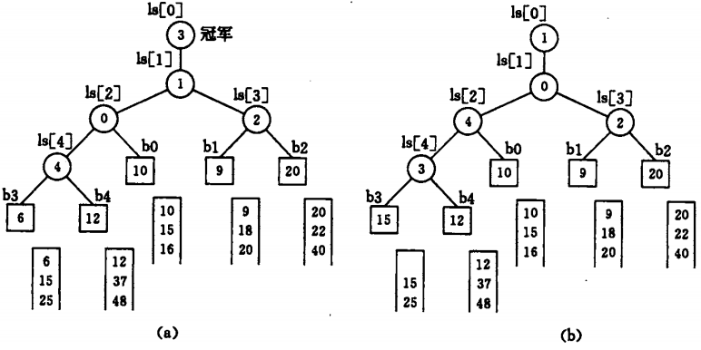

# 败者树
败者树可以应用于 K-路归并，可使在 k 个记录中选出关键值最小的记录仅需进行 lgk 次比较。败者树是树型选择排序的一种变形，也是一棵完全二叉树。每次比较父结点记录两个孩子比较时的“败者”，让“胜者”继续参加更高一层的比赛。下图为一棵实现 5-路归并的败者树 `ls[0..4]`


图中方形结点表示叶子结点，分别为 5 个归并段中当前参加归并选择的记录。败者树的根结点为 `ls[1]`，其父结点 `ls[0]` 记录“冠军”，在此指示各归并段中的最小记录为第三段中的当前记录。在选定最小记录之后，只需要修改叶子结点 `b[3]` 中的值，使其为同一归并段中的下一个记录，然后从该结点向上和双亲结点所指记录进行比较，败者留在该双亲结点，胜者继续向上直至数根的双亲。为了防止在归并过程中某个归并段变为空，可以在每个归并段中附加一个最大值记录，当选出的“冠军”记录为最大值时，表明此次归并已完成。

## 实现
```
#include <climits>
#include <utility>
#include <vector>
using std::size_t;
using std::vector;

struct ListNode {
  int val;
  ListNode* next;
  ListNode(int x) : val(x), next(nullptr) {}
};

class LoserTree {
 public:
  LoserTree() {}
  ~LoserTree() {}

  ListNode* mergeKLists(vector<ListNode*>& lists);

 private:
  void Adjust(int s);
  void CreateLoserTree();
  void input(vector<ListNode*>& lists, int pos);
  void output(vector<ListNode*>& lists, ListNode*& pre);

 private:
  vector<int> loser_;
  vector<int> leaf_;
};

ListNode* LoserTree::mergeKLists(vector<ListNode*>& lists) {
  if (lists.empty()) {
    return nullptr;
  }
  const size_t kWays = lists.size();
  loser_.resize(kWays);
  leaf_.resize(kWays + 1);
  ListNode dummy(-1), *tail;
  tail = &dummy;

  for (int i = 0; i < kWays; ++i) {
    input(lists, i);
  }
  CreateLoserTree();
  while (leaf_[loser_[0]] != INT_MAX) {
    output(lists, tail);
    input(lists, loser_[0]);
    Adjust(loser_[0]);
  }
  return dummy.next;
}

void LoserTree::Adjust(int s) {
  const size_t kWays = loser_.size();
  for (size_t p = (s + kWays) / 2; p > 0; p /= 2) {
    if (leaf_[s] > leaf_[loser_[p]]) {
      std::swap(s, loser_[p]);
    }
  }
  loser_[0] = s;
}

void LoserTree::CreateLoserTree() {
  const int kWays = loser_.size();
  leaf_[kWays] = INT_MIN;
  for (int i = 0; i < kWays; ++i) {
    loser_[i] = kWays;
  }
  for (int i = kWays - 1; i >= 0; --i) {
    Adjust(i);
  }
}

void LoserTree::input(vector<ListNode*>& lists, int i) {
  if (lists[i]) {
    leaf_[i] = lists[i]->val;
  } else {
    leaf_[i] = INT_MAX;
  }
}

void LoserTree::output(vector<ListNode*>& lists, ListNode*& tail) {
  tail->next = lists[loser_[0]];
  tail = tail->next;
  lists[loser_[0]] = lists[loser_[0]]->next;
}
```