## 性质
1. 结点是红色或黑色
2. 根结点必须是黑色
3. 所有叶子结点都是黑色（叶子是NIL结点）
4. 每个红色结点必须有两个黑色的子结点（从每个叶子到根的路径上不能有两个连续的红色结点）。
5. 从任一结点到其每个叶子的所有简单路径都包含相同数目的黑色结点

红黑树是一种自平衡二叉查找树，可以在O(logn)时间内完成查找、插入和删除

## \_Rb_tree_node
```
/// bits/stl_tree.h
133   template<typename _Val>
134     struct _Rb_tree_node : public _Rb_tree_node_base
135     {
136       typedef _Rb_tree_node<_Val>* _Link_type;
137 
149       __gnu_cxx::__aligned_buffer<_Val> _M_storage;
150 
151       _Val*
152       _M_valptr()
153       { return _M_storage._M_ptr(); }
154 
155       const _Val*
156       _M_valptr() const
157       { return _M_storage._M_ptr(); }
159     };
```
\_Rb_tree_node 是一个模板类，继承于 \_Rb_tree_node_base，模板参数决定数据成员 \_M_storage 类型。\_Rb_tree_node_base 定义了红黑树基本结点，两个分别指向左右子树的指针 \_M_left 和 \_M_right，一个表示颜色的标志 \_M_color。此外，为了方便查询，定义了一个指向父结点的指针 \_M_parent。
```
/// bits/stl_tree.h
 92   enum _Rb_tree_color { _S_red = false, _S_black = true };
 93 
 94   struct _Rb_tree_node_base
 95   {
 96     typedef _Rb_tree_node_base* _Base_ptr;
 97     typedef const _Rb_tree_node_base* _Const_Base_ptr;
 98 
 99     _Rb_tree_color      _M_color;
100     _Base_ptr           _M_parent;
101     _Base_ptr           _M_left;
102     _Base_ptr           _M_right;
103 
104     static _Base_ptr
105     _S_minimum(_Base_ptr __x) _GLIBCXX_NOEXCEPT
106     {
107       while (__x->_M_left != 0) __x = __x->_M_left;
108       return __x;
109     }
110 
111     static _Const_Base_ptr
112     _S_minimum(_Const_Base_ptr __x) _GLIBCXX_NOEXCEPT
113     {
114       while (__x->_M_left != 0) __x = __x->_M_left;
115       return __x;
116     }
117 
118     static _Base_ptr
119     _S_maximum(_Base_ptr __x) _GLIBCXX_NOEXCEPT
120     {
121       while (__x->_M_right != 0) __x = __x->_M_right;
122       return __x;
123     }
124 
125     static _Const_Base_ptr
126     _S_maximum(_Const_Base_ptr __x) _GLIBCXX_NOEXCEPT
127     {
128       while (__x->_M_right != 0) __x = __x->_M_right;
129       return __x;
130     }
131   };
```
此外，提供了两个辅助函数 \_S_maximum 和 \_S_minimum，返回当前结点为根的子树的最大和最小结点。

## \_Rb_tree_iterator
\_Rb_tree_iterator 是一个双向迭代器，有一个 \_M_node 数据成员，指向当前结点
```
/// bits/stl_tree.h
173   template<typename _Tp>
174     struct _Rb_tree_iterator
175     {
176       typedef _Tp  value_type;
177       typedef _Tp& reference;
178       typedef _Tp* pointer;
179 
180       typedef bidirectional_iterator_tag iterator_category;
181       typedef ptrdiff_t                  difference_type;
182 
183       typedef _Rb_tree_iterator<_Tp>        _Self;
184       typedef _Rb_tree_node_base::_Base_ptr _Base_ptr;
185       typedef _Rb_tree_node<_Tp>*           _Link_type;
240       _Base_ptr _M_node;
```
该迭代器的 ++ 操作返回中序遍历时，当前结点直接后继结点
```
/// bits/stl_tree.h
202       _Self&
203       operator++() _GLIBCXX_NOEXCEPT
204       {
205         _M_node = _Rb_tree_increment(_M_node);
206         return *this;
207       }
```
\_Rb_tree_increment 调用 local_Rb_tree_increment() 执行具体的查询操作。（1）如果当前结点右子树不为空，返回右子树最左结点。（2）否则，如果但前结点为其父结点的左子树，返回父结点；（3）如果但前结点为其父结点的右子树，返回最近祖先结点（如果存在），该祖先结点的左子树包括当前结点。
```
/// src/c++98/tree.cc
59   static _Rb_tree_node_base*
60   local_Rb_tree_increment(_Rb_tree_node_base* __x) throw ()
61   {
62     if (__x->_M_right != 0) // 右子树不为空，返回右子树最左结点（1）
63       {
64         __x = __x->_M_right;
65         while (__x->_M_left != 0) // 最左结点
66           __x = __x->_M_left;
67       }
68     else 
69       {
70         _Rb_tree_node_base* __y = __x->_M_parent;
71         while (__x == __y->_M_right)
72           { // __x为其父结点的右结点，循环
73             __x = __y;
74             __y = __y->_M_parent;
75           } 
76         if (__x->_M_right != __y) // TODO （2）（3）
77           __x = __y;
78       }
79     return __x;
80   }
```
该迭代器的 -- 操作返回中序遍历时，当前结点的下直接前驱结点
```
/// bits/stl_tree.h
217       _Self&
218       operator--() _GLIBCXX_NOEXCEPT
219       {
220         _M_node = _Rb_tree_decrement(_M_node);
221         return *this;
222       }
```
\_Rb_tree_decrement 调用 local_Rb_tree_decrement() 执行查找。（1）如果当前结点为 end() 返回整个树的最右结点。（2）如果当前结点有左子树，返回左子树的最右结点。（3）但前结点为其父结点的右子结点，返回父结点。（4）当前结点为其父结点的左子结点，返回最近祖先结点（如果存在），该祖先结点的左子树包含但前结点。
```
/// src/c++98/tree.cc
 94   static _Rb_tree_node_base*
 95   local_Rb_tree_decrement(_Rb_tree_node_base* __x) throw ()
 96   {
 97     if (__x->_M_color == _S_red
 98         && __x->_M_parent->_M_parent == __x)
 99       __x = __x->_M_right; // __x为end()的情况，__x为header。稍后解释
100     else if (__x->_M_left != 0) // 存在左子树，返回左子树最右结点
101       {
102         _Rb_tree_node_base* __y = __x->_M_left;
103         while (__y->_M_right != 0) // 找到最右结点
104           __y = __y->_M_right;
105         __x = __y;
106       }
107     else
108       {
109         _Rb_tree_node_base* __y = __x->_M_parent;
110         while (__x == __y->_M_left)
111           {__x为其父结点的左结点，循环
112             __x = __y;
113             __y = __y->_M_parent;
114           }
115         __x = __y; // （3）（4）
116       }
117     return __x;
118   }
```

## \_Rb_tree
```
/// bits/stl_tree.h
346   template<typename _Key, typename _Val, typename _KeyOfValue,
347            typename _Compare, typename _Alloc = allocator<_Val> >
348     class _Rb_tree
349     {
350       typedef typename __gnu_cxx::__alloc_traits<_Alloc>::template
351         rebind<_Rb_tree_node<_Val> >::other _Node_allocator;
352 
353       typedef __gnu_cxx::__alloc_traits<_Node_allocator> _Alloc_traits;
354 
355     protected:
356       typedef _Rb_tree_node_base*               _Base_ptr;
357       typedef const _Rb_tree_node_base*         _Const_Base_ptr;
358       typedef _Rb_tree_node<_Val>*              _Link_type;
359       typedef const _Rb_tree_node<_Val>*        _Const_Link_type;

466     public:
467       typedef _Key                              key_type;
468       typedef _Val                              value_type;
469       typedef value_type*                       pointer;
470       typedef const value_type*                 const_pointer;
471       typedef value_type&                       reference;
472       typedef const value_type&                 const_reference;
473       typedef size_t                            size_type;
474       typedef ptrdiff_t                         difference_type;
475       typedef _Alloc                            allocator_type;

577     protected:
624       _Rb_tree_impl<_Compare> _M_impl;

718     public:
719       typedef _Rb_tree_iterator<value_type>       iterator;
720       typedef _Rb_tree_const_iterator<value_type> const_iterator;
721 
722       typedef std::reverse_iterator<iterator>       reverse_iterator;
723       typedef std::reverse_iterator<const_iterator> const_reverse_iterator;
```
\_Rb_tree 提供双向迭代器和反向迭代器。\_Rb_tree 接口的具体实现在 \_Rb_tree_impl。分配器使用标准分配器 std::allocator
```
/// bits/stl_tree.h
579       template<typename _Key_compare,
580                bool /* _Is_pod_comparator */ = __is_pod(_Key_compare)>
581         struct _Rb_tree_impl : public _Node_allocator
582         {
583           _Key_compare          _M_key_compare;
584           _Rb_tree_node_base    _M_header;
585           size_type             _M_node_count; // Keeps track of size of tree.
```
\_M_key_compare 是键值比较的操作，\_M_node_count 统计红黑树中元素的个数，\_M_header 是实现的技巧，\_M_header.\_M_parent 保存根结点 root，\_M_header.\_M_left 保存最左元素，是中序遍历的首元素，\_M_header.\_M_right 保存最右元素，是中序遍历的最末元素。在 \_M_initialize() 中初始化。\_M_reset() 可以恢复初始化状态。
```
/// bits/stl_tree.h
614           void
615           _M_initialize()
616           {
617             this->_M_header._M_color = _S_red;
618             this->_M_header._M_parent = 0;
619             this->_M_header._M_left = &this->_M_header;
620             this->_M_header._M_right = &this->_M_header;
621           } 
```
## \_M_root、\_M_leftmost、\_M_rightmost、\_M_begin、\_M_end
```
/// bits/stl_tree.h
627       _Base_ptr&
628       _M_root() _GLIBCXX_NOEXCEPT
629       { return this->_M_impl._M_header._M_parent; }

635       _Base_ptr&
636       _M_leftmost() _GLIBCXX_NOEXCEPT
637       { return this->_M_impl._M_header._M_left; }

643       _Base_ptr&
644       _M_rightmost() _GLIBCXX_NOEXCEPT
645       { return this->_M_impl._M_header._M_right; }
646 
651       _Link_type
652       _M_begin() _GLIBCXX_NOEXCEPT // 父结点
653       { return static_cast<_Link_type>(this->_M_impl._M_header._M_parent); }

662       _Link_type
663       _M_end() _GLIBCXX_NOEXCEPT // 头结点
664       { return reinterpret_cast<_Link_type>(&this->_M_impl._M_header); }
```
## \_Rb_tree 内存分配
\_Rb_tree 调用 \_M_get_node 申请一块原始内存，用于存储结点
```
/// bits/stl_tree.h
490       _Link_type
491       _M_get_node()
492       { return _Alloc_traits::allocate(_M_get_Node_allocator(), 1); }
```
调用 \_M_construct_node 构造一个结点
```
/// bits/stl_tree.h
523       template<typename... _Args>
524         void
525         _M_construct_node(_Link_type __node, _Args&&... __args)
526         {
527           __try
528             {  // 首先构造整个结点，然后构造数据对象
529               ::new(__node) _Rb_tree_node<_Val>;
530               _Alloc_traits::construct(_M_get_Node_allocator(),
531                                        __node->_M_valptr(),
532                                        std::forward<_Args>(__args)...);
533             }
534           __catch(...)
535             {
536               __node->~_Rb_tree_node<_Val>();
537               _M_put_node(__node);
538               __throw_exception_again;
539             }
540         }
```
此外，也可以调用 \_M_create_node，结合上述两个函数的工作
```
/// bits/stl_tree.h
511       _Link_type
512       _M_create_node(const value_type& __x)
513       {
514         _Link_type __tmp = _M_get_node(); // 申请内存
515         _M_construct_node(__tmp, __x); // 构造对象
516         return __tmp;
517       }
```
相应的，调用 \_M_destroy_node 将结点析构
```
/// bits/stl_tree.h
551       void
552       _M_destroy_node(_Link_type __p) noexcept
553       {
554         _Alloc_traits::destroy(_M_get_Node_allocator(), __p->_M_valptr()); // 析构对象
555         __p->~_Rb_tree_node<_Val>(); // 析构结点
556       }
```
调用 \_M_put_node 释放内存
```
/// bits/stl_tree.h
494       void
495       _M_put_node(_Link_type __p) _GLIBCXX_NOEXCEPT
496       { _Alloc_traits::deallocate(_M_get_Node_allocator(), __p, 1); }
```
同样，也可以调用 \_M_drop_node 执行析构和释放内存
```
/// bits/stl_tree.h
559       void
560       _M_drop_node(_Link_type __p) _GLIBCXX_NOEXCEPT
561       {
562         _M_destroy_node(__p); // 析构
563         _M_put_node(__p); // 释放内存
564       }
```

## \_Rb_tree 析构函数
```
/// bits/stl_tree.h
858       ~_Rb_tree() _GLIBCXX_NOEXCEPT
859       { _M_erase(_M_begin()); }
```
在 _M_erase 中析构结点
```
/// bits/stl_tree.h
1615     void
1616     _Rb_tree<_Key, _Val, _KeyOfValue, _Compare, _Alloc>::
1617     _M_erase(_Link_type __x)
1618     {
1619       // Erase without rebalancing.
1620       while (__x != 0)
1621         { // 递归进行，先右子树，根，然后左子树
1622           _M_erase(_S_right(__x));
1623           _Link_type __y = _S_left(__x);
1624           _M_drop_node(__x);
1625           __x = __y;
1626         }
1627     }
```

## 红黑树平衡操作：旋转和变色
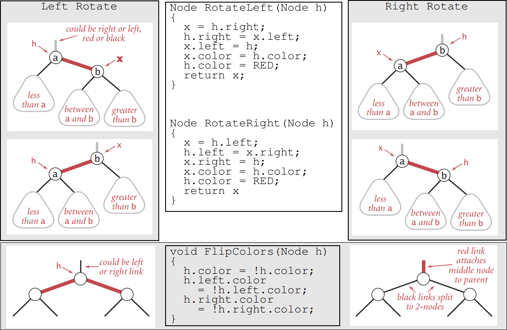

rb_tree 调用函数 local_Rb_tree_rotate_left() 执行左旋操作。\__x 指向需要执行左旋的结点，\__root 指向根结点。如果此时红黑树为空，\__root 为 NULL。（1）将 \__y（\__x 的右结点）的左子树转移到 \__x 的右结点，并更新其父结点。（2）更新 \__y 的父结点。（3）更新 \__x 父结（如果存在，当 \__x 为根结点，不存在父结点，此时更新 \__root 为 \__y）点的左右结点。（4）将 \__x 转移到 \__y 的左结点，并更新 \__x 的父结点为 \__y。
```
/// src/c++98/tree.cc
132   static void
133   local_Rb_tree_rotate_left(_Rb_tree_node_base* const __x,
134                      _Rb_tree_node_base*& __root)
135   {
136     _Rb_tree_node_base* const __y = __x->_M_right;
137
138     __x->_M_right = __y->_M_left; // 将__y的左子树移到__x的右结点（1）
139     if (__y->_M_left !=0)
140       __y->_M_left->_M_parent = __x; // 更新__y->_M_left的父结点
141     __y->_M_parent = __x->_M_parent; // 更新__y与的父结点 （2）
142
143     if (__x == __root) // 如果__x为根结点，左旋后根结点更新为__y（3）
144       __root = __y;
        // 否则更新__x的父结点的左或右结点为__y，视__x为其父的左或右孩子而定（3）
145     else if (__x == __x->_M_parent->_M_left)
146       __x->_M_parent->_M_left = __y;
147     else
148       __x->_M_parent->_M_right = __y;
149     __y->_M_left = __x; // 更新__y的左结点为__x（4）
150     __x->_M_parent = __y; // 更新__x的父结点为__y（4）
151   }
```
同样的，rb_tree 调用函数 local_Rb_tree_rotate_right() 执行右旋操作。执行过程和左旋类似
```
/// src/c++98/tree.cc
163   static void
164   local_Rb_tree_rotate_right(_Rb_tree_node_base* const __x,
165                  _Rb_tree_node_base*& __root)
166   {
167     _Rb_tree_node_base* const __y = __x->_M_left;
168 
169     __x->_M_left = __y->_M_right; // 将__y的右子树转移到__x的左结点
170     if (__y->_M_right != 0)
171       __y->_M_right->_M_parent = __x; // 更新__y->_M_right的父结点
172     __y->_M_parent = __x->_M_parent; // 更新__y的父结点
173 
174     if (__x == __root) // 如果__x为根结点，右旋后根结点更新为\__y`
175       __root = __y;
        // 否则更新__x的父结点的左或右结点为__y，视__x为其父的左或右孩子而定
176     else if (__x == __x->_M_parent->_M_right)
177       __x->_M_parent->_M_right = __y;
178     else
179       __x->_M_parent->_M_left = __y;
180     __y->_M_right = __x; // 将__x转移到__y的右结点
181     __x->_M_parent = __y; // 更新__x的父结点为__y
182   }
```
总结：左旋之后 \__x 为其新父结点（\__x 原来的右结点 \__y）的左结点，右旋之后 \__x 为其新父结点（\__x 原来的左结点 \__y）的右结点。将\__y 切断的子树转移到 \__x 空出的结点上（比如左旋，\__y 变成 \__x 的父结点，\__y 的左子树被切断，此时 \__x 的右结点空出来，就将 \__y 的左子树移到 \__x 的右结点）。

## \_Rb_tree 的插入操作
\_Rb_tree 的插入操作，最后都调用 \_Rb_tree_insert_and_rebalance()，在插入后执行平衡操作。
```
/// src/c++98/tree.cc
194   void
195   _Rb_tree_insert_and_rebalance(const bool          __insert_left,
196                                 _Rb_tree_node_base* __x,
197                                 _Rb_tree_node_base* __p,
198                                 _Rb_tree_node_base& __header) throw ()
```
传入的四个参数，\__x 指向待插入结点，\__p 指向接受 \__x 的结点，\__header 指向头结点 header，\__insert_left 表示是否在 \__p 的左结点插入 \__x。
```
/// src/c++98/tree.cc
199   {
200     _Rb_tree_node_base *& __root = __header._M_parent;
201 
202     // Initialize fields in new node to insert.
203     __x->_M_parent = __p;
204     __x->_M_left = 0;
205     __x->_M_right = 0;
206     __x->_M_color = _S_red;
```
首先是初始化 \__x，指定父结点为 \__p，并且将初始颜色设置为红色，如果设为黑色，就会导致根到叶子的路径上有一条路上，多一个额外的黑节点，这个是很难调整的。但是设为红色节点后，可能会导致出现两个连续红色节点的冲突，那么可以通过颜色调换。然后执行插入：
```
/// src/c++98/tree.cc
212     if (__insert_left)
213       {
214         __p->_M_left = __x;
215 
216         if (__p == &__header) // 空树插入，始终在左边插入
217         {
218             __header._M_parent = __x; // __x为根结点
219             __header._M_right = __x; // __x为rightmost结点
220         }
221         else if (__p == __header._M_left)
222           __header._M_left = __x; // 更新leftmost结点
223       }
```
在左边插入后，更新头结点：（1）当前为空，新插入的结点为根结点，并且更新rightmost结点为当前结点。（2）如果 \__p 指向最左结点，更新leftmost结点。相似地，在右边插入仅仅需要更新rightmost结点信息：
```
/// src/c++98/tree.cc
224     else
225       {
226         __p->_M_right = __x;
227 
228         if (__p == __header._M_right)
229           __header._M_right = __x; //  更新rightmost结点
230       }
```
接下就是平衡操作。从新插入的结点直到根结点，如果出现两个连续的红色（当前结点和其父结点），进行必要的左旋、右旋和变色。根据插入的位置和其父结点的位置，一共有四种情形：
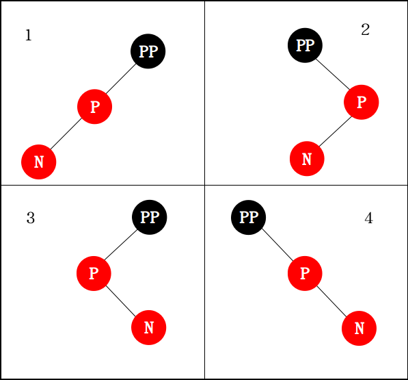

根据其叔父（父结点的兄弟）的颜色不同，操作不同。如果叔父结点为红色，只需要颜色反转。否则需要通过旋转和颜色反转结合。第一种是 \__x 的父结点是 \_xpp 的左孩子
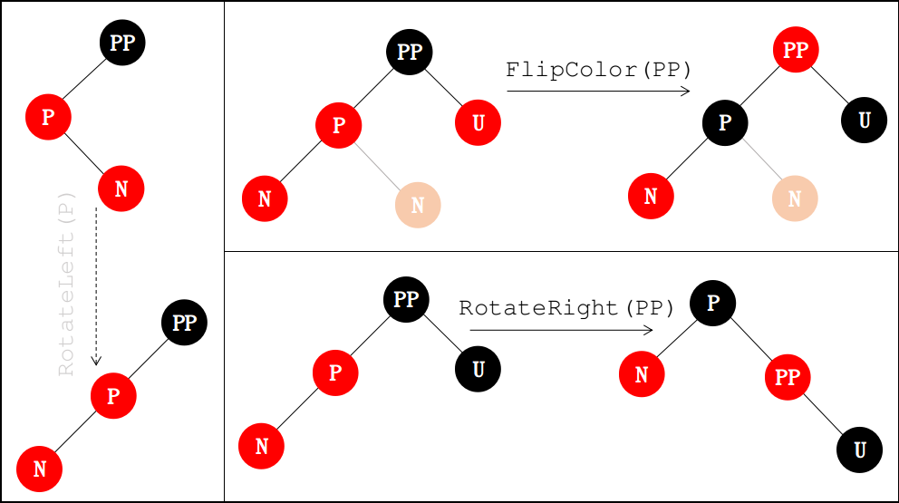

如果其叔父是红色，只需进行颜色反转
```
/// src/c++98/tree.cc
232     while (__x != __root
233        && __x->_M_parent->_M_color == _S_red)
234       {
235     _Rb_tree_node_base* const __xpp = __x->_M_parent->_M_parent;
236 
237     if (__x->_M_parent == __xpp->_M_left)
238       {
239         _Rb_tree_node_base* const __y = __xpp->_M_right;
240         if (__y && __y->_M_color == _S_red)
241           { // 叔父为红色，只需要颜色反转
242         __x->_M_parent->_M_color = _S_black;
243         __y->_M_color = _S_black;
244         __xpp->_M_color = _S_red;
245         __x = __xpp;
246           }
```
不然，进行右旋（必要时先左旋，转化成相同形式）
```
/// src/c++98/tree.cc
247         else
248           {
249         if (__x == __x->_M_parent->_M_right)
250           { 先左旋，统一形式
251             __x = __x->_M_parent;
252             local_Rb_tree_rotate_left(__x, __root);
253           }
254         __x->_M_parent->_M_color = _S_black;
255         __xpp->_M_color = _S_red;
256         local_Rb_tree_rotate_right(__xpp, __root); // 右旋
257           }
258       }
```
第二种情况是 \__x 的父结点是 \_xpp 的右孩子。操作和第一种情况相似
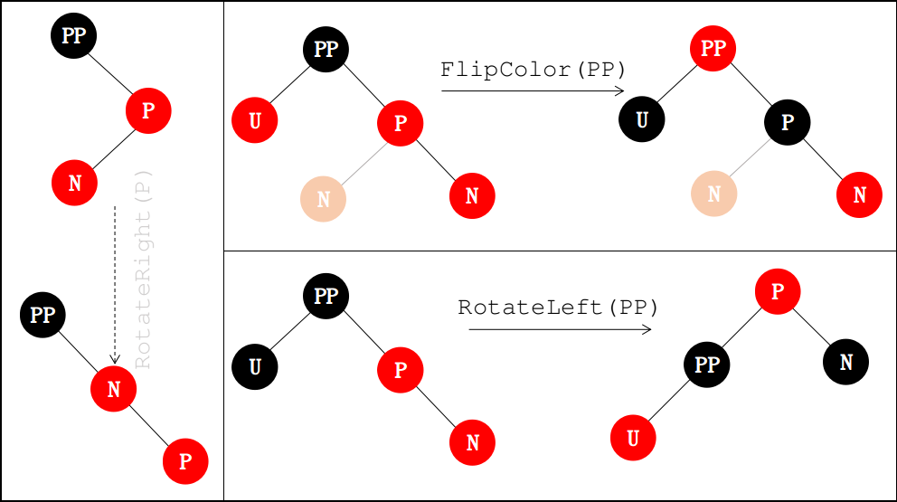
```
/// src/c++98/tree.cc
259     else
260       {
261         _Rb_tree_node_base* const __y = __xpp->_M_left;
262         if (__y && __y->_M_color == _S_red)
263           { 叔父为红色，只需要颜色反转
264         __x->_M_parent->_M_color = _S_black;
265         __y->_M_color = _S_black;
266         __xpp->_M_color = _S_red;
267         __x = __xpp;
268           }
269         else
270           {
271         if (__x == __x->_M_parent->_M_left)
272           { // 先右旋，统一形式
273             __x = __x->_M_parent;
274             local_Rb_tree_rotate_right(__x, __root);
275           }
276         __x->_M_parent->_M_color = _S_black;
277         __xpp->_M_color = _S_red;
278         local_Rb_tree_rotate_left(__xpp, __root); // 左旋
279           }
280       }
281       }
282     __root->_M_color = _S_black; // 根必须是黑色
283   }
```

## \_Rb_tree 的删除操作
在二叉查找树中，（1）删除至多有一个子树的结点是简单的，用其子结点替代自己就行。如果待删除的结点有两个子树，可以转化成（1）的情形，只需要把右子树的最左结点和当前待删除结点交换，转换为删除右子树的最左结点（如下图，删除B，将B和C交换）。在红黑树中，也可以用类似的方式删除结点，此外，对于破化了红黑树结构的操作，需要额外的操作恢复红黑树结构。
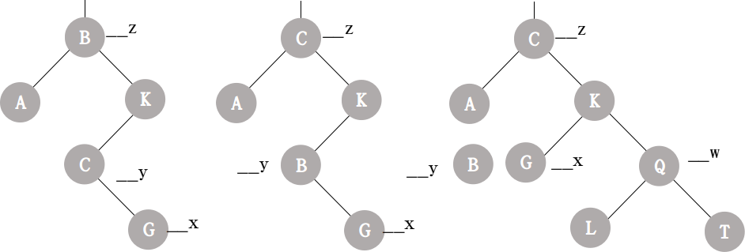

下面讨论（1）可能出现的结果：
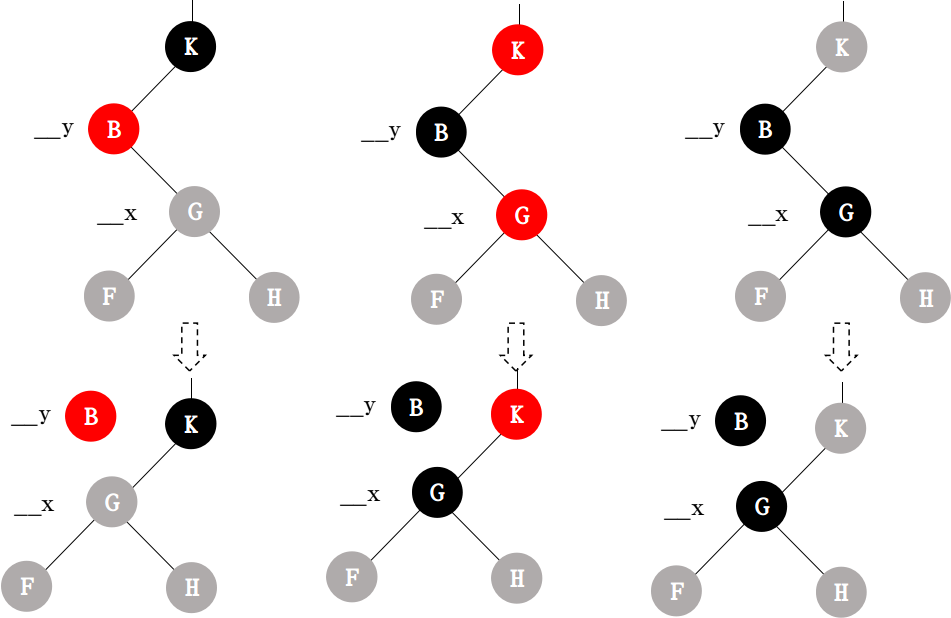

1. 删除的结点B是红色的：不会减少简单路径上黑结点的个数，一条路径上不会出现两个红色的情况，并且删除结点不可能是根，根仍然是黑色的。所有直接删除。
2. 删除结点B是黑色的，B的父结点K和子结点G都是红色的：删除B后出现两个红色，并且包含G的路径少了一个黑色结点，此时可以将G变为黑色恢复红黑树结构。
3. 删除结点B以及子结点G都是黑色：删除后，并且包含G的路径少了一个黑色结点，这种情况相当复杂，需要根据其兄弟结点的情况进行调整。

根据其兄弟结点的颜色一起兄弟的孩子的颜色，一共有5中情况

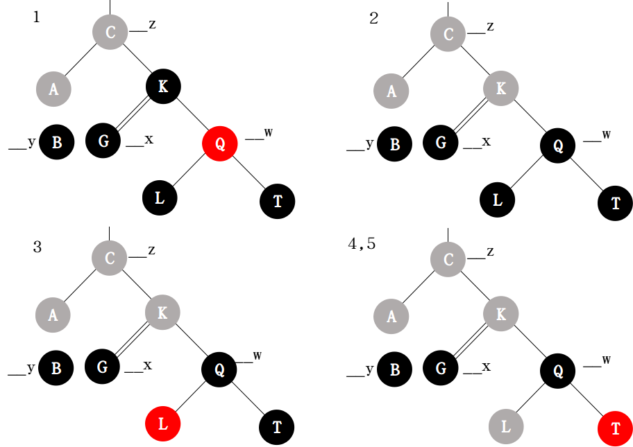

终极的方法是在保持其他路径的黑结点不变的情况下，将G的父结点K变为黑色。首先要用一次左旋，将K转移到G的路径上。此外，局部黑色结点应该满足：
1. count(K-Q-T) = count(Q'-T')
2. count(K-Q-L) = count(Q'-K'-L')
3. count(K-G) + 1 = count(Q'-K'-G)

如果K为黑色，则K'和G'必须为黑色（条件3）。如果Q为红色，则L为黑色，左旋后不能满足条件2，所以Q为黑色。那么T'必须是红变黑色（条件1），因此T的颜色必须是红色。而L的颜色任意。
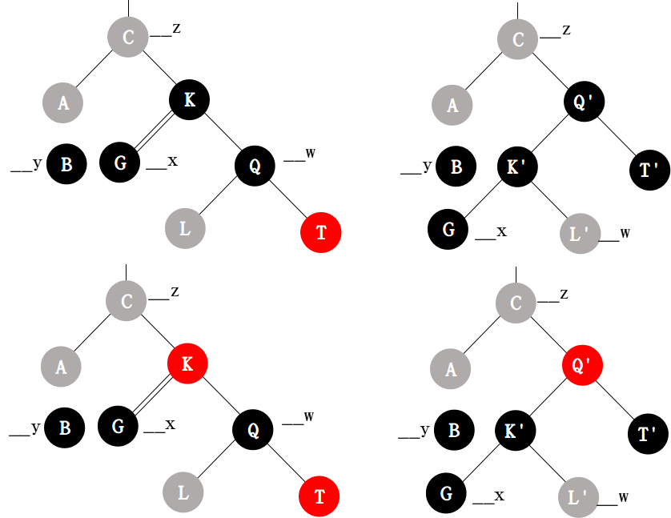

如果K是红色，Q必须是黑色（不能两个红色）。Q'和K'有且只有一个黑色，L'无约束。Q'的颜色可以是红色和黑色，如果为黑色，T'任意，如果为红色，则T'必须是红变黑，则T必须是红色。

总结上面分析，可以发现，如果Q是黑色，T为红色，可以不管K的颜色一步到位，恢复红黑树的结构，其他情况必须依赖K的颜色。这就是红黑树删除后出现4、5结果的恢复办法，对应于case4的情形：
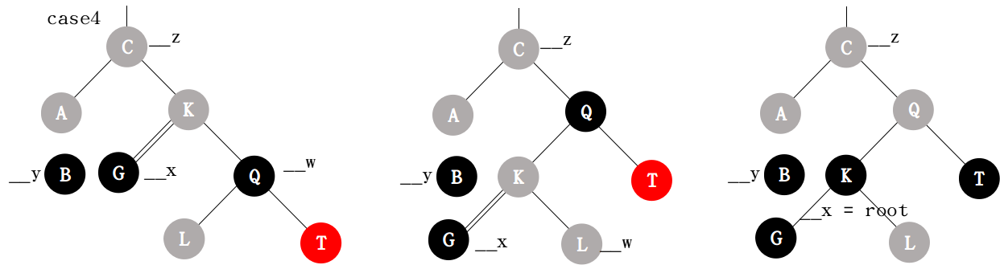

对于删除后是3的情况（兄弟结点的左结点为红色，右结点为黑色），可以通过右旋转换成case4的情况，然后一步到位，这就是case3：
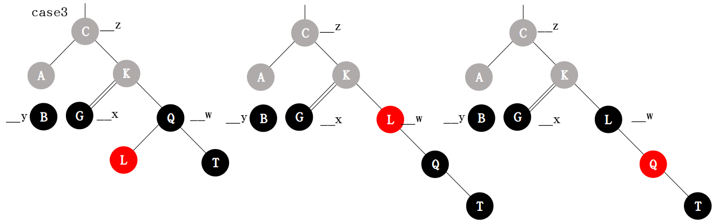

对于删除后是2的情况（兄弟结点是黑，其子是黑），可以简单的通过颜色变换，在上层继续构造case3或case4的情形：


对于删除后是1的情况（兄弟是红），可以通过左旋，在下层继续构造case3或case4的情形：
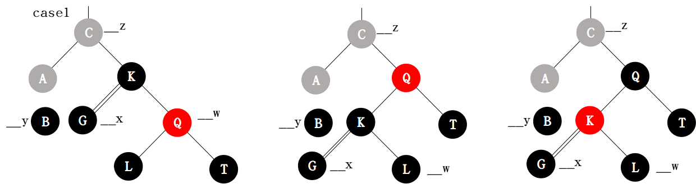

因此在恢复过程中，先判断是否满足case1，如果满足，通过左旋，在下次构造，此时可以继续判断。如果满足case2，在上层构造，此时必须从case1重新判断。否则，判断是否是case3，如果是就转换为case4。最后在case4一步到位。其逻辑如下：
```
while(condition) {
  if(__x == __x_parent->_M_left) {
    if(case1) {
      do_case1();
    }
    if(case2) {
      do_case2();
    } else {
      if(case3) {
        do_case3();
      }
      if(case4) {
        do_case4();
        break;
      }
    }
  } else {
    // same as above
  }
}
```

\_Rb_tree 的插入操作，最后都调用 \_Rb_tree_rebalance_for_erase()，在删除后执行平衡操作。逻辑如上分析
```
/// src/c++98/tree.cc
285   _Rb_tree_node_base*
286   _Rb_tree_rebalance_for_erase(_Rb_tree_node_base* const __z,
287                    _Rb_tree_node_base& __header) throw ()
288   {
289     _Rb_tree_node_base *& __root = __header._M_parent;
290     _Rb_tree_node_base *& __leftmost = __header._M_left;
291     _Rb_tree_node_base *& __rightmost = __header._M_right;
292     _Rb_tree_node_base* __y = __z;
293     _Rb_tree_node_base* __x = 0;
294     _Rb_tree_node_base* __x_parent = 0;
```
首先找到真正删除的结点 \__y 以及其孩子 \__x。如果 \__z 有两个孩子，找到右子树的最左结点，然后执行交换。否则删除结点就是当前结点
```
/// src/c++98/tree.cc
296     if (__y->_M_left == 0)     // __z has at most one non-null child. y == z    .
297       __x = __y->_M_right;     // __x might be null.
298     else
299       if (__y->_M_right == 0)  // __z has exactly one non-null child. y == z    .
300     __x = __y->_M_left;    // __x is not null.
301       else
302     {
303       // __z has two non-null children.  Set __y to
304       __y = __y->_M_right;   //   __z's successor.  __x might be null.
305       while (__y->_M_left != 0)
306         __y = __y->_M_left;
307       __x = __y->_M_right;
308     }
```
如果当前结点不是删除结点（有两个子树，需要转移到删除找到右子树的最左结点）
```
/// src/c++98/tree.cc
309     if (__y != __z)
310       { // 交换__y和__z，原来__z位置的颜色不变
311     // relink y in place of z.  y is z's successor
312     __z->_M_left->_M_parent = __y;
313     __y->_M_left = __z->_M_left;
314     if (__y != __z->_M_right)
315       {
316         __x_parent = __y->_M_parent;
317         if (__x) __x->_M_parent = __y->_M_parent;
318         __y->_M_parent->_M_left = __x;   // __y must be a child of _M_left
319         __y->_M_right = __z->_M_right;
320         __z->_M_right->_M_parent = __y;
321       }
322     else
323       __x_parent = __y;
324     if (__root == __z)
325       __root = __y;
326     else if (__z->_M_parent->_M_left == __z)
327       __z->_M_parent->_M_left = __y;
328     else
329       __z->_M_parent->_M_right = __y;
330     __y->_M_parent = __z->_M_parent;
331     std::swap(__y->_M_color, __z->_M_color);
332     __y = __z;
333     // __y now points to node to be actually deleted
334       }
335     else
336       {                        // __y == __z
337     __x_parent = __y->_M_parent;
338     if (__x)
339       __x->_M_parent = __y->_M_parent;
340     if (__root == __z)
341       __root = __x;
342     else
343       if (__z->_M_parent->_M_left == __z)
344         __z->_M_parent->_M_left = __x;
345       else
346         __z->_M_parent->_M_right = __x;
```
然后维护最左和最后结点
```
/// src/c++98/tree.cc
347     if (__leftmost == __z)
348       {
349         if (__z->_M_right == 0)        // __z->_M_left must be null also
350           __leftmost = __z->_M_parent;
351         // makes __leftmost == _M_header if __z == __root
352         else
353           __leftmost = _Rb_tree_node_base::_S_minimum(__x);
354       }
355     if (__rightmost == __z)
356       {
357         if (__z->_M_left == 0)         // __z->_M_right must be null also
358           __rightmost = __z->_M_parent;
359         // makes __rightmost == _M_header if __z == __root
360         else                      // __x == __z->_M_left
361           __rightmost = _Rb_tree_node_base::_S_maximum(__x);
362       }
363       }
```
然后如果不是红色，需要平衡，否则直接删除。首先是判断 \__x 的位置，是其父的左结点和右结点。两种情况是对称的，方法相同
```
/// src/c++98/tree.cc
364     if (__y->_M_color != _S_red) // 红色直接删除
365       {
366     while (__x != __root && (__x == 0 || __x->_M_color == _S_black))
367       if (__x == __x_parent->_M_left)
368         {
369           _Rb_tree_node_base* __w = __x_parent->_M_right;
```
case1
```
/// src/c++98/tree.cc
370           if (__w->_M_color == _S_red)
371         {
372           __w->_M_color = _S_black;
373           __x_parent->_M_color = _S_red;
374           local_Rb_tree_rotate_left(__x_parent, __root);
375           __w = __x_parent->_M_right;
376         }
```
case2
```
/// src/c++98/tree.cc
377           if ((__w->_M_left == 0 ||
378            __w->_M_left->_M_color == _S_black) &&
379           (__w->_M_right == 0 ||
380            __w->_M_right->_M_color == _S_black))
381         {
382           __w->_M_color = _S_red;
383           __x = __x_parent;
384           __x_parent = __x_parent->_M_parent;
385         }
```
case3
```
/// src/c++98/tree.cc
386           else
387         {
388           if (__w->_M_right == 0
389               || __w->_M_right->_M_color == _S_black)
390             { // case 3
391               __w->_M_left->_M_color = _S_black;
392               __w->_M_color = _S_red;
393               local_Rb_tree_rotate_right(__w, __root);
394               __w = __x_parent->_M_right;
395             }
396           __w->_M_color = __x_parent->_M_color;
397           __x_parent->_M_color = _S_black;
```
case4
```
/// src/c++98/tree.cc
398           if (__w->_M_right) // case 4
399             __w->_M_right->_M_color = _S_black; 
400           local_Rb_tree_rotate_left(__x_parent, __root);
401           break;
402         }
403         }
```
如果在右边，方法一样
```
/// src/c++98/tree.cc
404       else 
405         {
406           // same as above, with _M_right <-> _M_left.
407           _Rb_tree_node_base* __w = __x_parent->_M_left;
408           if (__w->_M_color == _S_red)
409         {
410           __w->_M_color = _S_black;
411           __x_parent->_M_color = _S_red;
412           local_Rb_tree_rotate_right(__x_parent, __root);
413           __w = __x_parent->_M_left;
414         }
415           if ((__w->_M_right == 0 ||
416            __w->_M_right->_M_color == _S_black) &&
417           (__w->_M_left == 0 ||
418            __w->_M_left->_M_color == _S_black))
419         {
420           __w->_M_color = _S_red;
421           __x = __x_parent;
422           __x_parent = __x_parent->_M_parent;
423         }
424           else
425         {
426           if (__w->_M_left == 0 || __w->_M_left->_M_color == _S_black)
427             {
428               __w->_M_right->_M_color = _S_black;
429               __w->_M_color = _S_red;
430               local_Rb_tree_rotate_left(__w, __root);
431               __w = __x_parent->_M_left;
432             }
433           __w->_M_color = __x_parent->_M_color;
434           __x_parent->_M_color = _S_black;
435           if (__w->_M_left)
436             __w->_M_left->_M_color = _S_black;
437           local_Rb_tree_rotate_right(__x_parent, __root);
438           break;
439         }
440         }
441     if (__x) __x->_M_color = _S_black;
442       }
443     return __y;
444   }
```