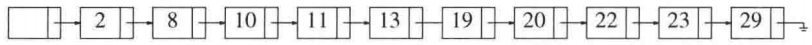
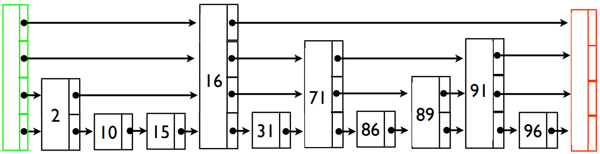
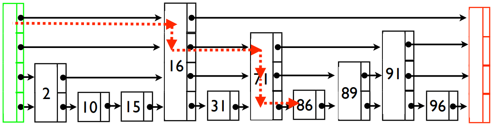
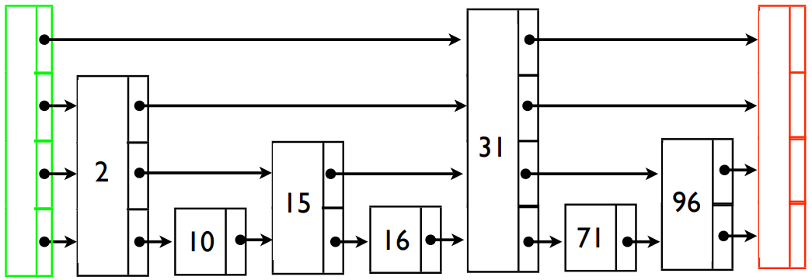
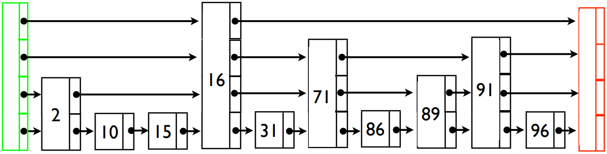
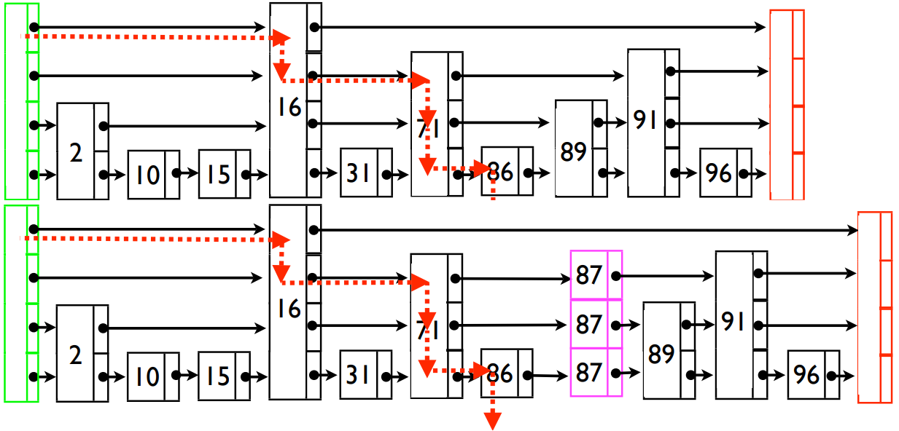
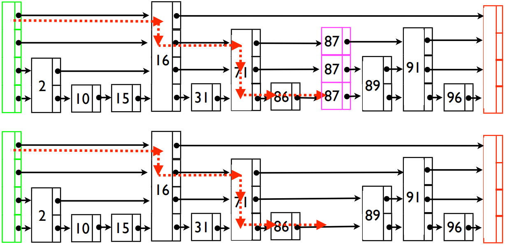

# 跳表（skiplist）
## 简介
跳表可以看作是链表的扩张数据结构，其插入、删除和查找时间复杂度都是 `O(log n)`。链表主要的一个缺点是查找不友好，时间复杂度为 `O(n)`，因为需要从第一个结点逐结点遍历然后比较。同样，对有序链表的插入时间复杂度也为 `O(n)`，因为需要找到插入的位置。


跳表是通过给链表添加“索引”的方式加速查找，可以减少查找时遍历的结点数


使得查找可以“走捷经”


## 完美跳表

我们讲跳表一定是有序的，不然无法工作。完美跳表具有如下性质
- 层数为 `O(log n)`
- 每层含有的结点数都是其下一层的一半

## 随机跳表
完美跳表过于僵硬，每次插入和删除都需要维护其性质不被破坏，所以不能进行高效的插入和删除。使这种数据结构实用的关键是稍微放松结构的条件。


随机跳表不严格要求每层含有的结点数都是其下一层的一半，只是要求大约是其下一层的一半。这种随机性是通过“抛硬币”的方式决定新插入结点的阶数
```
randomLevel()
  |v| = 1
  while random() < p and |v| < MaxLevel do
    |v| += 1
  return |v|
```

### 查找


为了执行一次查找，我们在头结点从最高阶的链开始，沿着这个阶一直走，直到发现下一个结点大于我们正在查找的结点或者下一个结点为空。这个时候，我们就转到低一阶链继续使用这种方法。当进行到最底层阶并且停止时，或者我们位于正在查找的结点的前面，或者查找结点不在这个跳表中。
```
Search(list, searchKey)
  x = list->header;
  for i = list->level downto 1 do
    while x->forward[i]->key < searchKey do
      x = x->forward[i]
  x = x->forward[1];
  if x->key == searchKey
    return x->value
  else
    return failure
```

### 插入


插入时查找插入的位置和查找过程是一致的，找到插入位置后需要计算待插入结点的阶数，然后插入链表
```
Insert(list, searchKey, newValue)
  local update[1..MaxLevel]
  x = list->header;
  for i = list->level downto 1 do
    while x->forward[i]->key < searchKey do
      x = x->forward[i]
    update[i] = x
  x = x->forward[1]
  if x->key == searchKey
    x->value = newValue
  else
    |v| = randomLevel()
    if |v| > list->level + 1
      for i = list->level + 1 do |v| do
        updata[i] = list->header
      list->level = |v|
    x = makeNode(|v|, searchKey, newValue)
    for i = 1 to |v| do
      x->forward[i] = update[i]->forward[i]
      update[i]->forward[i] = x
```

### 删除


```
Delete(list, searchKey)
  local update[1..MaxLevel]
  x = list->header
  for i = list->level downto 1 do
    while x->forward[i]->key < searchKey do
      x = x->forward[i]
    update[i] = x
  x = x->forward[1]
  if x->key == searchKey
    for i = 1 to list->level do
      if update[i]->forward[i] == x
        update[i]->forward[i] = x->forward[i]
    free(x)
    while list->level > 1 and
        list->header->forward[list->level] == NIL do
      list->level = list->level - 1
```

## 实现
TODO