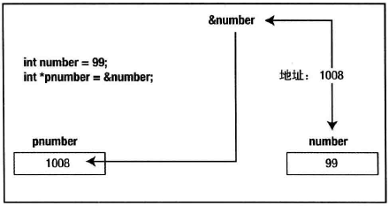
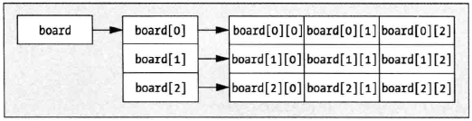
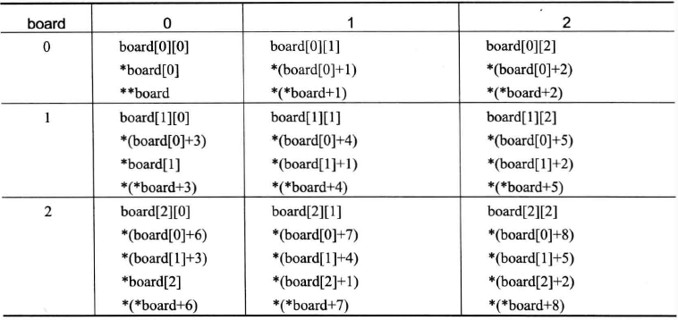

## 指针
可以存储地址的变量称为指针。如图所示，指针 pnumber 含有另一个变量 number 的地址，是变量 number 第一个字节的地址。



知道变量 pnumber 是一个指针是不够的，更重要的是，编译器必须知道它所指变量的类型。没有这个信息，根本不可能知道它占用多少内存，或者如何处理它所指的内存的内容。每个指针都和某个变量类型相关联，也只能用于指向该类型的变量。

类型名 void 表示没有指定类型，所以 void* 类型的指针可以包含任意类型数据项的地址。类型 void* 常常用做参数类型或者函数返回类型。任意类型的指针都可以传送为 void* 类型的值，在使用它时，再将其转换为合适的类型。

## 指向常量的指针
声明指针时，可以使用 const 关键字限定，使得不能通过该指针改变所指变量的值。
```
long value = 9999L;
const long *pvalue = &value;
```
无法通过 pvalue 指针改变 value 的值，比如
```
*pvalue = 8888L;
```
会产生编译错误，但是可以改变 pvalue 的值（指向另外的变量）
```
long number = 8888L;
pvalue = &number;
```
另外，const 和 long 关键字的顺序没有关系，如下方式也可以声明指向常量的指针：
```
long const *pvalue = &value;
```

## 常量指针
也可以用 const 关键字限定指针的值不能被修改（不能指向其他的变量）。此时，在指针声明中使用 const 关键字的方式略有区别，如下所示：
```
int count = 43;
int *const pcount = &count;
```

## 数组和指针
数组名可以隐士转换为指针，表示数组的第一个元素的地址。但是数组不是指针，它们有一个重要的区别：可以改变指针包含的地址，但不能改变数组名引用的地址。

另外，数组名代表的并不是数组的地址，尽管两者都指向同一地址，但是指针运算完全不同。比如：
```
char chs[10];
printf("%x %x\n", chs, &chs);
printf("%x %x\n", chs + 1, &chs + 1);
```
输出为
```
0x60fee6 0x60fee6
0x60fee7 0x60fef0
```

## 多维数组和指针
多维数组中，名称和指针之间的差异更为明显，例如定义如下二维数组
```
char board[3][3] = {
    {'1', '2', '3'},
	{'4', '5', '6'},
	{'7', '8', '9'},
};
```
多维数组和它元素（子数组）的关系如下所示



board 引用第一个元素的地址，该元素仍然是一个数组，而 board[0]、board[1] 和 board[3] 引用对应子数组第一个元素的地址。则用多维数组名称访问元素的方式如下所示



## 指针数组
数组的元素也可以是指针类型，在声明需要注意方法
```
char *ptr[10] = {NULL};
```
上述方法声明了一个容量是 10 个 char* 类型的指针数组。[] 操作符的优先级比 * 高，所以 ptr 首先和 [] 操作符结合，表明 ptr 是数组，然后确定元素类型是 char*。

## 函数指针
使用指针也可以操作函数，函数的内存地址存储了函数开始执行的位置（起始地址），存储在函数指针中的内容就是这个地址。不过，只有地址还不够，还必须指定形参列表以及返回值类型。函数指针的声明方法如下：
```
RetureType (*FunctionPtr)(Parameters - separated by commas);
```
该声明只定义了一个名为 FunctionPtr 的指针变量，不指向任何内容。*FunctionPtr 必须放在括号中，因为 () 操作符具有最高优先级，FunctionPtr 和右边 () 结合，FunctionPtr 就表示函数。

通过函数指针调用函数和函数调用类型，只需要将函数调用时函数名换成函数指针
```
int sum(int a, int b);
int (*pfun)(int, int) = sum;
int result = pfun(1, 2);
```
函数指针也可以使用 typedef 定义别名
```
typedef int (*Func)(int, int);
Func pfunc = sum;
```