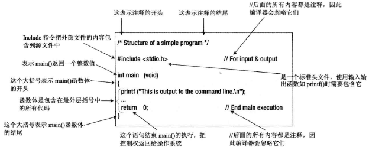

## 创建 C 程序
C 程序的创建过程有 4 个基本步骤或者过程：
1. 编辑：编辑过程就是创建和修改 C 程序的源代码；
2. 编译：编译器将源代码转换成机器语言；编译过程包括两个阶段。第一个阶段称为预处理阶段，在此期间会修改和添加代码，第二个阶段是生成机器代码的实际编译过程，
3. 链接：链接器将编译器产生的目标模块组合起来，再从 C 语言提供的程序库中添加必要的代码模块，将它们组合成一个可执行的文件；
4. 执行：运行可执行文件；

## 源代码要点

##  计算机内存
计算机执行程序时，组成程序的指令和程序所操作的数据都必须存储到某个地方，这个地方就是机器的内存，也称为主存。内存的最小单位是位，将 8 个位组合为一组，称为字节。每个字节都有唯一的地址。字节地址从 0 开始。位只能是 0 或 1。

### 什么是变量
变量是计算机里一块特定的内存，它是由一个或多个连续的字节组成，一般是 1、2、4、8 或 16 字节。每个变量都有一个名称（字母、数字和下划线组成，数字不能在首部），可以用该名称表示内存的这个位置，以提取它包含的数据或存储的一个新数值。程序用到变量名时，计算机就会访问存储在其中的值。

### 变量与内存
变量有几种不同的类型，每种变量都用于存储特定类型的数据，它们之间的区别是占用内存的大小和可以存储数值的范围不同。

每次声明特定类型的变量时，编译器都会给它分配一块足够大的内存空间，用来保存该类型的变量。相同类型的不同变量总是占据相同大小的内存，但不同类型的变量需要分配的内存空间就不一定相同。

## 变量类型及其占用内存大小
|类型名称|字节数|
|:-|:-|
|char 或 signed char|1|
|unsigned char|1|
|short int|2|
|unsigned short int 或 unsigned short|2|
|int 或 long int|4|
|unsigned int 或 unsigned long int 或 unsigned long|4|
|long long int|8|
|unsigned long long int 或 unsigned long long|8|
|float|4|
|double|8|
|long double|12|

## 默认的整数常量类型
|后缀|十进制常量|八或十六进制常量|
|:-|:-|:-|
|无|int long long long|int unsigned int long unsigned long long long unsigned long long|
|U|unsigned int unsigned long unsigned long long|unsigned int unsigned long unsigned long long|
|L|long long long|long unsigned long long long unsigned long long|
|UL|unsigned long unsigned long long|unsigned long unsigned long long|
LL|long long|long long unsigned long long|
ULL|unsigned long long|unsigned long long|

## 变量极限值 <limits.h>
|类型|下限|上限|
|:-|:-|:-|
|char|CHAR_MIN|CHAR_MAX|
|short|SHRT_MIN|SHRT_MAX|
|int|INT_MIN|INT_MAX|
|long|LONG_MIN|LONG_MAX|
|long long|LLONG_MIN|LLONG_MAX|
|float|FLT_MIN|FLT_MAX|
|double|DBL_MIN|DBL_MAX|
|long double|LDBL_MIN|LDBL_MAX|

## 变量隐式类型转换规则
1. 如果一个操作数的类型是 long double，就把另一个操作数转换为 long double类型；
2. 否则，如果一个操作数的类型是 double，就把另一个操作数转换为 double 类型；
3. 否则，如果一个操作数的类型是 float，就把另一个操作数转换为 float 类型；
4. 否则，如果两个操作数的类型都是带符号整数或者无符号整数，就把级别较低的操作数转换为另一个操作数的类型。带符号整数类型的级别从低到高为：char，short int，int，long，long long。每个无符号整数类型的级别都与对应的带符号整数类型相同。
5. 否则，如果带符号整数类型的操作数级别低于无符号整数类型的级别，就把带符号整数类型的操作数转换为无符号整数类型。
6. 否则，如果带符号整数类型的值域包含了无符号整数类型所表示的值，就把无符号整数类型转换为带符号整数类型。
7. 否则，两个操作数都转换为带符号整数类型对应的无符号整数类型。