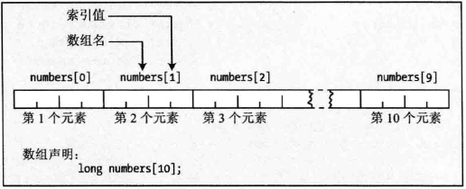

## 枚举 enum
在编程时，常常希望变量存储一组可能值中的一个，枚举就用于这种情形。利用枚举，可以定义一个新的整数类型，该类型变量的值域是指定的几个可能值。下面语句定义了一个枚举类型 Weekday
```
enum Weekday {
    Monday, Tuesday, Wednessday, 
    Thursday, Friday, Saturday, Sunday
};
```
可以给任意或者所有枚举器指定特定的整数值。尽管枚举器使用的名称必须唯一，但枚举器的值不要求是惟一的。未设定指定值的枚举器，其值为前一个的值 +1

## 结构体 struct
关键字 struct 能定义各种类型的变量集合，成为结构体，并把它们视为一个单元。下面是一个简单声明一个结构体 Horse 的例子：
```
struct Horse {
  int age;
  int height;
} silver = {
  27， 12
};
```
Horse 不是一个变量名，而是一个新的数据类型，定义了一个 Horse 类型的变量 silver 并进行初始化。上面的初始化方式需要将初始值以正确的顺序放在大括号中，也可以在初始化列表中指定成名名，如下：
```
struct Horse trigger = {
  .age = 22, .height = 30
};
```
可以只指定部分成员的值。

结构体内的变量成为成员或字段，通过成员访问运算符 . 访问，例如
```
silver.age = 12;
```
不一定要给结构体指定标记符名字，如下例子也是合法的，只不过再定义其他变量
```
struct {
  int age;
  int height;
} silver;
```
结构体也可以在结构体内部声明，以限制作用域，例如
```
struct Horse {
  struct Date {
    int day;
	int month;
	int year;
  } dob;
  int age;
  int height;
};
```

### 结构体中的位字段
位字段机制允许几个成员分别使用某种数据类型的几位，通常是 unsigned int 类型。例如
```
struct {
  unsigned int flag1 : 1;
  unsigned int flag2 : 1;
  unsigned int flag3 : 2;
  unsigned int flag4 : 3;
} indicators;
```

## 联合体
联合体和结构体类似，但是各个成员以共享的方式占用同一块内存，而不是像结构体一样各个成员独立占用一块内存。关键字 union 用于定义联合体。例如
```
union U_example {
  float decval;
  int* pnum;
  double my_value;
} ul;
```
联合体成员的访问方式和结构体成员完全相同，联合体对象所占的字节数是其最大的成员所占的空间。

## 数组
数组是一组数目固定、类型相同的数据项，数组中的数据项称为元素。



### 数组和地址
数组名称指定了存储数据项的内存区域地址，把该地址和索引值组合起来就可以找到每个元素，因为索引值表示各个元素与数组开头的偏移量。

### 数组的初始化
为了初始化数组的元素，只需要在声明语句中，在大括号中指定一列用逗号分开的初始值。
```
double values[3] = {1.1, 2.2, 3.3};
```
可以不指定所有的值，初始值从数组开始处存放，后面没有指定初始值的部分填充 0。

### 多维数组
多维数组可以用如下方式声明：
```
DataType val[DIM_1][DIM_2][...][DIM_N]
```
其中 DIM_1、DIM_2、DIM_N 指的是维度大小。

### 多维数组的初始化
多维数组初始化和一维数组初始化方式相似，只不过每一维的初始值都必须放在一对大括号中。

## 别名
C 语言提供 typedef 关键字，可以为某种类型定义（简单）的别名，例如：
```
typedef int INT;
typedef void VOID;
typedef unsigned int COUNTER;
```
上述枚举、结构体、联合体，都可以使用 typedef 定义简单的别名，比如：
```
typedef enmu ThisIsALongLongEnumTypeName {
    ...
} Name;

typedef struct ThisIsALongLongStructTypeName {
    ...
} ShortName;
```
也可以为数组定义别名
```
typedef int IntArray[10];
IntArray array
```