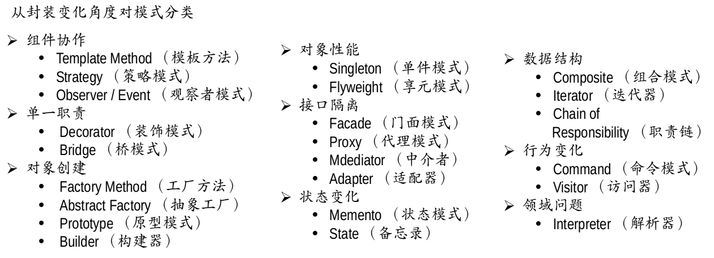

## 介绍
### 什么是设计模式
每一个模式描述了一个在我们周围不断重复发生的问题以及该问题的解决方案的核心。这样，你就能一次又一次地使用该方案而不必做重复劳动。

### GOF 设计模式
历史性著作《设计模式：可复用面向对象软件的基础》

### 从面向对象谈起
- 底层思维：向下，如何把握机器底层从微观理解对象构造
  - 语言构造
  - 编译转换
  - 内存模型
  - 运行时机制
- 抽象思维：向上，如何将我们的周围世界抽象为程序代码
  - 面向对象
  - 组件封装
  - 设计模式
  - 架构模式

### 深入理解面向对象
- 向下：深入理解三大面向对象机制
  - 封装，隐藏内部实现
  - 继承，复用现有代码
  - 多态，改写对象行为
- 向上：深刻把握面向对象机制多带来的抽象意义，理解如何使用这些机制来表达现实世界，掌握什么是“好的面向对象设计”。

### 如何解决复杂性
- 分解：分而治之
- 抽象：特殊到一般

### 重新认识面向对象
- 隔离变化
- 各司其职
- 对象是什么？
  - 封装了代码和数据
  - 一系列可被使用的公共接口
  - 某种拥有责任的抽象

### 面向对象设计原则（SOLID）
- 依赖倒置原则（DIP）
  - 高层模块（稳定）不依赖与低层模块（变化），二者都应该依赖于抽象（稳定）
  - 抽象（稳定）不应该依赖于实现细节（变化），实现细节应该依赖抽象（稳定）
- 开放封闭原则（OCP）
  - 对扩展开放，对更改封闭
  - 类模块应该是可扩展的，但是不可修改
- 单一职责原则（SRP）
  - 一个类应该仅有一个引起它变化的原因
  - 变化的方向隐含着类的责任
- Liskov 替换原则（LSP）
  - 子类必须能够替换他们的基类
  - 继承表达类型抽象
- 接口隔离原则（ISP）
  - 不应该强迫客户程序依赖他们不用的方法
  - 接口应该小而完备

### 从封装变化角度对模式分类
