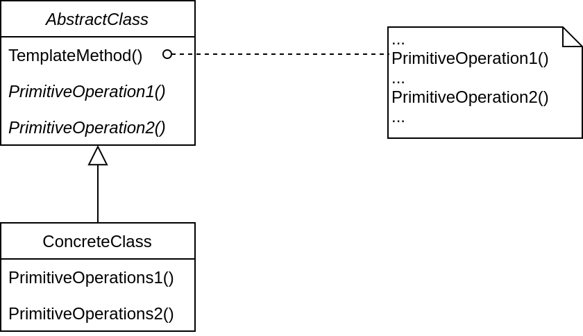

## Template Method
### 动机
在软件构建过程中，对于某一项任务，它常常有稳定的整体操作结构，但各个子步骤却有很多改变的需求，或者由于固有的原因（比如框架与应用之间的关系）而无法和任务的整体结构同时实现。

如何在确定稳定操作结构的前提下，来灵活应对各个子步骤的变化或者晚期实现需求？

### 定义
定义一个操作中的算法骨架（稳定），而将一些步骤延迟（变化）到子类中。Template Method 使得子类可以不改变（复用）一个算法的结构即可重定义（override 重写）该算法的某些特定的步骤。

### 结构
