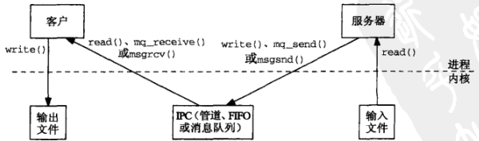
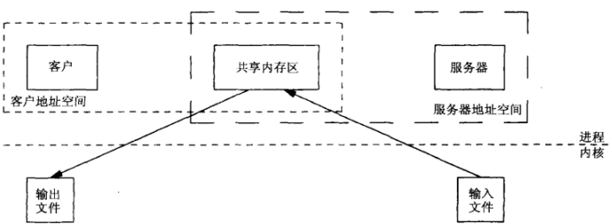
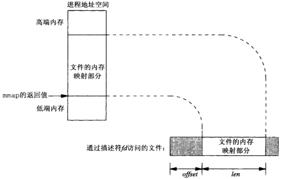

## 概述
共享内存区是可用 IPC 形式中最快的。一旦这样的内存区映射到共享它的进程的地址空间，这些进程间数据的传递就不再涉及内核（进程不再通过执行内核的系统调用来彼此传递数据）。然而往该共享内存区存放信息或从中取走信息的进程间需要同步。

考虑用来传递各种类型消息的一个实例客户-服务器文件复制程序中涉及的通常步骤
- 服务器从输入文件读。该文件的数据由内核读入自己的内存空间，然后从内核复制到服务器进程。
- 服务器往一个管道、FIFO 或消息队列以一条消息的形式写入这些数据。这些IPC形式通常需要把这些数据从进程复制到内核。
- 客户从该 IPC 通道读出这些数据。这通常需要把这些数据从内核复制到进程
- 最后，将这些数据从由 write() 函数的第二个参数指定的客户缓冲区复制到输出文件。



使用共享内存区的通常步骤
- 服务器使用（譬如说）一个信号量取得访问某个共享内存区对象的权力
- 服务器将数据从输入文件读入到该共享内存区对象
- 服务器读入完毕，使用一个信号量通知客户
- 客户将这些数据从该共享内存区对象写出到输出文件中



## mmap()、munmap() 和 msync() 函数
mmap() 函数把一个文件或一个 Posix 共享内存区对象映射到调用进程的地址空间。使用该函数有三个目的：
1. 使用普通文件以提供内存映射 IO
2. 使用特殊文件以提供匿名内存映射
3. 使用 shm_open() 以提供无亲缘关系进程间的 Posix 共享内存区
```
#include <sys/mman.h>
/* @param
 * addr：可以指定描述符 fd 应被映射到的进程内空间的起始地址。通常为 NULL，表示内核自己选择起始地址
 * len：映射到调用进程地址空间中的字节数，从被映射文件开头起第 offset 该字节处开始算
 * prot：内存映射区保护参数
 *    PROT_READ：数据可读
 *    PROT_WRITE：数据可写
 *    PROT_EXEC：数据可执行
 *    PROT_NONE：数据不可访问
 * flags：MAP_SHAPRED 或 MAP_PRIVATE 这两个标志必须指定一个，并可有选择地或上MAP_FIXED
 *    MAP_SHARED：变动是共享的，调用进程对被映射数据所作修改对于共享该对象的所有进程都可见（改变类其底层支撑对象）
 *    MAP_PRIVATE：变动是私有的，调用进程对被映射数据所作修改只对本进程可见（不改变类其底层支撑对象）
 *    MAP_FIXED：准确地解释 addr 参数
 * fd：描述符，成功后可以关闭
 * offset：偏移量，从这开始共享
 * return：成功返回被映射区的起始地址，出错返回 MAP_FAILED
 */
void *mmap(void *addr, size_t len, int prot, int flags, int fd, off_t offset);
```


为从某个进程的地址空间删除一个映射关系，可以调用 munmap() 
 ```
/* @param
 * addr：起始地址
 * len：映射区大小
 * return：成功返回0，失败返回-1
 */
int munmap(void *addr, size_t len);
```
再次访问以删除的映射地址将导致向调用进程产生一个 SIGSEGV 信号（假设以后的 mmap 调用不重用这部分地址空间）。如果被映射区是使用 MAP_PRIVATE 标志映射的，那么调用进程对它所作的变动都会被丢弃。如果是一个 MAP_SHARED 内存区，如果我们修改类处于内存映射到某个文件的内存区中某个位置的内容，那么内核将在稍后某个时刻相应地更新文件，也可以调用 msync() 来执行这种同步
```
#include <sys/mmap.h>
/* @param
 * addr：起始地址
 * len：映射区大小
 * flags：MS_ASYNC和MS_SYNC必须指定一个
 *    MS_ASYNC：执行异步写
 *    MS_SYNC：执行同步写
 *    MS_INVALIDATE：使告诉缓存的数据失效
 * return：成功返回0，失败返回-1
 */
int msync(void *addr, size_t len, int flags);
```
 MS_ASYNC 指示一旦写操作已由内核排入队列，立即返回，而 MS_SYNC 则要等到写操作完成后才返回。指定了 MS_INVALIDATE ，那么与其最终副本不一致的文件数据的所有内存中副本都失效，后续的引用将从文件中取得数据。

## 4.4BSD 匿名内存映射
- 4.4BSD 匿名内存映射，其办法是把 mmap() 的 flags 指定成 MAP_SHARED | MAP_ANON，把 fd 参数指定为-1。 offset 参数则被忽略。这样的内存区初始化为0
- SVR4 提供 /dev/zero 设备文件，我们 open() 它之后可在 mmap() 调用中使用得到的描述符，从该设备读时返回的字节全为0,写往该设备的任何字节则被丢弃
- Linux 都支持

## 访问内存映射的对象
内存映射一个普通文件时，内存中映射区的大小（mmap() 的第二个参数）通常等于该文件的大小，然而文件大小和内存映射区大小可以不同。
