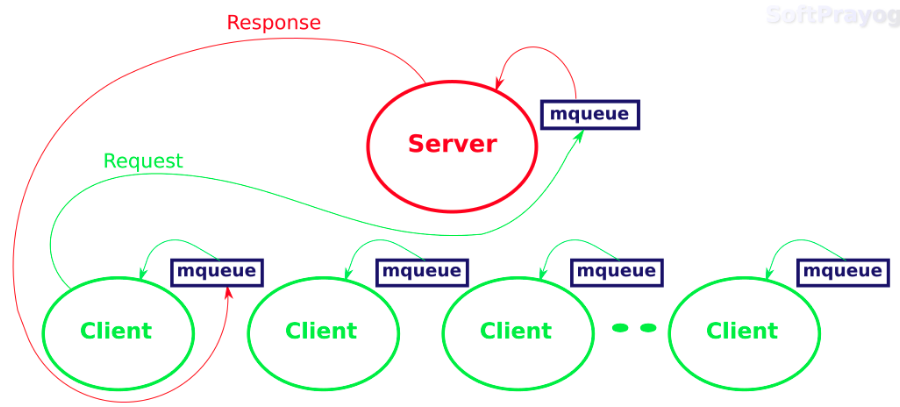
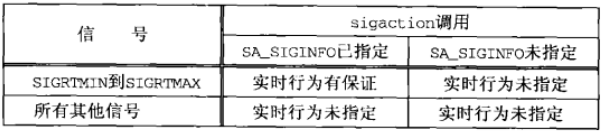

### mq_open()、mq_close() 和 mq_unlink() 函数
```
#include <bits/mqueue.h>
typedef int mqd_t;

struct mq_attr {     /* linux */
  long mq_flags;     /* message queue flags */
  long mq_maxmsg;    /* maximum number of messages */
  long mq_msgszie;   /* maximum message size */
  long mq_curmsgs;   /* number of messages currently queued */
  long __pad[4];
};

#include <fcntl.h>
#include <sys/stat.h>
#include <mqueue.h>
/* @param
 * name：消息队列名字
 * oflag：打开模式，是 O_RDONLY、O_WRONLY 或 O_RDWR 之一，可能按位或上 O_CREAT、O_EXCL 或 O_NONBLOCK
 * mode：如果创建，mode 值
 * attr：创建消息队列的属性，如果为空指针，使用默认属性
 * return：成功返回消息队列描述符，出错返回 -1
 */
mqd_t mq_open(const char *name, int oflag, ...
              /* mode_t mode, struct mq_attr *attr */);

int mq_close(mqd_t mqdes);

/** 删除消息队列
 * @param
 * name: 消息队列
 * return：成功返回 0，失败返回 -1
 */
int mq_unlink(const char *name);
```

### mq_getattr() 和 mq_setattr() 函数
```
#include <mqueue.h>
/* @param
 * mqdes：消息队列的描述符
 * attr：接收属性的 mq_attr 结构体变量指针
 * return：成功返回 0，失败返回 -1
 */
int mq_getattr(mqd_t mqdes, struct mq_attr *attr);

/* @param
 * mqdes：消息队列描述符
 * attr：目标属性值（只使用 mg_flags 的值）
 * oattr：保存原来属性值
 * return：成功返回 0，失败返回 -1
 */
int mq_setattr(mqd_t mqdes, const struct mq_attr *attr, struct mq_attr *oattr);
```

### mq_send() 和 mq_receive() 函数
```
#include <mqueue.h>
/* @param
 * mqdes：消息队列描述符
 * ptr：传送数据地址指针
 * len：传送数据长度
 *    不能小于能加到所指队列中的消息的最大大小，否则返回 EMSGSIZE 错误
 * prio：传送数据优先级
 *    必须小于 MQ_PRIO_MAX，0 表示不使用
 * return：成功返回 0，失败返回 -1
 */
int mq_send(mqd_t mqdes, const char *ptr, size_t len, unsigned int prio);

/* @param
 * mqdes：消息队列描述符
 * ptr：接收数据地址指针
 * len：传送数据长度
 *    不能小于能加到所指队列中的消息的最大大小，否则返回EMSGSIZE错误
 * prio：传送数据优先级
 *    必须小于 MQ_PRIO_MAX，NULL 表示不使用
 * return：成功返回传送数据的字节数，出错返回 -1
 */
ssize_t mq_receive(mqd_t mqdes, char *ptr, size_t len, unsigned int *priop);
```

### mqueue 客户/服务端例子


- client: `mqueue_client.c`
- server: `mqueue_server.c`

### 消息队列限制
- mq_maxmsg：队列中的最大消息数
- mq_msgsize：给定消息的最大字节数
- MQ_OPEN_MAX：一个进程能够同时打开的消息队列的最大数目
- MQ_PRIO_MAX：任意现已的最大优先级值加 1

### mq_notify() 函数
Posix 消息队列允许异步事件通知，以告知何时有一个消息放置到了某个空队列消息队列中，这种通知有两种方式供选择
- 产生一个信号
- 创建一个线程来执行一个指定的函数
```
#include <mqueue.h>
/* @param
 * mqdes：消息队列描述符
 * notification：
 * return：成功返回0，失败返回-1
 */
int mq_notify(mqd_t mqdes, const struct sigevent *notification);

#include <signal.h>
union sigval {
  int   sival_int;  /* integet value */
  void *sival_ptr;  /* pointer value */
};
struct sigevent {
  int              sigev_notify;  /* SIGEV_{NONE, SIGNAL, THREAD} */
  int              sigev_signo;   /* signal number if SIGEV_SIGNO */
  union sigval     sigev_value;   /* passed to signal handler or thread */
                                  /* following tow if SIG_THREAD */
  void           (*sigev_notify_function)(union sigval);
  pthread_attr_t  *sigev_notify_attributes
};
note: sigev_notify specifies how notification is to be performed.
    SIGEV_NONE: don't do anything when the event occurs.
    SIGEV_SIGNAL:Notify the process by sending the signal specified in sigev_signo.
    SIGEV_THREAD: Notify the process by invoking sigev_notify_function "as if" it were the start function of a new thread.
```
mq_notify() 函数说明
- 如果 notification 参数不为空，那么当前进程希望有一个消息到达指定的先前为空的队列时得到通知
- 如果 notification 参数为空指针，而且当前进程目前被注册为接收所指定队列的通知，那么已存在的注册将被撤销
- 任意时刻只有一个进程可以被注册为某个队列的通知
- 当有一个消息到达某个先前为空的队列，而且已有一个进程被注册为接收该队列的通知，只有在没有任何线程阻塞在该队列的 mq_receive() 调用的前提下，通知才会发出。也就是说，在 mq_receive() 调用中的阻塞比任何通知的注册都优先
- 当该通知被发送给它的注册进程时，其注册即被撤销。该进程必须再次调用mq_notify() 重新注册（如果必要）。

### 例子
- 简单的信号通知 `mqnotifysig1.c`
  - 当消息放置到某个空对列中，该程序产生一个 SIGUSR1 信号
  - 问题
    - 在信号处理程序中调用 mq_notify()、mq_receive() 和 printf() 函数，这些是非异步信号安全函数
- 信号通知 `mqnotifysig2.c`
  - 避免从信号处理程序调用任何函数的方法之一是：让处理程序仅仅设置一个全局标志，由某个线程检查该标志以确定何时接受到一个消息。
  - 通过调用 sigsuspend() 阻塞，以等待某个消息的到达。当有一个消息被放置到某个空队列中时，该信号产生，主线程被阻止，信号处理程序执行并设置 mqflag 变量，主线程再次执行，发现 mq_flag 为非零，于是读出该消息
  - 问题
    - 考虑一下第一个消息被读出之前有两个消息到达的情形（可以在调用 mq_notify() 前调用 sleep() 模拟）。这里的基本问题是，通知只是在一个消息没放置到某个空队列上时才发出。如果在能够读出第一个消息前有两个消息到达，那么只有一个通知被发出，只能读出第一个消息，并调用 sigsuspend() 等待另一个消息，而对应它的通知可能永远不会发出，在此期间，另一个消息放置于该队列中等待读取，而我们一致忽略它。
- 使用非阻塞 mq_receive() 的信号通知 `mqnotifysig3.c`
  - 当使用 mq_notify() 产生信号时，总是以非阻塞模式读取消息队列
  - 问题
    - 不够高效，处理器处于忙等（轮询查看队列里有没有数据）。
- 使用 sigwait() 代替信号处理程序的信号通知 `mqnotifysig4.c`
  - 更为简易（并且更为高效）的办法之一是阻塞在某个函数中，仅仅等待该信号的递交，而不是让内核执行一个只为设置一个标志的信号处理程序。 sigwait() 提供了这种能力
  ```
  #include <signal.h>
  /* @param
   * set：等待发生的信号集
   * sig：被递交信号的个数
   * return：成功返回0，失败返回正值，设置errno
   */
  int sigwait(const sigset_t *set, int *sig);
  ```
- 使用 select() 的Posix 消息队列 `mqnotifusig5.c`
  - 消息队列描述符（mqd_t 变量）不是“普通”描述符，它不能用在 select() 或 poll() 中
  - 可以伴随一个管道和 mq_notify() 函数使用他们（在信号处理函数中调用 write() 向管道写数据，select() 用来检测管道是否有数据可读）
- 启动线程 `mqnotifythread.c`
  - 异步事件通知的另一种方式是把 sig_notify 设置成 SIGEV_THREAD，这会创建一个新的线程。该线程调用由 sigev_notify_function 指定的函数，所用的参数由 sigev_value 指定。新线程的属性由 sigev_notify_attributes 指定，要是默认属性合适的化，它可以是一个空指针。

### Posix 实时信号
信号可以划分为两个大组
- 其值在 SIGRTMIN 和 SIGRTMAX 之间（包括两者）的实时信号。Posix 要求至少提供 RTSIG_MAX 这种实时信号，而该常值的最小值为 8
- 所有其他信号：SIGALRM、SIGINT、SIGKILL 等

接收某个信号的进程的 sigaction() 调用中是否指定了新的 SA_SIGINFO 标志会有实时行为差异



实时行为隐含如下特征
- 信号是排队的。也就是说产生几次，就提交几次。对于不排队的信号来说，产生了三次的某种信号可能只提交一次
- 当有多个 SIGRTMIN 到 SIGRTMAX 范围内的解阻塞信号排队时，值较小的信号先于值较大的信号递交。
- 当某个非实时信号递交时，传递给它的信号处理程序的唯一参数是该信号的值。实时信号比其他信号携带更多的信息。通过设置 SA_SIGINFO 标志（act.sa_falgs = SA_SIGINFO）安装的任意实时信号的信号处理函数声明如下：
  ```
  void func(int signo, siginfo_t *info, void *context);

  typedef struct {
    int          si_signo;  /* same value as signo argument */
    int          si_code;   /* SI_{USER, QUEUE, TIMER, ASYNCIO, MESGQ} */
    union sigval si_value;  /* interget or pointer from sender*/
  } siginfo_t;
  /**
   SI_USER：信号由 kill() 函数发出
   SI_QUEUE：信号由 sigqueue() 函数发出
   SI_TIMER：信号由 timer_settime() 函数设置的某个定时器的倒是发生
   SI_ASYNCIO：信号由某个异步 IO 请求的完成产生
   SI_MESGQ：信号在有一个消息被放置到某个空消息队列中时产生
   */
  ```

例子`rtsignal.c`

### 使用内存映射 IO 实现 Posix 消息队列