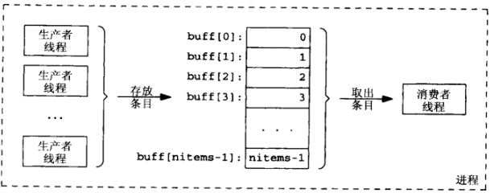

## 互斥锁：上锁与解锁
互斥锁指代相互排斥，用于保护临界区，以保证任何时刻只有一个线程（或进程）在执行其中的代码。
```
#include <pthread.h>
// 均返回：成功0，失败返回正数Exxx值
int pthread_mutex_lock(pthread_mutex_t *mptr);
int pthread_mutex_trylock(pthread_mutex_t *mptr);
int pthread_mutex_unlock(pthread_mutex_t *mptr);
```
如果尝试给一个已由某个线程锁住的互斥锁上锁，那么 pthread_mutex_lock() 将阻塞到该互斥锁解锁为止。pthread_mutex_trylock() 是对应的非阻塞函数，如果该互斥锁已锁住，它就返回 EBUSY 错误。

如果互斥锁变量是静态分配的，那么可以把它初始化成常值 PTHREAD_MUTEX_INITIALIZER。如果是动态分配的（例如调用 malloc() 函数），必须在运行时之前调用 pthread_mutex_init() 函数初始化

## 生产者和消费者问题 `mutex_prodcons1.c`
生产者产生所有数据之后，消费者开始启动



## 对比上锁与等待 `mutex_prodcons2.c`
生产者和消费者并发执行，采用轮询的方式查看某个数据是否有生产者生成

## 条件变量：等待与信号发送 `mutex_prodcons3.c`
条件变量用于等待。每个条件变量总是有一个互斥锁与之关联。

如果条件变量是静态分配的，那么可以把它初始化成常值 PTHREAD_COND_INITIALIZER ，如果是动态分配的（例如调用 malloc() 函数），必须在运行时之前调用 pthread_cond_init() 函数初始化
```
#include <pthread.h>
/* @brief
 * 会先解除 *mptr，然后阻塞在等待对列里，直到再次被唤醒。唤醒后，该进程会先锁定 *mptr，再读取资源
 * @param
 * cptr：条件变量指针
 * mptr：互斥锁指针
 * return：成功返回 0，失败返回为正的 Exxx值
 */
int pthread_cond_wait(pthread_cond_t *cptr, pthread_mutex_t *mptr);

/* @param
 * cptr：条件变量指针
 * return：成功返回 0，失败返回为正的 Exxx 值
 */
int pthread_cond_signal(pthread_cond_t *cptr);
```
总的来说，给条件变量发送信号的代码大体如下：
```
struct {
  pthread_mutex_t mutex;
  pthread_cond_t cond;
  whatever variables maintain the condition
} var = { PTHREAD_MUTEX_INITIALIZER, PTHREAD_COND_INITIALIZER, ... };

pthread_mutex_lock(&var.mutex);
set condition true;
pthread_cond_signal(&val.cond); // 上锁冲突，即使唤醒，不能获取 var.mutex，不能运行
pthread_mutex_unlock(&var.mutex);
```
测试条件并进入睡眠以等待该条件变为真的代码如下：
```
pthread_mutex_lock(&var.mutex);
while(condtion is false)
  pthread_cond_wait(&var.cond, &var.mutex); // 先解除 mutex，让权等待
modify condition;
pthread_mutex_unlock(&var.mutex);
```
避免上锁冲突
```
int dosignal;
pthread_mutex_lock(&nready.mutex);
dosignal = (nready.nready == 0);
nready.nready++;
pthread_mutex_unlock(&nready.mutex);

if(dosignal)
  pthread_cond_signal(&nready.cond);
```

## 条件变量：定时等待和广播
通常 pthread_cond_signal() 只唤醒等待在相应条件变量上的一个线程。在某些情况下一个线程认定有多个其他线程应被唤醒，这时可调用 pthread_cond_broadcast() 唤醒阻塞在相应条件变量上的所有线程。
```
#include <pthread.h>
/* @param
 * cptr：条件变量
 * return：成功返回 0，失败返回为正的 Exxx 值
 */
int pthread_cond_broadcast(pthread_cond_t *cptr);

/* @param
 * cptr：条件变量
 * mptr：互斥变量
 * abstime：绝对时间，UTC 时间 1970 年 1 月 1 日以来流逝的秒数和纳秒数
 * return：成功返回 0，失败返回为正的 Exxx 值
 */
int pthread_cond_timedwait(pthread_cond_t *cptr, pthread_mutex_t *mptr, const struct timespec *abstime);

struct timespect {
  time_t tv_sec;  /* seconds */
  long   tv_nsec; /* nanoseconds */
}
```

## 互斥锁和条件变量的属性
互斥锁和条件变量是用以下函数初始化或摧毁的
```
#include <pthread.h>
/** 
 * mptr 和cptr 必须指向已分配的 pthread_mutex_t 或 pthread_cond_t 变量
 * attr 指向属性变量，如果为 NULL，使用默认属性
 * 均返回：成功返回 0，失败返回为正的 Exxx 值
 */
int pthread_mutex_init(pthread_mutex_t *mptr, const pthread_mutextattr_t *attr);
int pthread_mutex_destroy(pthread_mutex_t *mptr);
int pthread_cond_init(pthread_cond_t *cptr, const pthread_condarrt_t *attr);
int pthread_cond_destroy(pthread_cond_t *cptr);
```
互斥锁属性的数据类型为 pthread_mutexattr_t，条件变量属性的数据类型为 pthread_condattr_t，它们由以下函数初始化或摧毁
```
#include <pthread.h>
/**
* 均返回：成功返回 0，失败返回为正的 Exxx 值
*/
int pthread_mutexattr_init(pthread_mutexattr_t *attr);
int pthread_mutexattr_destroy(pthread_mutexattr_t *attr);
int pthread_condattr_init(pthread_condattr_t *attr);
int pthread_condattr_destroy(pthread_condattr_t *attr);
```
一旦某个互斥锁属性对象或某个条件变量属性对象被初始化，就通过调用不同函数启用或禁止特定的属性。举例来说，我们将在以后各章中使用的一个属性是：指定互斥锁或条件变量在不同进程间共享，而不是只在单个进程内的不同线程间共享。这个属性是用以下函数取得或存入的
```
#include <pthread.h>
/**
* value的值可以是
*     PTHREAD_PROCESS_PRIVATE：进程的线程间共享
*     PTHREAD_PROCESS_SHARED：进程间共享
* 均返回：成功返回0，失败返回为正的Exxx值
*/
int pthread_mutexattr_getpshared(const pthread_mutexattr_t *attr, int *valptr);
int pthread_mutexattr_setpshared(const pthread_mutexattr_t *attr, int value);
int pthread_condattr_getpshared(const pthread_condattr_t *attr, int *valptr);
int pthread_condattr_setpshared(const pthread_condattr_t *attr, int value);
```

## 持有锁期间进程终止
- 进程终止时系统不会自动释放持有的互斥锁、读写锁和 Posix 信号量，进程终止时内核总是自动清理的唯一同步锁类型是 fcntl 记录锁。使用 System V 信号量时，应用程序可以选择进程终止时内核是否自动清理某个信号量锁
- 一个线程也可以在持有某个互斥锁期间终止，自己调用 pthread_exit() 或被另一个线程取消。如果线程调用 pthread_exit() 资源终止时，这时它应该知道自己还持有一个互斥锁(对于程序员来说)，如果是被另一个线程取消的情况，线程可以安装清除处理程序 pthread_cleanup_push()，在被取消时调用来释放相应的锁。
- 对于线程意外操作导致进程终止的情况，就和进程终止时相同。
