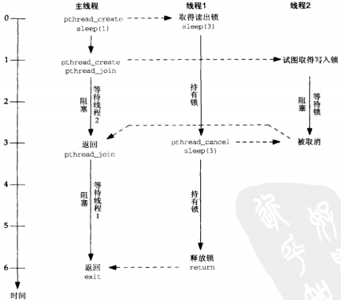

## 概述
读写锁分配规则
- 只要没有线程持有某个给定的读写锁用于写，那么任意数目的线程可以持有该读写锁用于读
- 仅当没有线程持有某个给定的读写锁用于读或用于写时，才能分配该读写锁用于写

某些应用中读数据比修改数据频繁，这些应用可以从改用读写锁代替互斥锁中获益

## 获取与释放读写锁
读写锁的数据类型为 pthread_rwlock_t 。如果这个类型的某个变量是静态分配的，那么可以通过给它赋常值 PTHREAD_RWLOCK_INITIALIZER 来初始化它
```
#include <pthread.h>
/**
 * pthread_rwlock_rdlock() 获取一个读出锁，如果锁被某个写入者持有，
                        就阻塞调用线程
 * pthread_rwlock_wrlock() 获取一个写入锁，如果锁被某个写入者持有，
                        或者由一个或多个读出者持有就阻塞调用线程
 * pthread_rwlock_unlock() 是否一个读出锁或写入锁
 * 均返回：成功返回 0，失败返回为正的 Exxx 值
 */
int pthread_rwlock_rdlock(pthread_rwlock_t *rwptr);
int pthread_rwlock_wrlock(pthread_rwlock_t *rwptr);
int pthread_rwlock_unlock(pthread_rwlock_t *rwptr);
```
下面两个函数尝试获取一个读出锁或写入锁，但是如果该锁不能马上取得，那么就返回一个EBUSY 错误
```
#include <pthread.h>
/* 均返回：成功返回 0，失败返回为正的 Exxx 值 */
int pthread_rwlock_tryrdlock(pthread_rwlock_t *rwptr);
int pthread_rwlock_trywrlock(pthread_rwlock_t *rwptr);
```

## 读写锁属性
可以通过给静态分配的读写锁赋常值 PTHREAD_RWLOCK_INITIALIZER 来初始化它。读写锁也可以通过调用 pthread_rwlock_init() 来动态初始化。当一个线程不再需要某个读写锁时，可以调用 pthread_rwlock_destroy() 摧毁它
```
#include <pthread.h>
/** 
 * rwptr 必须指向已分配的 pthread_rwlock_t 变量
 * attr 指向属性变量，如果为 NULL，使用默认属性
 * 均返回：成功返回 0，失败返回为正的 Exxx 值
 */
int pthread_rwlock_init(pthread_rwlock_t *rwptr, const pthread_rwlockattr_t *attr);
int pthread_rwlock_destroy(pthread_rwlock_t *rwptr);


```
数据类型为 pthread_rwlockarrt_t 的某个属性对象一旦初始化，就通过调用不同的函数来启动或禁止特定属性。
```
#include <pthread.h>
/**
* value的值可以是
*     PTHREAD_PROCESS_PRIVATE：进程的线程间共享
*     PTHREAD_PROCESS_SHARED：进程间共享
* 均返回：成功返回 0，失败返回为正的 Exxx 值
*/
int pthread_rwlockattr_getpshared(const pthread_rwlockattr_t *attr, int *valptr);
int pthread_rwlockattr_setpshared(pthread_rwlockattr_t *attr, int value);
```

## 使用互斥锁和条件变量实现读写锁

## 线程取消
通过对方调用函数 pthread_cancel()，一个线程可以被同一进程内的任何其他线程所取消
```
#include <pthread.h>
/**
 * function sends a cancellation request to the thread thread. 
 * Whether and when the target thread reacts to the cancellation
 * request depends on two attributes that are under the control
 * of that thread: its cancelability state and type.
 *
 * A thread's cancelability state, determined by pthread_setcancelstate, 
 * can be enabled (the default for new threads) or disabled. 
 *
 * A thread's cancellation type, determined by pthread_setcanceltype,
 * may be either asynchronous or deferred (the default for new threads).
 */
int pthread_cancel(pthread_t tid); /* 成功返回 0，失败返回为正的 Exxx 值 */

/* @param
 * state：可能的值
 *    PTHREAD_CANCEL_ENBALE：默认，响应取消请求
 *    PTHREAD_CANCEL_DISABLE：阻塞取消请求，直到可以取消
 * oldstate：返回旧状态
 * return：成功返回0，失败返回为正的Exxx值
 */
int pthread_setcancelstate(int state, int *oldstate);

/* @param
 * type：可能的值
 *    PTHREAD_CANCEL_DEFERRED：默认类型，取消请求被推迟，直到线程接下来调用作为取消点的函数
 *    PTHREAD_CANCEL_ASYNCHRONOUS：线程可以随时取消（通常，它会在收到取消请求后立即取消，但系统不保证这一点。）
 * oldtype：返回旧的类型
 * return：成功返回 0，失败返回为正的 Exxx 值
 */
int pthread_setcanceltype(int type, int *oldtype);
```
为了处理被取消的可能情况，任何线程可以安装（压入）和删除（弹出）清理程序
```
#include <pthread.h>
/* @param
 * function：线程被取消时调用函数的地址
 * arg：function所指函数的单个参数
 */
void pthread_cleanup_push(void (*function)(void *), void *arg);

/* @param
 * 总是删除调用线程的取消清理栈中位于栈顶的函数，而且如果 execute 不为0，那就调用该函数
 */
void pthread_cleanup_pop(int execute);
```

例子

