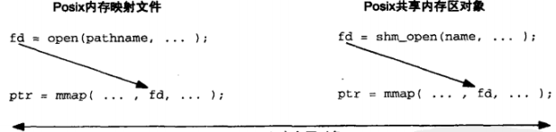

## 概述
Posix.1 提供了两种在无亲缘关系进程间共享内存区的方法
- 内存映射文件：由 open() 函数打开，由 mmap() 函数把得到的描述符映射到当前进程地中空间的一个文件
- 共享内存区对象：由 shm_open() 打开一个 Posix.1 IPC 名字（也许是在文件系统中的一个路径名），所返回的描述符由 mmap() 函数映射到当前进程的地址空间



## shm_open() 和 shm_unlink() 函数
```
#include <sys/mman.h>
/* @param
 * name：名字
 * oflag：必须或者含有 O_RDONLY，或者含有 O_RDWR，还可以指定 O_CREAT、O_EXCL 或 O_TRUNC
 * mode：权限位，在指定了 O_CREAT 标志时有效，如果没有 O_CREAT，可以指定为 0
 * return：成功返回非负描述符，失败返回 -1
 */
int shm_open(const char *name, int oflag, mode_t mode);

/* @brief
 * 删除一个共享内存区对象的名字
 * return：成功返回 0，失败返回 -1*/
int shm_unlink(const char *name);
```

## ftruncate() 和 fstat() 函数
处理 mmap() 的时候，普通文件或共享内存区对象的大小都可以通过调用 ftruncate() 修改
```
#include <unistd.h>
int ftruncate(int fd, off_t length);
```
Posix就该函数对普通文件和共享内存区对象的处理的定义稍有不同
- 对于一个普通文件：
  - 如果该文件的大小大于 length 参数，额外的数据就丢弃掉。
  - 如果该文件的大小小于 length 参数，那么该文件是否修改以及其大小是否增长是未加说明的。实际上对于一个普通文件，把它的大小扩展到 length 字节的可移植方法是：先 lseek 到偏移为 length-1 处，然后写 1个字节的数据。所幸的是几乎所有 UNIX 实现都支持使用 ftruncate() 扩展一个文件。
- 对于一个共享内存区对象：ftruncate() 把该对象的大小设置成 length 字节

当打开一个已存在的普通文件或共享内存区对象时，可以调用 fstat() 来获取有关该对象的信息
```
#include <sys/types.h>
#include <sys/stat.h>
int fstat(int fd, struct stat *buf);

struct stat {
  dev_t     st_dev;         /* ID of device containing file */
  ino_t     st_ino;         /* Inode number */
  mode_t    st_mode;        /* File type and mode */
  nlink_t   st_nlink;       /* Number of hard links */
  uid_t     st_uid;         /* User ID of owner */
  gid_t     st_gid;         /* Group ID of owner */
  dev_t     st_rdev;        /* Device ID (if special file) */
  off_t     st_size;        /* Total size, in bytes */
  blksize_t st_blksize;     /* Block size for filesystem I/O */
  blkcnt_t  st_blocks;
  struct timespec st_atim;  /* Time of last access */
  struct timespec st_mtim;  /* Time of last modification */
  struct timespec st_ctim;  /* Time of last status change */
};
```
当 fd 指代一个共享内存区对象时，只有 st_mode 、 st_uid 、 st_gid 和 st_size 有信息