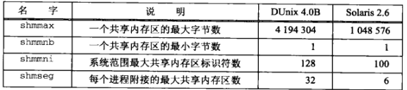

## 概述
System V 共享内存区在概念上类似于 Posix 共享内存区。不同的是先调用 shmget()，再调用 shmat()。

对于每个共享内存区，内核维护如下信息结构：
```
#include <sys/shm.h>
struct shmid_ds {
  struct ipc_perm  shm_perm;    /* operation permission struct */
  size_t           shm_segsz;   /* segment size */
  pid_t            shm_lpid;    /* pid of last operation */
  pid_t            shm_cpid;    /* pid of creator */
  shmatt_t         shm_nattch;  /* current # attached */
  shmatt_t         shm_cnattch; /* in-core # attached */
  time_t           shm_atime;   /* last attach time */
  time_t           shm_dtime;   /* last detach time */
  time_t           shm_ctime;   /* last change time of this structure */
};
```

## shmget() 函数
shmget() 函数创建一个新的共享内存区，或者访问一个已存在的共享内存区
```
#include <sys/shm.h>
/* @param
 * key：ftok() 返回值
 * size：共享内存区大小（字节），访问操作指定 0
 * oflag：读写权限。它可以与 IPC_CREATE 或 IPC_CREATE|IPC_EXCL 按位或
 * return：成功返回共享内存区标识符，失败返回 -1
 */
int shmget(key_t key, size_t size, int oflag);
```

## shmat() 函数
shmat() 函数将 shmget() 创建或打开的一个共享区附接到调用进程的地址空间
```
#include <sys/shm.h>
/* @param
 * shmid：共享内存标识符
 * shmaddr：地址
 * flag：权限标志，默认读写权限，可以指定 SHM_RDONLY 表示只读访问
 * return：成功返回映射区的起始地址，失败返回 (void *)-1 
 */
void *shmat(int shmid, const void *shmaddr, int flag);
```
返回地址的规则
- 如果 shmaddr 是一个空指针，那么系统替调用者选择地址（优选方案）
- 如果 shmaddr 是一个非空指针，那么返回地址取决于调用者是否给 flag 指定了 SHM_RND 值：
  - 如果没有指定 SHM_RND，那么相应的共享内存区附接到由 shmaddr 参数指定的地址
  - 如果指定类 SHM_RND，那么相应的共享内存区附接到由 shmaddr 参数指定的地址向下舍入一个 SHMLBA 常值。LBA 代表低端边界地址（lower boundary address）

## shmdt() 函数
当一个进程完成某个共享内存区的使用时，它可调用 shmdt() 断接这个内存区
```
#include <sys/shm.h>
int shmdt(const void *shmaddr); /* 成功返回 -1，失败返回 0 */
```

## shmctl() 函数
```
#incude <sys/shm.h>
/* @param
 * shmid：共享内存区标识符
 * cmd：命令
 * buff：值-结果传递
 * return：成功返回0，失败返回-1
 */
int shmctl(int shmid, int cmd, struct shmid_ds *buff);
```
该函数提供了三个命令
- IPC_RMID：从系统中删除由 shmid 表示的共享区并拆除它（只有在最后一个进程分离该段之后，即 shm_nattch 成员为零时,才会销毁该段）
- IPC_SET：给所指定的共享内存区设置其 shmid_ds 的以下三个成员： shm_perm.uid、shm_perm.gid 和 shm_perm.mode，它们的值来自 buff。shm_ctime 的值也用当前时间替换
- IPC_STAT：（通过 buff 参数）向调用者返回所指定 gentian 内存区的 shmid_ds 结构

## 共享内存区限制


## P1、使用内存映射 IO 实现 Posix 消息队列
提供一个使用内存映射 IO 以及 Posix 互斥锁和条件变量完成的 Posix 消息队列的实现

