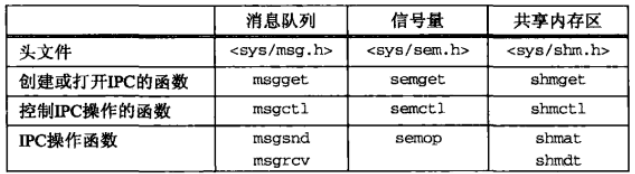
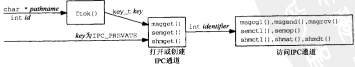
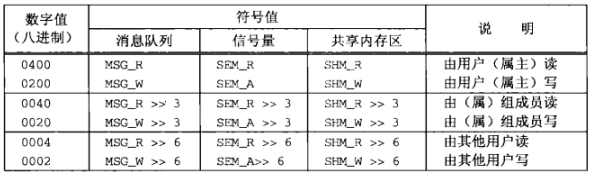

## 概述
以下三种类型的 IPC合称为 System V IPC
- System V 消息队列
- System V 信号量
- System V 共享内存区

System V IPC 函数



## key_t 键和 ftok() 函数
三种类型的System V IPC 使用 key_t 值作为它们的名字
```
#include <sys/ipc.h>
key_t ftok(const char *pathname, int id); // 出错返回 -1
```

## 创建与打开 IPC


- 调用ftok()，给它传递 pathname 和 id
- 指定 key 为 IPC_PRIVATE，这将保证会创建一个新的、唯一的 IPC 对象

## IPC 权限
