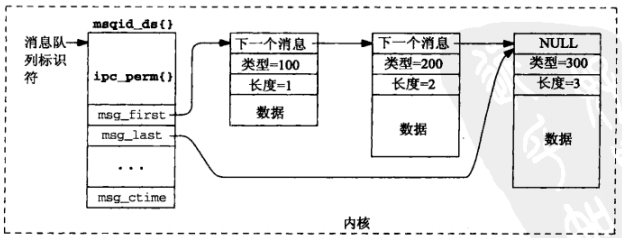
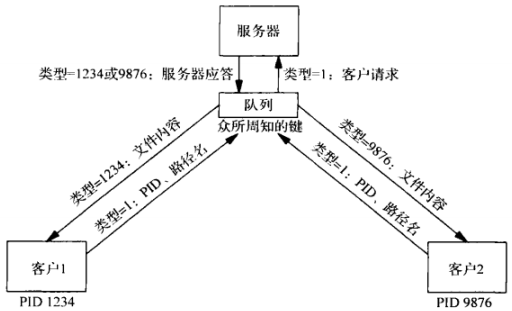
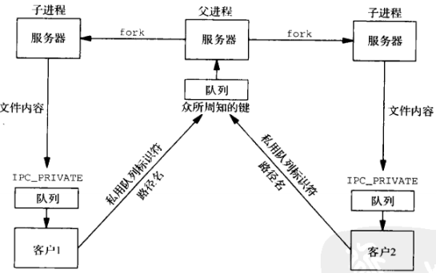
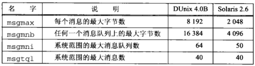

## 概述
System V 消息队列使用**消息队列标识符**表示。具有足够特权的进程可以向一个给定队列里读取数据。
```

消息队列结构
#include <sys/msg.h>
struct msqid_ds {
  struct ipc_perm  msg_perm;    /* read_write permissions */
  struct msg      *msg_first;   /* ptr to first message on queue */
  struct msg      *msg_last;    /* ptr to last message on queue */
  msglen_t         msg_cbytes;  /* current # bytes on queue */
  msgqnum_t        msg_qnum;    /* current # of mseeages on queue */
  msglen_t         msg_qbytes;  /* max # of bytes allowed on queue */
  pid_t            msg_lspid;   /* pid of last msgsnd() */
  pid_t            msg_lrpid;   /* pid of last msgrcv() */
  time_t           msg_stime;   /* time of last msgsnd() */
  time_t           msg_rtime;   /* time of last msgrcv() */
  time_t           msg_ctime;   /* time of last msgctl() */
};
```


## msgget() 函数
用于创建一个新的消息队列或访问一个已存在的消息队列
```
#include <sys/msg.h>
/* @param 
 * key：既可以是 ftok() 的返回值，也可以是 IPC_PRIVATE 常值
 * oflag：读写权限值的组合
 * return：成功返回非负标识符，失败返回 -1
 */
int msgget(key_t key, int oflag);
```

当创建一个新消息队列时， msdid_ds 结构的如下成员被初始化：
- msg_perm 结构的 uid 和 cuid 成员被设置成当前进程的有效用户 ID， gid 和 cgid 成员被设置为当前进程的有效组ID
- oflag 的读写权限位存放在 msg_perm.mode 中
- msg_qnum、msg_lspid、msg_lrpid、msg_stime 和 msg_rtime 被设置为0
- msg_ctime 被设置成当前时间
- msg_qbytes 被设置成系统限制值

## msgsnd() 函数
```
#include <sys/msg.h>
/* @param
 * msqid：标识符
 * ptr：struct msgbuf 结构指针
 * length：消息长度，字节数
 * flag：既可以是 0，也可以是 IPC_NOWIAT（非阻塞）
 * return：成功返回 0，失败返回 -1
 */
int msgsnd(int msqid, const void *ptr, size_t length, int flag);

struct msgbuf {
  long mtype;    /* message type, must be > 0 */
  char mtext[1]; /* message data */
};
```

##  msgrcv() 函数
```
#include <sys/msg.h>
/* @param
 * msqid：标识符
 * ptr：接收消息的存放位置
 * length：ptr 指向的缓冲区中数据部分的大小
 * type：指定希望从给定的队列中读出什么样的消息
 *    0：返回队列中的第一个消息
 *    >0：返回其类型值为 type 的第一个消息
 *    <0：返回其类型值小于或等于 type 参数的结对值的消息中类型值最小的第一个消息
 * flag：指定所请求的消息不在所指定的队列中时该做如何处理
 *    0：阻塞，直到下列某个事件发生为止：
 *        （1）有一个所请求类型的消息可读
 *        （2）由msqid标识的消息队列从系统删除（此时返回 EIDRM 错误）
 *        （3）调用线程被某个捕获的信号所中断（此时返回 EINTR 错误）
 *    IPC_NOWAIT：立即返回一个 ENOMSG 错误
 *    MSG_NOERROR：消息大于 length 时直接截断（没有设置就返回 E2BIG 错误）
 * return：成功返回读取的字节数，是否返回 -1
 */
ssize_t msgrcv(int msqid, void *ptr, size_t length, long type, int flag);
```

##  msgctl() 函数
```
#include <sys/msg.h>
/* @param
 * msqid：标识符
 * cmd：控制操作命令
 * buff：值-结果传递
 * return：成功返回0，出错返回-1
 */
int msgctl(int msqid, int cmd, struct msqid_ds *buff);
```
 msgctl() 函数提供 3 个命令
- IPC_RMID：从系统中删除由 mqsid 指定的消息队列。当前在该队列上的任何消息都被丢弃，第三个参数被忽略
- IPC_SET：给指定的消息队列设置其msgid_ds结构的以下4个成员 msg_perm.uid、msg_perm.gid、msg_perm.mode 和 msg_qbytes。它们的值来自有 buff 参数指向的结构中的相应成员
- IPC_STAT：（通过 buff 参数）给调用者返回当前 msqid_ds 结构
  
## 复用消息
与一个队列中的每个消息相关联的类型字段 msgbuf.mtype 提供了两个特性
- 类型字段可用于标识消息，从而允许多个进程在单个队列上复用消息
- 类型字段可用作优先级字段
  
例子：每个应用一个队列



例子：每个客户一个队列



## 消息队列的限制
