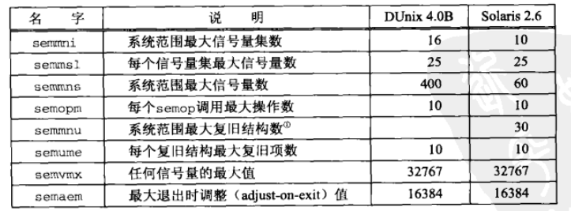

### 概述
- 二值信号量
- 计数信号量
- 计数信号量集

当我们在谈论“System V 信号量”时，所指的是计数信号量集，当我们在谈论“Posix信号量”时，所指的是单个计数信号量。

对于系统中的每个信号量集，内核维护一个如下的信息结构
```
#include <sys/sem.h>
struct semid_ds {
  struct ipc_perm  sem_perm;  /* operation permission struct */
  struct sem      *sem_base;  /* ptr to array of semaphores in set */
  ushort           sem_nsems; /* # of semaphores in set */
  time_t           sem_otime; /* time of last semop() */
  time_t           sem_ctime; /* time of creation or last IPC_SET */
};
struct sem {
  ushort           semval;    /* semaphore value, nonnegative */
  short            sempid;    /* PID of last sucessful semop() SETVAL, SETALL */
  ushort_t         semncnt;   /* # awaiting semval > current value */
  ushort_t         semzcnt;   /* # awaiting semval = 0 */
};
```

###  semget() 函数
semget() 函数创建一个信号量集或访问一个已存在的信号量集
```
#include <sys/sem.h>
/* @param
 * key：ftok返回的值
 * nsems：指定集合中的信号量数。如果只是访问，指定为0
 * oflag：权限位
 * return：成功则返回为非负标识符，出错则返回-1
 */
int semget(key_t key, int nsems, int oflag);
```
oflag 值是 SEM_R 和 SEM_A 常值的组合。其中 R 代表读（read）， A 代表改变（alter）。它们还可以与 IPC_CREAT 或 IPC_CREAT | IPC_EXCL 按位或

当实际操作为创建一个新的信号量集时，相应的 semid_ds 结构的以下成员被初始化
- sem_perm 结构的 uid 和 cuid 成员被置为调用进程的有效用户ID， gip 和 cgid 成员被置为调用进程的有效组ID
- oflag 参数中的读写权限位存入 sem_perm.mode 
- sem_otime 被置0， sem_otime 则被置为当前时间
- sem_nsems 被设置为 nsems 参数的值
- 与该集合中每个信号量关联的各个 sem 结构并不初始化，这些结构是在一 SETVAL 或 SETALL 命令调用 semctl() 时初始化的

### semop() 函数
使用 semget() 函数打开一个信号量集后，对其中一个或多个信号量的操作就是用 semop() 函数来执行
```
#include <sys/sem.h>
/* @param
 * semid：标识符，semget() 返回
 * opsptr：指向 sembuf 结构数组的指针
 * nops：sembuf 结构数组长度
 * return：成功返回 0，失败返回-1
 */
int semop(int semid, struct sembuf *opsptr, size_t nops);

struct sembuf {
  short sem_num; /* semaphore number: 0, 1, ... nsems-1 */
  short sem_op;  /* semaphore opeartion <0, 0, >0 */
  short sem_flg; /* operation flags: 0, IPC_NOWAIT, SEM_UNDO */
};
```
由内核保证传递给 semop() 函数的操作数组（opsptr）被原子地执行。

semop 的操作
- 如果 sem_op 是正数，其值就加到 semval 上，这对应于释放由某个信号量控制的资源。如果指定了 SEM_UNDO 标志，那就从相应信号量的 semadj （由内核为在其某个信号量操作中指定了 SEM_UNDO 标志的各个进程维护，不必存在名为 semadj 的结构成员）中减掉 sem_op 的值。
- 如果 sem_op 是0，那么调用者希望等待到 semval 变为0。如果 semval 已经是0，那就立即返回。如果 semval 不为0，相应信号量的 semzcnt 值就加1，调用线程则被阻塞到 semval 变为0（到那时，相应信号量的 semzcnt 值再减1）；如果某个被捕获的信号中断了引起睡眠的 semop() 函数，或者相应的信号量被删除了，那么该函数将过早地返回一个错误。如果指定了 IPC_NOWAIT 标志，调用线程就不会被阻塞，不能完成就返回 EAGAIN 错误。
- 如果 sem_op 是负数，那么调用者希望等待 semval 变为大于或等于 sem_op 的绝对值。这对应于分配资源。如果 semval 大于或等于 sem_op 的绝对值，那就从 semval 中减掉 sem_op 的绝对值。如果指定了 SEM_UNDO 标志，那么 sem_op 的绝对值就加到相应信号量的 semadj 上。如果 semval 小于 sem_op 的绝对值，相应信号量的 semncnt 值就加1，调用线程被阻塞到 semval 变为大于或等于 sem_op 的绝对值。到那时该线程被阻塞，还将从 semval 中减掉 sem_op 的绝对值，相应信号量的 semncnt 值将减1。如果指定了 SEM_UNDO 标志，那么 sem_op 的绝对值就加到相应信号量的 semadj 上。如果指定了 IPC_NOWAIT 标志，调用线程就不会被阻塞，不能完成就返回 EAGAIN 错误。或者如果某个被捕获的信号中断了引起睡眠的 semop() 函数，或者相应的信号量被删除了，那么该函数将过早地返回一个错误。

### semctl() 函数
```
#include <sys/sem.h>
/* @param
 * semid：标识其操作待控制的信号量集
 * semnum：表示该信号量集内的某个成员（0, 1, ..., nsems-1）
 * cmd：命令
 * return：成功返回非负值（根据命令不同），出错返回-1
 * arg：可选参数，取决与第三个参数cmd
 */
int semctl(int semid, int semnum, int cmd, ... /* union semun arg*/);

union semun { // 必须由应用程序声明
  int              val;   /* used for SETVAL only */  
  struct semid_ds *buf;   /* used for IPC_SET and IPC_STAT */
  ushort          *array; /* used for GETALL and SETALL */
}
```
System V支持下列 cmd 值，除非另外声明，否则成功返回0，失败返回-1
-  GETVAL ：把 semval 的当前值作为函数返回值
-  SETVAL ：把 semval 值设置为 arg.val 。如果操作成功，那么相应信号量在所有进程中的信号量调整值（ semadj ）被置为0
-  GETPID ：把 sempid 的当前值作为函数返回值
-  GETZCNT ：把 semzcnt 的当前值作为函数返回值
-  GETALL ：通过 arg.array 返回指定信号量集内每个成员的 semval 值。 arg.array 必须指向 unsigned short 数组并且足够大（能够容纳所有 semval 的值）
-  SETALL ：设置所指定信号量集中每个成员的 semval 值。这些值是通过 arg.array 指针指定
-  IPC_RMID ：把 semid 指定的信号量集从系统中删除掉
-  IPC_SET ：设置所指定信号量集的 semid_ds 结构中的 sem_perm.uid 、 sem_perm.gid 和 sem_perm.mode ，这些值由 arg.buf 指定。 semid_ds 结构中 sem_ctime 也被设置成当前时间
-  IPC_STAT ：通过 arg.buf （指向已分配空间）返回所指定信号量集当前的 semid_ds 结构

### 信号量限制
