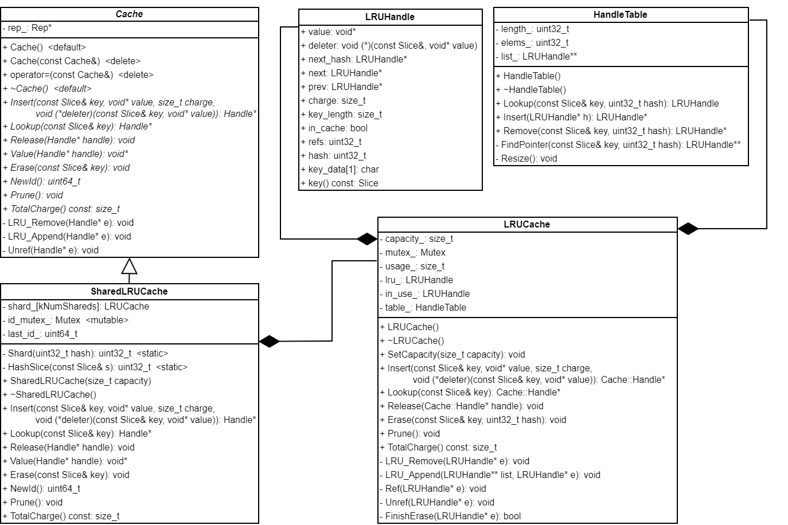
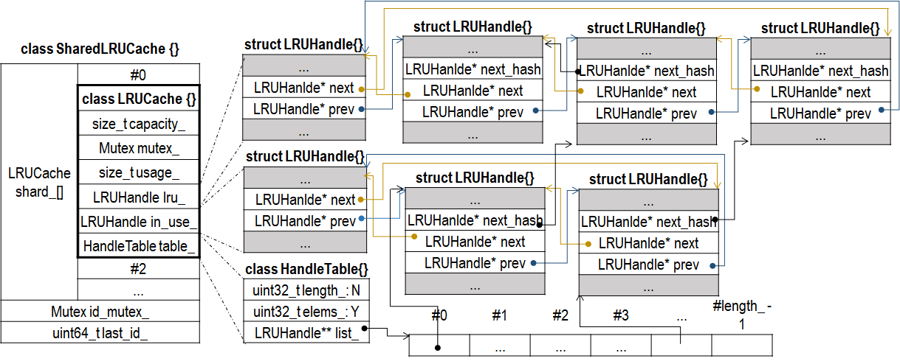
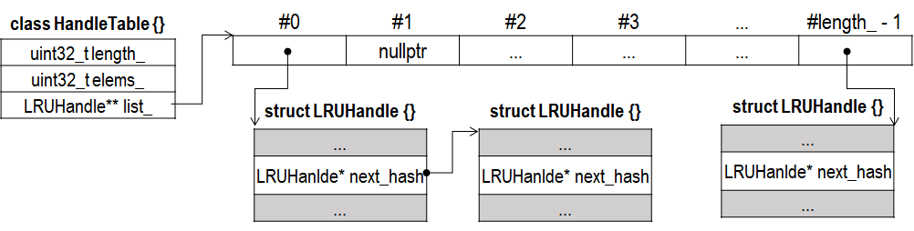

## Cache 相关
LevelDB 使用 LRU 缓存策略缓存 Table 或者 DataBlock，其中 DataBlock 是可选的。相关的类有 Cache、LRUCache、LRUHandle、HandleTable 和 SharedLRUCache 几个。Cache 是 LevelDB 暴露的接口，其他都是内部实现。其关系如下：



LevelDB 通过函数 NewLRUCache() 创建一个 Cache，其实现如下：
```
Cache* NewLRUCache(size_t capacity) { return new ShardedLRUCache(capacity); }
```

LRUCache 是 LRU 缓存策略的主要实现，不过为了减少多线程间的竞争，提升效率，引入 SharedLRUCache，其继承自 Cache 类，内部有 kNumShards（值为 16）个 LRUCache。



查找 key 时，先计算属于哪个 LRUCache，然后在相应的 LRUCache 中查找。计算方法很简单，取 hash 值的高 4 位值当成索引值，由 SharedLRUCache::Shard() 负责计算
```
uint32_t SharedLRUCache::Shard(uint32_t hash) { 
  return hash >> (32 - kNumShardBits); 
}
```

## HandleTable
LRUCache 借助哈希表实现 O(1) 查找，HandleTable 是哈希表的实现。根据注释介绍，其性能优于某些内置哈希表的实现，比如和 g++ 4.4.3 内置哈希表相比，其随机读取性能提高了 5%。HandleTable 使用链地址法处理冲突，即将所有关键字为同义词的记录存储在同一线性链表中（通过 LRUHandle 中的指针域 next_hash 链接成一条单链表）。



当插入元素后，哈希表的元素大于桶的个数的时候（elems_ > length_），HandleTable 会进行扩容，增加桶的个数，增长方式是 2 倍增长。HandleTable 桶的数量和一般哈希表实现方式不同，HandleTable 桶的个数始终是 2 的幂（初始值为 4，两倍增长）。如此设置，可以摈弃传统取“模”定位“桶”的索引，转而使用按位“与”，直接提取哈希值低位值当作“桶”的索引。
```
void HandleTable::Resize() {
  uint32_t new_length = 4;
  while (new_length < elems_) {
    new_length *= 2;
  }
  LRUHandle** new_list = new LRUHandle*[new_length];
  memset(new_list, 0, sizeof(new_list[0]) * new_length);
  uint32_t count = 0;
  for (uint32_t i = 0; i < length_; i++) {
    LRUHandle* h = list_[i];
    while (h != nullptr) {
      LRUHandle* next = h->next_hash;
      uint32_t hash = h->hash;
      LRUHandle** ptr = &new_list[hash & (new_length - 1)]; // 与
      h->next_hash = *ptr;
      *ptr = h;
      h = next;
      count++;
    }
  }
  assert(elems_ == count);
  delete[] list_;
  list_ = new_list;
  length_ = new_length;
}
```
HandleTable 提供查找 Lookup()、插入 Insert() 和删除 Remove() 接口。三者都会调用一个重要的函数 FindPointer()
```
LRUHandle** HandleTable::FindPointer(const Slice& key, uint32_t hash) {
  LRUHandle** ptr = &list_[hash & (length_ - 1)];
  while (*ptr != nullptr && ((*ptr)->hash != hash || key != (*ptr)->key())) {
    ptr = &(*ptr)->next_hash;
  }
  return ptr;
}
```
FindPointer() 的返回值需要注意，并不是返回 LRUHandle 的地址（LRUHandle* 类型），而是返回指向 LRUHandle 的指针的地址（LRUHandle\** 类型）。实际上，FindPointer() 返回的是 next_hash 指针（LRUHandle* 类型）的地址：
1. 如果存在匹配的 LRUHandle，该 LRUHandle 前一个结点的 next_hash 指针域指向该 LRUHandle，返回其前结点 next_hash 的地址，方便进行插入和删除；
2. 如果不存在，一直遍历到链表最后一个结点，其 next_hash 指针域值为 nullptr，返回该 next_hash 的地址，方便插入。

两种方式，解引用 FindPointer() 返回的指针，其结果为某个 LRUHandle 对象 next_hash 指针域的值，该值为指向匹配的 LRUHandle 指针或者为 nullptr。 

那么 Lookup() 的实现就相当简单，直接调用 FindPointer()
```
LRUHandle* HandleTable::Lookup(const Slice& key, uint32_t hash) {
  return *FindPointer(key, hash);
}
```

Remove() 方法也比较简单，返回被删除的条目。
```
LRUHandle* HandleTable::Remove(const Slice& key, uint32_t hash) {
  LRUHandle** ptr = FindPointer(key, hash);
  LRUHandle* result = *ptr;
  if (result != nullptr) {
    *ptr = result->next_hash;
    --elems_;
  }
  return result;
}
```

Insert() 方法，需要区分是替换 LRUHandle 还是插入新 LRUHandle，而且可能需要扩容。Insert() 返回值指向被替换的 LRUHandle（如果是插入新 LRUHandle，返回值为 nullptr）。
```
LRUHandle* HandleTable::Insert(LRUHandle* h) {
  LRUHandle** ptr = FindPointer(h->key(), h->hash);
  LRUHandle* old = *ptr;
  h->next_hash = (old == nullptr ? nullptr : old->next_hash); // *
  *ptr = h;
  if (old == nullptr) {
    ++elems_;
    if (elems_ > length_) {
      Resize();
    }
  }
  return old;
}
```

## LRUHandle
LRUHandle 是 LRUCache 中的一个条目，是堆空间对象，成员变量 in_cache 指示当前 LRUHandle 是否缓存在 LRUCache 中。in_cache 状态只会在 Erase()、Insert() 和 ~LRUCache() 中被改变？？。LRUCache 将缓存的 LRUHandle 组织成两个双向链表，每个 LRUHandle 都只能位于两个链表中的一个。这两个链表是：
- in_use：正在使用中，LRUHandle 没有特殊的顺序
- lru：没有正在使用，LRUHandle 按照 LRU 顺序组织。

refs 成员变量指示当前使用者的数量（使用者包括 LRUCache）。当 refs 递减为 0 时，调用 deleter 指向的函数清理 LRUHandle 保存的 Key-Value 数据，并且释放 LRUHandle 本身。LRUHandle 对象可能经历如下三种状态：
1. 被手动从 LRUCache 中删除、被相同的 key 替换，或者容量满时被淘汰，此时 LRUCache 不应该持有该对象。如果客户也不再持有，应当彻底删除该对象。
2. 不满足 1 的条件，对象正常位于 LRUCache 中，同时被客户持有。此时即使容量满，也不会被淘汰。
3. 不满足 1 的条件，对象正常位于 LRUCache 中，但不被客户持有。此时即使容量满，可能会被淘汰。

这 3 个状态，就分别对应了以下三个条件：
1. in_cache == false
2. in_cache == true && refs >= 2
3. in_cache == true && refs == 1

其中满足条件 3 的 LRUHandle 对象按照 LRU 的顺序缓存在 lru_ 链表上，lru_.prev 指向最“新”的对象，lru_.next 指向最“老”的对象，当容量满时会被淘汰。满足条件 2 的结点存在于 in_use_，表示该 LRUHandle 正在被其他使用者使用。

LRUCache 提供 Ref() 和 Unref() 两个方法进行引用计数的管理。Ref() 方法用于将 lru_ 上的对象转移到 in_use_ 量表上，并递增引用计数
```
void LRUCache::Ref(LRUHandle* e) {
  if (e->refs == 1 && e->in_cache) { // if on lru_ list, move to in_use_ list
    LRU_Remove(e);
    LRU_Append(&in_use_, e);
  }
  e->refs++;
}
```

而 Unref() 的工作相反，并且在 refs 减为 0 时负责释放内存
```
void LRUCache::Unref(LRUHandle* e) {
  assert(e->refs > 0);
  e->refs--;
  if (e->refs == 0) {  // Deallocate
    assert(!e->in_cache);
    (*e->deleter)(e->key(), e->value); // step 1
    free(e);                           // step 2
  } else if (e->in_cache && e->refs == 1) {
    // No longer in use; move to lru_ list.
    LRU_Remove(e);
    LRU_Append(&lru_, e);
  }
}
```

LRUCache 也提供查找、插入和删除相关接口。其中查找的时间复杂度为 O(1)，因为借助于哈希表，直接在哈希表中查询。并且，在返回之前，调用 Ref() 管理引用计数等信息。
```
Cache::Handle* LRUCache::Lookup(const Slice& key, uint32_t hash) {
  MutexLock l(&mutex_);
  LRUHandle* e = table_.Lookup(key, hash);
  if(e != nullptr) {
    Ref(e);
  }
  return reinterpret_cast<Cache::Handle*>(e);
}
```

LRUCache 跟删除有关的操作有两个，Release() 和 Erase()。Release() 的逻辑主要是用于归还，表示当前不再使用，未必是销毁数据，直接调用一次 Unref()
```
void LRUCache::Release(Cache::Handle* handle) {
  MutexLock l(&mutex_);
  Unref(reinterpret_cast<LRUHandle*>(handle));
}
```

而 Erase() 更像是删除操作。首先从 table_ 中删除
```
void LRUCache::Erase(const Slice& key, uint32_t hash) {
  MutexLock l(&mutex_);
  FinishErase(table_.Remove(key, hash));
}
```

然后调用 FinishErase() 继续处理，从链表中删除。
```
bool LRUCache::FinishErase(LRUHandle* e) {
  if (e != nullptr) {
    assert(e->in_cache);
    LRU_Remove(e);
    e->in_cache = false;
    usage_ -= e->charge;
    Unref(e);
  }
  return e != nullptr;
}
```

LRUCache 的插入 Insert() 相对比较复杂，需要考虑缓存空间不足，淘汰“老”对象的情况。
```
Cache::Handle* LRUCache::Insert(const Slice& key, uint32_t hash, void* value,
                        size_t charge,
                        void (*deleter)(const Slice& key, void* value)) {
  MutexLock l(&mutex_);
  LRUHandle* e = reinterpret_cast<LRUHandle*>(malloc(sizeof(LRUHandle) - 1 + key.size()));
  e->value = value;
  e->deleter = deleter;
  e->charge = charge;
  e->key_length = key.size();
  e->hash = hash;
  e->in_cache = false;
  e->refs = 1;
  memcpy(e->key_data, key.data(), key.size());

  if (capacity_ > 0) {
    e->refs++;
    e->in_cache = true;
    LRU_Append(&in_use_, e);
    usage += charge;
    FinishErase(table_.Insert(e));
  } else {
    e->next = nullptr;
  }
  while (usage_ > capacity_ && lru_.next != lru_) {
    LRUHandle* old = lru_.next;
    assert(old->refs == 1);
    bool erased = FinishErase(table_.Remove(old->key(), old->hash));
    if (!erased) {
      assert(erased);
    }
  }
  return reinterpret_cast<Cache::Handle*>(e);
}
```

此外，LRUCache 还提供 Prune() 函数，用于将所有 lru_ 上的对象删除
```
void LRUCache::Prune() {
  MutexLock l(&mutex_);
  while (lru_.next != &lru_) {
    LRUHandle* e = lru_.next;
    assert(e->refs == 1);
    bool erased = FinishErase(table_.Remove(e->key(), e->hash));
    if (!erased) {
      assert(erased);
    }
  }
}
```

## SharedLRUCache 实现
我们看到，LRUCache 为了保证线程安全，Lookup()、Insert()、Release()、Erase() 和 Prune() 函数都先加锁，再操作。如果 LevelDB 只有一个 LRUCache，则 LRUCache 相关操作会引起强烈的竞争条件。SharedLRUCache 利用多个 LRUCache，减小线程间的竞争条件，其接口都是直接调用 LRUCache 的接口。
```
Handle* SharedLRUCache::Insert(const Slice& key, void* value, size_t charge,
                               void (*deleter)(const Slice& key, void* value)) {
  const uint32_t hash = HashSlice(key);
  return shard_[Shard(hash)].Insert(key, hash, value, charge, deleter);
}

Handle* SharedLRUCache::Lookup(const Slice& key) {
  const uint32_t hash = HashSlice(key);
  retrurn shard_[Shard(hash)].Lookup(key, hash);
}

void SharedLRUCache::Release(Handle* handle) {
  LRUHandle* h = reinterpret_cast<LRUHandle*>(handle);
  shard_[Shard(h->hash)].Release(handle);
}

void SharedLRUCache::Erase(const Slice& key) {
  const uint32_t hash = HashSlice(key);
  shard_[Shard(hash)].Erase(key, hash);
}

void SharedLRUCache::Prune() {
  for(int s = 0; s < kNumShards; s++) {
    shard_[s].Prune();
  }
}
```