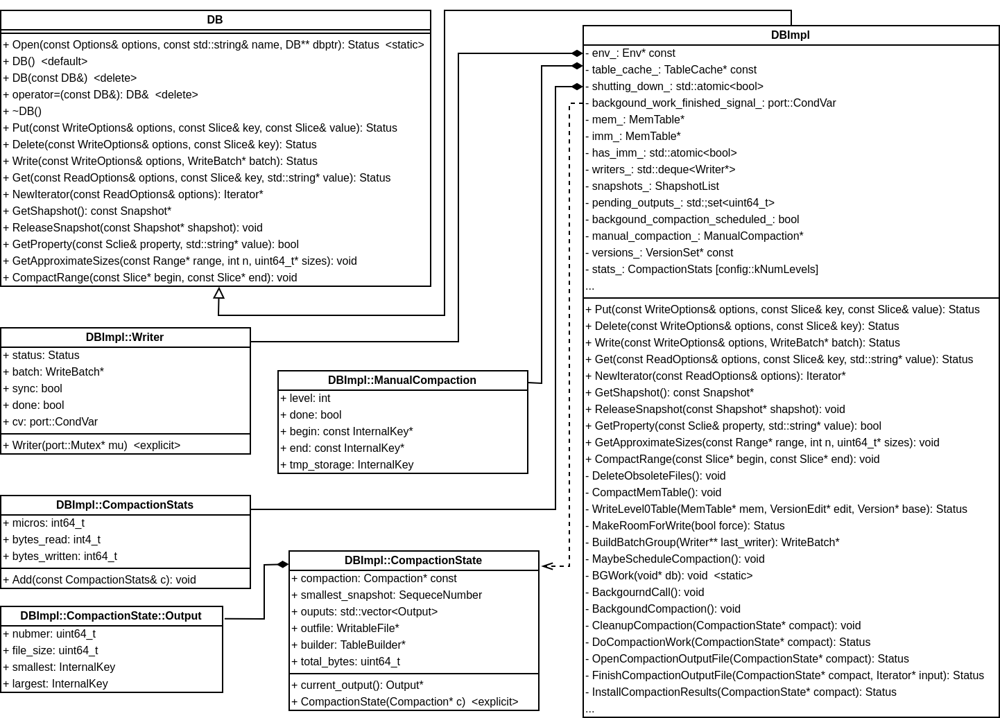

## DB 相关


## Put()、Delete() 和 Write()
DB 是接口类，DBImpl 是真正的实现。DB::Put() 和 DB::Delete() 函数都将单个 Key-Value 组织成 WriteBatch，再调用 Write() 函数
```
Status DB::Put(const WriteOptions& opt, const Slice& key, const Slice& value) {
  WriteBatch batch;
  batch.Put(key, value);
  return Write(opt, &batch);
}

Status DB::Delete(const WriteOptions& opt, const Slice& key) {
  WriteBatch batch;
  batch.Delete(key);
  return Write(opt, &batch);
}
```
DBImpl::Put() 和 DBImpl::Put() 函数直接调用 DB::Put() 和 DB::Delete()
```
Status DBImpl::Put(const WriteOptions& o, const Slice& key, const Slice& val) {
  return DB::Put(o, key, val);
}

Status DBImpl::Delete(const WriteOptions& options, const Slice& key) {
  return DB::Delete(options, key);
}
```
DB::Write() 函数在 DBImpl 实现，定义如下：
```
Status DBImpl::Write(const WriteOptions& options, WriteBatch* updates) {
  Writer w(&mutex_);
  w.batch = updates;
  w.sync = options.sync;
  w.done = false;

  MutexLock l(&mutex_);
  writers_.push_back(&w);
  while (!w.done && &w != writers_.front()) {
    w.cv.Wait();
  }
  if (w.done) {
    return w.status;
  }

  // May temporarily unlock and wait.
  Status status = MakeRoomForWrite(updates == nullptr);
  uint64_t last_sequence = versions_->LastSequence();
  Writer* last_writer = &w;
  if (status.ok() && updates != nullptr) {  // nullptr batch is for compactions
    WriteBatch* updates = BuildBatchGroup(&last_writer);
    WriteBatchInternal::SetSequence(updates, last_sequence + 1);
    last_sequence += WriteBatchInternal::Count(updates);

    // Add to log and apply to memtable.  We can release the lock
    // during this phase since &w is currently responsible for logging
    // and protects against concurrent loggers and concurrent writes
    // into mem_.
    {
      mutex_.Unlock();
      status = log_->AddRecord(WriteBatchInternal::Contents(updates));
      bool sync_error = false;
      if (status.ok() && options.sync) {
        status = logfile_->Sync();
        if (!status.ok()) {
          sync_error = true;
        }
      }
      if (status.ok()) {
        status = WriteBatchInternal::InsertInto(updates, mem_);
      }
      mutex_.Lock();
      if (sync_error) {
        // The state of the log file is indeterminate: the log record we
        // just added may or may not show up when the DB is re-opened.
        // So we force the DB into a mode where all future writes fail.
        RecordBackgroundError(status);
      }
    }
    if (updates == tmp_batch_) tmp_batch_->Clear();

    versions_->SetLastSequence(last_sequence);
  }

  while (true) {
    Writer* ready = writers_.front();
    writers_.pop_front();
    if (ready != &w) {
      ready->status = status;
      ready->done = true;
      ready->cv.Signal();
    }
    if (ready == last_writer) break;
  }

  // Notify new head of write queue
  if (!writers_.empty()) {
    writers_.front()->cv.Signal();
  }

  return status;
}
```
首先，将 WriteBatch 构造成 DBImpl::Writer 并添加到队列 writers_ 中，等待被执行。因为是多线程环境，每个线程都不是仅仅写入单个 DBImpl::Writer 的内容，而是将 writers_ 多个元素组成一个 WriteBatch（BuildBatchGroup() 函数）一并写入，所以添加到 writers_ 后，可能被其他线程执行，此时直接返回，否则需要将其写入。

在写入前，调用 MakeRoomForWrite() 函数检查 MemTable 是否有足够的空间。如果没有足够的空间，MakeRoomForWrite() 函数可能的操作：

1. 延缓写入线程（Level-0 的文件数量超过 kL0_SlowdownWritesTrigger，睡眠 1ms，放慢写入速度）
2. 阻塞写入线程（还有 Immutable MemTable 没有写入到磁盘或者 Level-0 的文件数量超过 kL0_StopWritesTrigger，等待 Level-0 文件合并）
3. 将当前 MemTable 转变为 Immutable MemTable 启动后台线程合并（容量合并，调用 MaybeScheduleCompaction() 函数），再申请一个 MemTable 和 .log 文件供写入

然后调用 BuildBatchGroup() 函数将 writers_ 多个元素组成一个 WriteBatch，开始写入。首先写入到 .log 文件，再插入到 MemTable 中。最后将 writers_ 已经处理的元素设定标识（ready->done = true）并唤醒其他线程。

## Get()
DB::Get() 函数在 DBImpl::Get() 实现。如果存在 Key-Value 数据，讲 Value 存在 *value 中，返回返回 Status::OK()；如果不存在该 KeyValue，返回 Status::IsNotFound()；如果发生错误，也会返回其他错误状态。处理流程如下：

1. 在 MemTable 中查找
2. 在 Immutable MemTable 中查找
3. 在当前 Version 中查找
4. 调用 current->UpdateStats() 更新查找文件信息，可能触发合并（查找触发，调用MaybeScheduleCompaction() 函数）

DBImpl::Get() 定义如下：
```
Status DBImpl::Get(const ReadOptions& options, const Slice& key,
                   std::string* value) {
  Status s;
  MutexLock l(&mutex_);
  SequenceNumber snapshot;
  if (options.snapshot != nullptr) {
    snapshot =
        static_cast<const SnapshotImpl*>(options.snapshot)->sequence_number();
  } else {
    snapshot = versions_->LastSequence();
  }

  MemTable* mem = mem_;
  MemTable* imm = imm_;
  Version* current = versions_->current();
  mem->Ref();
  if (imm != nullptr) imm->Ref();
  current->Ref();

  bool have_stat_update = false;
  Version::GetStats stats;

  // Unlock while reading from files and memtables
  {
    mutex_.Unlock();
    // First look in the memtable, then in the immutable memtable (if any).
    LookupKey lkey(key, snapshot);
    if (mem->Get(lkey, value, &s)) {
      // Done
    } else if (imm != nullptr && imm->Get(lkey, value, &s)) {
      // Done
    } else {
      s = current->Get(options, lkey, value, &stats);
      have_stat_update = true;
    }
    mutex_.Lock();
  }

  if (have_stat_update && current->UpdateStats(stats)) {
    MaybeScheduleCompaction();
  }
  mem->Unref();
  if (imm != nullptr) imm->Unref();
  current->Unref();
  return s;
}
```