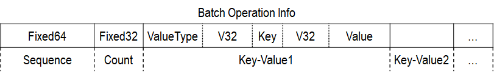
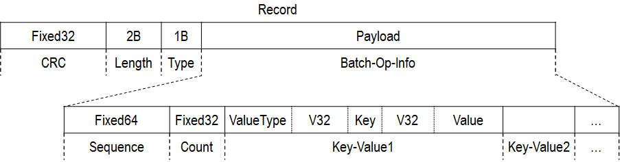
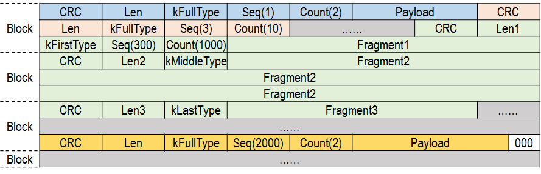
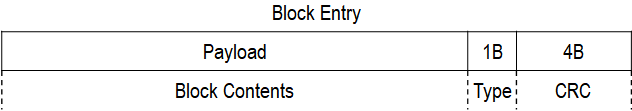
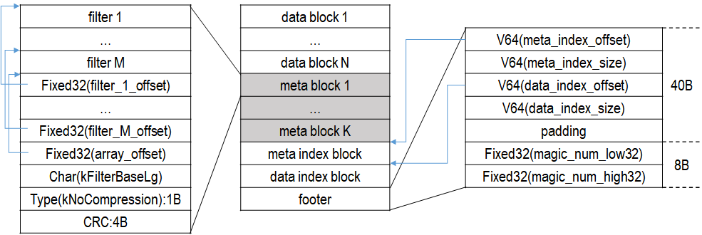
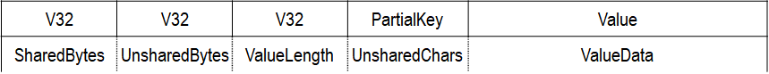
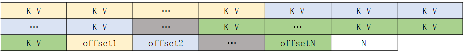
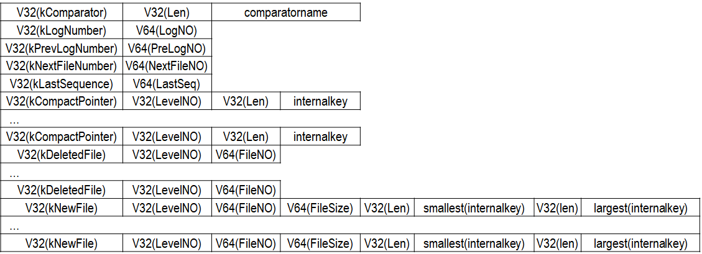

## 磁盘布局
LevelDB 使用如下文件保存数据库数据

|文件名|作用|说明|
|:-|:-|:-|
|xxxxxx.log|操作日志（WAL），记录增删改操作|为了防止丢失数据，在增删改数据时，LevelDB 总是先在 .log 文件中写入操作过程，然后再在内存 MemTable 中进行增删改。|
|######.ldb|LevelDB 存储 Key-Value 的文件|早期版本是 .sst 文件，从 1.14 版本以后改为 .ldb 文件|
|MANIFEST-******|序列化 VersionEdit|
|CURRENT|当前使用的 MANIFEST-****** 文件|
|LOCK|文件锁|多线程并发|
|LOG|日志文件，简要记录 LevelDB 操作|查看 LevelDB 执行过程，用于 Debug|

### .log 文件存储格式
.log 文件用于记录 LevelDB 增删改操作，以便在故障出现后能够恢复数据。一次增删改可能不是只针对一条 Key-Value，多条 Key-Value 增删改可以组成一个 Batch 进行。.log 文件是以 Batch 为单位记录，一次记录的增删改操作可能包括多条 Key-Value 的增删改。LevelDB 会给每一次增删改操作添加一个 64 位无符号整数序号，以区分不同操作的先后顺序，便于恢复数据。每个 Batch 的信息组织如下：

头 12 字节为头部，Sequence 表示全局递增序号，而 Count 表示该 Batch 中 Key-Value 数量。Sequence 递增值跟 Count 有关，下一个 Record 序号从 Sequence + Count 开始。每个 Key-Value 中 ValueType 表示 Key-Value 类型，是 kTypeDeletion 和 kTypeValue 的一种。前者表示删除，此时 value 为空，后者表示添加或者修改。

LevelDB 并不是简单地将 Batch-Op-Info 写入 .log 文件，而是将其组成一个记录（Record）按照 Block 为单位存储，每个 Block 为 32 KB 大小。每个 Record 组织如下：

4 字节的 CRC 存储 Payload 的校验和，生成方式和 Type 有关；2 字节的 Length 存储 Payload 的长度；1 字节的 Type 标记 Record 和 Block 的关系，取值如下：

|值|含义|
|:-|:-|
|kFullType (1)|Record 完全位于一个 Block 中|
|kFirstType (2)|Record 跨越多个 Block，这是第一部分|
|kLastType (3)|Record 跨越多个 Block，这是最后部分|
|kMiddleType (4)|Record 跨越多个 Block，这是中间部分|

.log 文件由 Block 组成，如下所示：

当一个 Record 跨越多个 Block 需要切分时，直接将 Payload 当作字节数据切割成合适大小，此时头部中 Length 字段是当前 Fragment 的长度。当一个 Block 剩余空间不能放下头部时（小于 7 字节），直接填充 0，不再使用。

### .ldb 文件存储格式
.ldb（或者 .sst）是 SSTable（Sorted String Table）文件，存储有序的 Key-Value 数据，是 LevelDB 数据存储文件。.ldb 文件也是按照 Block 为单位存储数据，不过每个 Block 并不是固定大小。每个 Block 的格式如下：

每个 Block 最后 5 个字节是尾部，1 字节 Type 表示 Payload 数据压缩方式，可以是 kSnappyCompression 或者 kNoCompression，4 字节的 CRC 表示数据校验和。Payload Block 数据，.ldb 文件中有 4 种 Block，分别是 DataBlock、MetaBlock、MetaIndexBlock 和 DataIndexBlock，其中 MetaBlock 是可选的。.ldb 总体布局如下：

DataBlock 的 Payload 存储 Key-Value 数据，当添加 Key-Value 后 Payload 超过一定大小（默认 4KB），将其写到 .ldb 文件中。Block 采用前缀压缩（Prefix Compression）存储 Key 值，以减少数据大小。此外，为了方便查找，每隔 K 个 Key 的位置，弃用前缀压缩，存储完整 Key 值，这称为一个“重启点”（Restart Point）。这种存储方式，既减少了 Block 大小，还可以对一个 Block 采用二分查找，加速 Key 查找速度。每一条 Key-Value 数据格式如下：

Block 在 Payload 尾部记录重启点数据，每个重启点的偏移（相对本 Block）以及重启点的数量，则 Payload 如下所示：

由于 DataBlock 大小并不是固定值，因此需要将每个 DataBlock 在 .ldb 文件中的位置偏移以及大小进行记录，以界定不同 DataBlock。此外，为了方便查找，LevelDB 还为 DataBlock 添加索引。每个 DataBlock 的索引 index_key 都满足：（1）本 DataBlock 所有 Key 都小于等于 index_key；（2）下一个 DataBlock 所有 Key 都大于 index_key。而且 index_key 并不是简单地将一个 DataBlock 的最后一个 Key 当作索引，为了减少空间占用，会在两个 DataBlock 间选取一个可以区分且最短字符串当作 index_key。在存储时，将 index_key 当作 Key、DataBlock 的偏移和大小信息当作 Value 存储在 DataIndexBlock 的 Payload中，存储方式和 DataBlock 完全一样，也采用前缀压缩和设置重启点。

MetaBlock 是可选项，在 Options 可以指定类型或者为空，当前可以指定 Filter 加速 Key-Value 查找。Filter(i) 存放偏移在
[i * base, (i+1) * base) 区间中所有 DataBlock 的 Key 生成的数据（base 默认 2K）。由此可见，data_block 并不是和 filter 一一对应，一个 filter 可能包含多个 data_block 的数据。

MetaIndexBlock 存储必要的统计信息，目前只存储 MetaBlock 偏移和大小相关的数据。Key 为 filter.<Name>，其中 Name 由指定 Filter 的 Name() 函数返回。Value 存储 MetaBlock 大小和偏移。

.ldb 尾部 48 字节为 Footer，前面 40 字节存储 MetaIndexBlock 和 DataIndexBlock 偏移量和大小，不够 40 字节时进行填充。后面 8 字节存储 MagicNumber。

### MANIFEST 文件存储格式
MANIFEST 文件存储了 LevelDB 版本间的变更信息。LevelDB 使用 Version 表示数据库的一个版本，Version 记录了每个 Level 上 .ldb 的文件。Version 的变更信息使用 VersionEdit 表示，MANIFEST 存储的是 VersionEdit 变量序列号字符，存储方式和 .log 文件一样。每次调用  VersionEdit 的 EncodeTo() 函数其内容序列化为字符串，序列化后格式如下（存储时连续存储）：

可见 [Version 之 VersionEdit](./verionedit.md) 参考 VersionEdit 序列号过程。