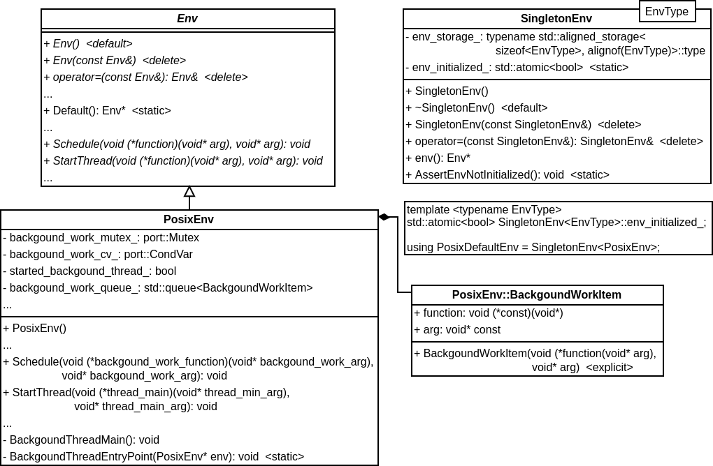

## Env 相关
Env 是 LevelDB 实现的与操作系统相关的接口，用于访问诸如文件系统、线程调用等操作系统功能。调用者可以在打开 LevelDB 时提供自定义的 Env 对象，以进行更加精细的控制，但是所有 Env 实现都必须保证线程安全，多个线程无需任何外部同步，就可以安全地进行并发访问。下面分析 Env 相关类中和线程有关的相关实现（和 Compaction 有关），类图如下：



默认情况下使用 Default() 函数返回的 Env 变量，Linux 系统中 Default() 函数定义如下：
```
Env* Env::Default() {
  static PosixDefaultEnv env_container;
  return env_container.env();
}
```
PosixDefaultEnv 是包含 PosixEnv 的单例模式，env() 函数返回已经初始化的 PosixEnv 变量。PosixEnv 继承 Env，是对 POSIX 类函数的封装。

首先分析 Schedule() 函数，该函数调度后台线程运行一次 (*function)(arg)。function 可能在未指定的线程中运行，添加到同一 Env 的多个 function 可以在不同的线程中同时运行，调用者不能假定后台线程序列化地执行传入的 function。Schedule() 函数定义如下：
```
void PosixEnv::Schedule(
    void (*background_work_function)(void* background_work_arg),
    void* background_work_arg) {
  background_work_mutex_.Lock(); // 互斥访问 background_work_queue_

  // Start the background thread, if we haven't done so already.
  if (!started_background_thread_) {
    started_background_thread_ = true;
    std::thread background_thread(PosixEnv::BackgroundThreadEntryPoint, this);
    background_thread.detach();
  }

  // If the queue is empty, the background thread may be waiting for work.
  if (background_work_queue_.empty()) { // 唤醒后台线程，有活干了
    background_work_cv_.Signal();
  }

  background_work_queue_.emplace(background_work_function, background_work_arg);
  background_work_mutex_.Unlock();
}
```
如果后台线程还未启动，Schedule() 会创建一个后台线程。然后把用户传入的函数指针及其参数添加到 background_work_queue_ 等待执行。后台线程的主函数为 BackgroundThreadEntryPoint()，该函数是一个静态函数，方便参数传递。其定义如下：
```
  static void BackgroundThreadEntryPoint(PosixEnv* env) {
    env->BackgroundThreadMain();
  }
```
直接调用 BackgroundThreadMain() 函数，BackgroundThreadMain() 为真正的线程主函数。其定义如下：
```
void PosixEnv::BackgroundThreadMain() {
  while (true) {
    background_work_mutex_.Lock(); // 互斥访问 background_work_queue_

    // Wait until there is work to be done.
    while (background_work_queue_.empty()) {
      background_work_cv_.Wait(); // 等待分配活
    }

    assert(!background_work_queue_.empty());
    auto background_work_function = background_work_queue_.front().function;
    void* background_work_arg = background_work_queue_.front().arg;
    background_work_queue_.pop();

    background_work_mutex_.Unlock();
    background_work_function(background_work_arg);
  }
}
```
BackgroundThreadMain() 一直循环，如果任务队列 background_work_mutex_ 不为空，就取出一个任务，开始执行。如果任务队列为空，就阻塞自己，等待分配任务。

StartThread() 用于启动一个新线程，在新线程中调用 function(arg)。当 functio(arg) 返回时，线程将被销毁。
```
void PosixEnv::StartThread(void (*thread_main)(void* thread_main_arg),
                           void* thread_main_arg) {
  std::thread new_thread(thread_main, thread_main_arg);
  new_thread.detach();
}
```