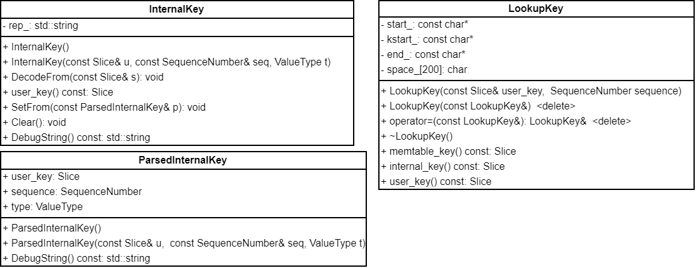
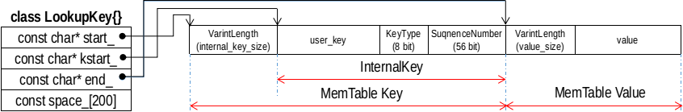

## Key 相关
LevelDB 中跟 Key 相关的数据结构主要有 InternalKey、ParsedInternalKey 和 LookupKey。



LevelDB 中 Key 包括三个部分，Key，ValueType 和 SequenceNumber。SequenceNumber 虽然是 64 位无符号整数，但是其上限被定义为：
```
static const SequenceNumber kMaxSequenceNumber = ((0x1ull << 56) - 1);
```
实际上只使用了 56 位，预留了 8 位用于存储 ValueType。具体而言，低 8 位存储 ValueType，高 56 位存储 SequenceNumber。这样可以 用 DecodeFixed64() 函数将 ValueType 和 SequenceNumber 读出为一个 64 位无符号整数。InternalKey 是 Key，ValueType 和 SequenceNumber 在内存中序列化表示，而 ParsedInternalKey 是三者反序列化的结果，LookupKey 则主要用于在 MemTable 中查找。三者的关系可以用下图表示：



函数 ParseInternalKey() 用于将 InternalKey 解析成 ParsedInternalKey，其定义如下：
```
inline bool ParseInternalKey(const Slice& internal_key,
                             ParsedInternalKey* result) {
  const size_t n = internal_key.size();
  if (n < 8) return false;
  uint64_t num = DecodeFixed64(internal_key.data() + n - 8);
  unsigned char c = num & 0xff;
  result->sequence = num >> 8;
  result->type = static_cast<ValueType>(c);
  result->user_key = Slice(internal_key.data(), n - 8);
  return (c <= static_cast<unsigned char>(kTypeValue));
}
```
直接使用 DecodeFixed64() 会处理字节序，其返回结果是小端字节序。