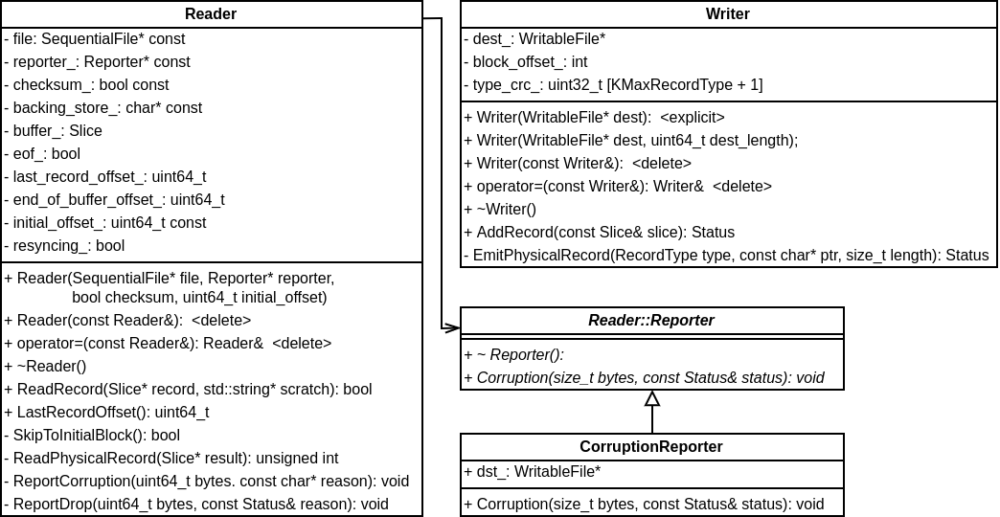
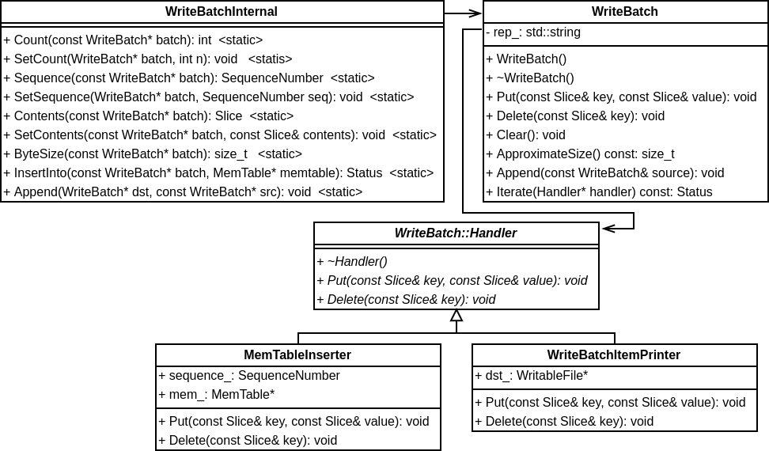

## log 相关
LevelDB 将一个或者多个增删改记录组成一个记录（Record）按照 Block 为单位存储，每个 Block 为 32 KB 大小。
```
static const int kMaxRecordType = kLastType;
static const int kBlockSize = 32768;
// Header is checksum (4 bytes), length (2 bytes), type (1 byte).
static const int kHeaderSize = 4 + 2 + 1;
```
跟 log 相关的类比较简单，分别是 Writer 和 Reader，类图如下：



不过，Writer 和 Reader 只能处理读取一条 Record，并不能构建或者解析一条 Record。WriteBatch 相关的类用于构建或者解析一条 Record，类图如下：

