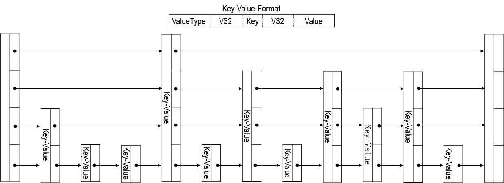

## 内存布局
LevelDB 内存主要是 MemTable 和 Cache 两个部分。

### MemTable
LevelDB 增删改并不是直接在 .ldb 文件上进行。LevelDB 增删改操作首先会记录到 .log 文件中（顺序写入），待 .log 文件增加到一定大小（默认是 4MB），再根据 .log 文件的内容生成 .ldb 文件永久保存。MemTable 是 .log 文件在内存的体现，LevelDB 增删改在写入到 .log 文件后，立即在 MemTable 上进行。当 .log 文件超过阈值（通过 MemTable 大小间接判断），将 MemTable 转变成只读的 Immutable MemTable，.log 文件和 MemTable 会重新生成，继续记录 LevelDB 增删改，而 Immutable MemTable 则等待合并线程（BGThread）将其写入 .ldb 文件中。

MemTable 采用跳表（SkipList）组织 Key-Value 数据。MemTable 实现的跳表只有插入接口，没有删除接口，因此如果删除一个 Key-Value 数据，会在跳表中该结点后插入一个数据类型为 kTypeDeletion 的 Key-Value 数据，真正的删除操作在 Immutable MemTable 生成 .ldb 的过程中。因此，除非删除整个跳表，否则跳表申请的内存永远不会归还给内存。跳表的内存并不是直接向系统申请的，而是通过 Arena 申请。Arena 生命周期和 MemTable 相同，释放 MemTable 时，Arena 管理的内存全部归还给系统，跳表也被销毁。

### Cache
LevelDB 存在两个 Cache，分别是 TableCache 和 BlockCache。前者用于缓存 .ldb 索引相关数据，后者用于缓存 .ldb 文件 DataBlock 数据。

用户提交 Key 查询时，LevelDB 依次查询 MemTable、Immutable MemTable，如果没有找到，就在当前版本从最低 Level 到最高 Level 查询找到可能包含该 Key 的 .ldb 文件，然后在 TableCache 中继续查询。TableCache 也是以 Key-Value 方式存储，Key 值为 .ldb 文件序号，Value 值为 .ldb 文件 MetaIndexBlock 和 DataIndexBlock 数据。如果查找 TableCache 失败，则将 .ldb 文件的索引数据加载到内存，并插入到 TableCache。

LevelDB 获取到包含用户查找 Key 的 .ldb 文件的索引数据后，则通过 MetaIndexBlock 和 DataIndexBlock 查找真正包含该 Key 的 DataBlock。在确定所属的 DataBlock 后，此时在 BlockCache 中继续查找。BlockCache 也是以 Key-Value 方式存储，Key 值为 cache_id 和 DataBlock 的 offset，Value 值为 DataBlock 的 BlockContents。如果查找 BlockCache 失败，则将 DataBlock 数据加载到内存，并插入到 BlockCache。