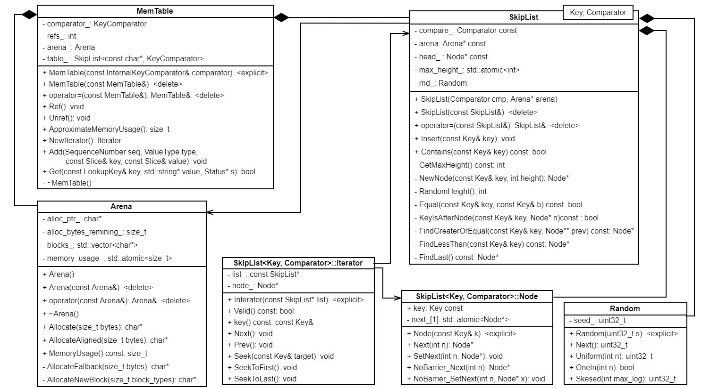
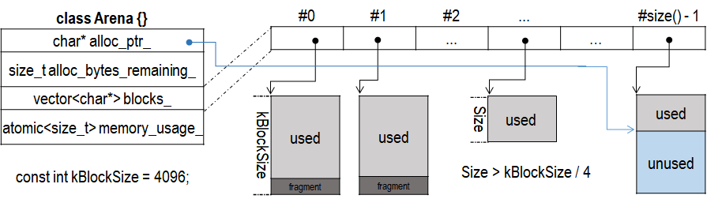

## MemTable 相关
跟 MemTable 相关的主要有 MemTable、SkipList 和 Arena 三个类。主要关系如下：



## Arena
Arena 是 LevelDB 实现的内存管理器，只在 MemTable 使用，用于分配 SkipList 的结点和存储 Key-Value 的内存。和一般内存分配器不一样的是，Arena 只有分配内存的接口，没有释放内存的接口。Arena 管理的内存在 MemTable 释放后才全部归还给系统，其他任何时候都不归还内存（即使删除一个 Key-Value 值，MemTable 也是在 SkipList 中插入一个类型为 kTypeDeletion 的 Key-Value）。Arena 内存组织方式如下：



和普通内存池一样，Arena 也是一次申请一块足够大（4 KB）的内存，然后从这一块中分割出合适大小的内存返回给客户。每次申请的 Block，都将其（指针）附加到 blocks_ 数组末尾。任意时刻，Arena 只有一块 Block 有未使用的内存（blocks_ 最后元素），由 alloc_ptr_ 指向首地址。

当剩余空间满足时，只需要移动 alloc_ptr_，分割出内存返回客户。
```
char* Arena::Allocate(size_t bytes) {
  assert(bytes > 0);
  if (butes <= alloc_bytes_remaining_) {
    char* result = alloc_ptr_;
    alloc_ptr_ += bytes;
    alloc_bytes_remaining_ -= bytes;
    return result;
  }
  return AllocateFallback(bytes);
}
```
否则，就需要向系统申请额外的空间，不过需要注意 Arena 处理方式
。前面分析可知，任意时刻，Arena 只有一块 Block 有未使用的内存，当再次申请时，前一块 Block 未使用的内存就会丢弃，浪费内存。因此，为了减少内存浪费，Arena 可能会直接申请一块完整的内存返回给客户，这个阈值是 kBlockSize 的四分之一。这样，每个 Block 最多后 1/4 的空间被浪费。
```
char* Arena::AllocateFallback(size_t bytes) {
  if (bytes > kBlockSize / 4) {
    char* result = AllocateNewBlock(bytes);
    return result;
  }

  alloc_ptr_ = AllocateNewBlock(kBlockSize);
  alloc_bytes_remaining_ = kBlockSize;
  char* result = alloc_ptr_;
  alloc_ptr_ += bytes;
  alloc_bytes_remaining_ -= bytes;
  return result;
}
```
因此，可以看出 Arena 内存分配的策略
1. bytes <= alloc_bytes_remaining_，移动 alloc_ptr_，返回内存。
2. bytes > alloc_bytes_remaining_ && bytes > kBlockSize / 4，单独申请一块完整的内存返回给客户。此时不修改 alloc_ptr_。
3. 否则，Arena 向系统申请另一块 Block，从这里分割出一块给客户。

AllocateNewBlock() 负责向系统申请内存
```
char* Arena::AllocateNewBlock(size_ block_bytes) {
  char* result = new char[block_bytes];
  blocks_.push_back(result);
  memory_usage_.fetch_add(block_bytes + sizeof(char*), std::memory_order_relaxed);
  return result;
}
```
此外，Arena 还支持地址对齐的内存。这里对齐并不是大小对齐，起始地址对齐。比如说，当前 alloc_ptr_ 值为 13，系统 8 字节对齐，返回的内存首地址应该是 16。
```
char* Arena::AllocateAligned(size_t bytes) {
  const int align = (sizeof(void*) > 8) ? sizeof(void*) : 8;
  static_assert((align & (align - 1)) == 0,
                "Pointer size should be a power of 2");
  size_t current_mod = reinterpret_cast<uintptr_t>(alloc_ptr_) & (align - 1);
  size_t slop = (current_mod == 0 ? 0 : align - current_mod);
  size_t needed = bytes + slop;
  char* result;
  if (needed <= alloc_bytes_remaining_) {
    result = alloc_ptr_ + slop;
    alloc_ptr_ += needed;
    alloc_bytes_remaining_ -= needed;
  } else {
    result = AllocateFallback(bytes);
  }
  assert((reinterpret_cast<uintptr_>(result) & (align - 1)) == 0);
  return result;
}
```

## SkipList
MemTable 利用 SkipList 管理内存中的 Key-Value 数据。SkipList 是作为平衡树的替代品（Alternative）被提出，在概率上具有和平衡树相同的查找、插入和删除效率。而且，SkipList 实现以及插入和删除操作都比平衡树或者红黑树简单。在多线程环境中，利用 SkipList 代替普通的平衡树或者红黑树，可以使临界区代码更加简短，减少多线程间的竞争条件。LevelDB 实现的跳表比较特殊，只有插入接口，没有删除节点的接口，在销毁跳表之前，绝不会删除 SkipList 的结点。

跳表结点的阶数是随机的，LevelDB 中的 Node 用柔性数组来实现，每次申请 Node 前必须确定阶数，分配合适的空间。Node 提供的接口比较简洁
```
Node* Next(int n) {
  assert(n >= 0);
  return next_[n].load(std::memory_order_acquire);
}
void SetNext(int n, Node* x) {
  assert(n >= 0);
  next_[n].store(x, std::memory_order_release);
}

Node* NoBarrier_Next(int n) {
  assert(n >= 0);
  return next_[n].load(std::memory_order_relaxed);
}
void NoBarrier_SetNext(int n, Node* x) {
  assert(n >= 0);
  next_[n].store(x, std::memory_order_relaxed);
}
```
先分析 SkipList 几个比较重要的私有成员函数。我们知道，当跳表插入新结点时，新结点的阶数是随机决定的（如果第 i 阶存在指针，那么第 i+1 阶也有指针的概率为 p，LevelDB 中 p 为 1/4）。RandomHeight() 就是用来决定 Node 的阶数。
```
template <typename Key, class Comparator>
int SkipList<Key, Comparator>::RandomHeight() {
  static const unsinged int kBranching = 4;
  int height = 1;
  while (height < kMaxHeight && ((rnd_.Next() % kBranching) == 0)) {
    height++; // 每次有 1/4 的概率执行
  }
  assert(height > 0);
  assert(height <= kMaxHeight);
  return height;
}
```
另一个是 NewNode() 成员函数，SkipList 每次都通过它从 Arena 中申请结点。height 参数就是通过 RandomHeight() 计算的。
```
template <typename Key, class Comparator>
typename SkipList<Key, Comparator>::Node*
SkipList<Key, Comparator>::NewNode(const Key& key, int height) {
  char* const node_memory = arena_->AllocateAlinged(
      sizeof(Node) + sizeof(std::atomic<Node*>) * (height - 1));
  return new (node_memory) Node(key);
}
```
另一个是 FindGreaterOrEqual() 成员函数。我们知道在跳表中插入前也是查找。为了执行一次查找，我们在头结点从最高阶的链开始，沿着这个阶一直走，直到发现下一个结点大于我们正在查找的结点或者下一个结点为空。这个时候，我们就转到低一阶链继续使用这种方法。当进行到最底层阶并且停止时，或者我们位于正在查找的结点的前面，或者查找结点不在这个跳表中。并且为了后续方便插入，还需要记录查找过程每阶最右的结点。
```
template <typename Key, class Comparator>
typename SkipList<Key, Comparator>::Node*
SkipList<Key, Comparator>::FindGreaterOrEqual(const Key& key, 
                                              Node** prev) const {
  Node* x = head_;
  int level = GetMaxHeight() - 1;
  while (true) {
    Node* next = x->Next(level);
    if (KeyIsAfterNode(key, next)) {
      x = next;
    } else {
      if (prev != nullptr) {
        prev[level] = x;
      }
      if (level == 0) {
        return next;
      } else {
        level--;
      }
    }
  }
}
```
另外两个较重要的私有成员函数，FindLessThan() 返回最后一个满足 key < key 的结点。而 FindLast() 返回跳表的最后一个结点。
```
template <typename Key, class Comparator>
typename SkipList<Key, Comparator>::Node*
SkipList<Key, Comparator>::FindLessThan(const Key& key) const {
  Node* x = head_;
  int level = GetMaxHeight() - 1;
  while (true) {
    assert(x == head_ || compare_(x->key, key) < 0);
    Node* next = x->Next(level);
    if (next == nullptr || compare_(next->key, key) >= 0) {
      if (level == 0) {
        return x;
      } else {
        level--;
      }
    }
  }
}

template <typename Key, class Comparator>
typename SkipList<Key, Comparator>::Node*
SkipList<Key, Comparator>::FindLast() const {
  Node* x = head_;
  int level = GetMaxHeight() - 1;
  while (true) {
    Node* next = n->Next(level);
    if (next == nullptr) {
      if (level == 0) {
        return x;
      } else {
        level--;
      }
    } else {
      x = next;
    }
  }
}
```
SkipList 创建后的状态只有一个头结点
```
template <typename Key, class Comparator>
void SkipList<Key, Comparator>::SkipList(Comparator cmp, Arena* arena):
    : compare_(cmp),
      arena_(arena),
      head_(NewNode(0, kMaxHeight)),
      max_height_(1),
      rnd_(0xdeadbeef) {
  for (int i = 0; i < kMaxHeight; ++i) {
    head_->SetNext(i, nullptr);
  }
}
```
在 SkipList 中查找（Contains() 函数）的过程比较直观，FindGreaterOrEqual() 完成了主要的逻辑
```
template <typename Key, class Comparator>
bool SkipList<Key, Comparator>::Contains(const Key& key) const {
  Node* x = FindGreaterOrEqual(key, nullptr);
  if (x != nullptr && Equal(key, x->key)) {
    return true;
  } else {
    return false;
  }
}
```
在 SkipList 中插入（Insert() 函数）需要找到插入位置，使得插入后跳表仍然有序。而且，每次插入都需要决定插入结点的阶数。
```
template <typename Key, class Comparator>
void SkipList<Key, Comparator>::Insert(const Key& key) {
  Node* prev[kMaxHeight];
  Node* x = FindGreaterOrEqual(key, prev);
  assert(x == nullptr || !Equal(key, x->key));
  int height = RandomHeight();
  if (height > GetMaxHeight()) {
    for (in i = GetMaxHeight(); i < height; i++) {
      prev[i] = head_;
    }
    max_height_.store(height, std::memory_order_relaxed);
  }

  x = NewNode(key, height);
  for (int i = 0; i < height; i++) {
    x->NoBarrier_SetNext(i, prev[i]->NoBarrier_Next(i));
    prev[i]->SetNext(i, x);
  }
}
```
此外，SkipList 还提供一个双向迭代器 Iterator 供遍历使用。其实现基本调用 SkipList 的接口。

## MemTable
MemTable 是 LevelDB 位于内存的数据结构。MemTable 既可以读，也可以写，和它对应的是 Immutable MemTable，两者结构完全一样，只是后者只能读，不可写。当写入的数据到达指定门限（默认 4MB），就会自动转化为 Immutable MemTable，等待写入到磁盘里。LevelDB 会产生新的 MemTable 供写入新的键-值对。

MemTable 提供了 Key-Value 插入和查询接口，没有提供删除接口。删除 Key-Value 利用插入接口实现，此时 Value 值为空，数据类型为 kTypeDeletion。这也是 SkipList 没有删除接口的原因，因为永远没有删除的需求。真正的删除操作在 Immutable MemTable 写入磁盘的时候进行。

MemTable 采用引用计数管理自己的生命周期。当外部使用该 MemTable 对象时，递增引用计数；当不使用的时候，递减引用技术，在引用计数递减至 0 时释放 MemTable 内存。Ref() 和 Unref() 接口提供引用计数相关操作：
```
void MemTable::Ref() { ++refs_; }
void MemTable::Unref() {
  --refs_;
  assert(refs_ >= 0);
  if (refs_ <= 0) {
    delete this;
  }
}
```
Add() 接口向 MemTable 添加一个 Key-Value，如果 type == kTypeDeletion，Value 通常为空，表示一个删除操作。
```
void MemTable::Add(SequenceNumber s, ValueType type, const Slice& key,
                   const Slice& value) {
  size_t key_size = key.size();
  size_t val_size = value.size();
  size_t internal_key_size = key_size + 8;
  const size_t encode_len = VarinLength(internal_key_size) + 
                            internal_key_size + VarintLength(val_size) + 
                            val_size;
  char* buf = arena_.Allocate(encoded_len); // 申请内存
  char* p = EncodeVarient32(buf, internal_key_size);
  memcpy(p, key.size(), key_size);
  p += key_size;
  EncodeFixed64(p, (s << 8) | type);
  p += 8;
  p = EncodeVarint32(p, val_size);
  memcpy(p, value.data(), val_size);
  assert(p + val_size == buf + encoded_len);
  table_.Insert(buf); // 插入跳表
}
```
Get() 接口提供读取 Key-Value 的操作。其结果比较复杂，包括下面三种情况：（1）如果 MemTable 存在这个 Key 并且数据类型为 kTypeValue，则将对应的 Value 存储在 value 中并返回 true；（2）如果 MemTable 包含这个 Key 单数数据类型是 kValueDeletion，在 s 中保存 NotFound() 状态，函数仍然返回 true；（3）不包含对应的 Key，返回false。
```
bool MemTable::Get(const LookupKey& key, std::string* value, Status* s) {
  Slice memkey = key.memtable_key();
  Table::iterator iter(&table_);
  iter.Seek(memkey.data());
  if (iter.Valid()) {
    const char* entry = iter.key();
    uint32_t key_length;
    const char* key_ptr = GetVarint32Ptr(entry, entry + 5, &key_length);
    if (comparator_.comparator.user_comparator()->Compare(
            Slice(key_ptr, key_length - 8), key.user_key()) == 0) {
      const uint64_t tag = DecodeFixed64(key_ptr + key_length - 8);
      switch (static_cast<ValueType>(tar & 0xff)) {
        case kTypeValue: {
          Slice v = GetLengthPrefixedSlice(key_ptr + key_length);
          value->assign(v.data(), v.size());
          return true;
        }
        case kTypeDeletion:
          *s = Status::NotFound(Slice());
          return true;
      }
    }
  }
  return false;
}
```
另外，ApproximateMemoryUsage() 用于返回 MemTable 占用的内存大小，当其超过阈值（默认 4MB），将其变为 Immutable MemTable。
```
size_t MemTable::ApproximateMemoryUsage() { return arena_.MemoryUsage(); }
```