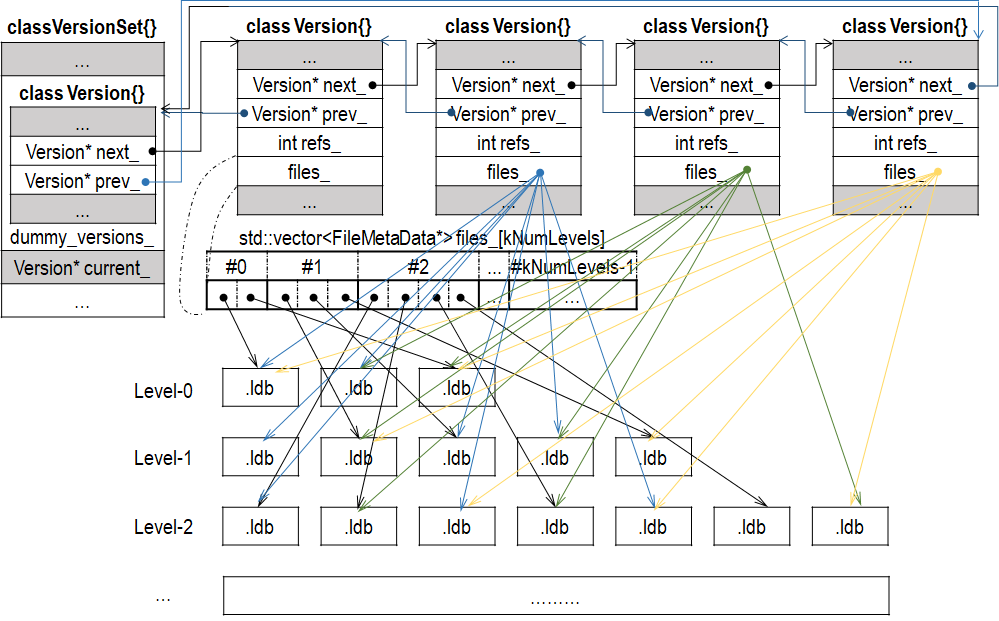
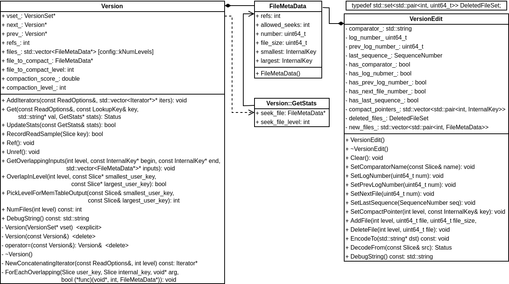

## Version 相关
LevelDB 用 Version 表示一个版本的元信息，主要是每个 Level 的 .ldb 文件。除此之外，Version 还记录了触发 Compaction 相关的状态信息，这些状态信息会在响应读写请求或者 Compaction 的过程中被更新。VersionEdit 表示一个 Version 到另一个 Version 的变更，为了避免进程崩溃或者机器宕机导致数据丢失，LevelDB 把各个 VersionEdit 都持久化到磁盘，形成 MANIFEST 文件。数据恢复的过程就是依次应用 VersionEdit 的过程。VersionSet 表示 LevelDB 历史 Version 信息，所有的 Version 都按照双向链表的形式链接起来。VersionSet 和 Version 的大体布局如下：



## Version
Version 用 FileMetaData 数据结构维护一个 .ldb 文件必要的信息，包括文件名、文件大小、Key 值范围以及引用计数等。另外，Version 还记录了触发 Compaction 相关的状态信息，这些状态信息会在响应读写请求或者 Compaction 的过程中被更新。



Version 使用引用计数管理生命周期，函数 Ref() 和 Unref() 递增或者递减引用计数。当引用计数 refs_  递减为 0，Version 的内存会被删除。析构函数也会检查 refs_，只有为 0 才是正确状态。
```
void Version::Ref() { ++refs_; }

void Version::Unref() {
  assert(this != &vset_->dummy_versions_);
  assert(refs_ >= 1);
  --refs_;
  if (refs_ == 0) {
    delete this;
  }
}
```
Get() 函数用于在一个 Version 中查找 Key-Value 数据。查找时逐级搜索，如果在较低 Level 查找到，则以后的 Level 数据无关紧要，因为低 Level 的数据是最新的数据。Get() 定义如下：
```
Status Version::Get(const ReadOptions& options, const LookupKey& k,
                    std::string* value, GetStats* stats) {
  Slice ikey = k.internal_key();
  Slice user_key = k.user_key();
  const Comparator* ucmp = vset_->icmp_.user_comparator();
  Status s;

  stats->seek_file = nullptr;
  stats->seek_file_level = -1;
  FileMetaData* last_file_read = nullptr;
  int last_file_read_level = -1;

  // We can search level-by-level since entries never hop across
  // levels.  Therefore we are guaranteed that if we find data
  // in a smaller level, later levels are irrelevant.
  std::vector<FileMetaData*> tmp;
  FileMetaData* tmp2;
  for (int level = 0; level < config::kNumLevels; level++) {
    size_t num_files = files_[level].size();
    if (num_files == 0) continue;

    // Get the list of files to search in this level
    FileMetaData* const* files = &files_[level][0];
    if (level == 0) {
      // Level-0 files may overlap each other.  Find all files that
      // overlap user_key and process them in order from newest to oldest.
      tmp.reserve(num_files);
      for (uint32_t i = 0; i < num_files; i++) {
        FileMetaData* f = files[i];
        if (ucmp->Compare(user_key, f->smallest.user_key()) >= 0 &&
            ucmp->Compare(user_key, f->largest.user_key()) <= 0) {
          tmp.push_back(f);
        }
      }
      if (tmp.empty()) continue;

      std::sort(tmp.begin(), tmp.end(), NewestFirst); // 由新到旧排序
      files = &tmp[0];
      num_files = tmp.size(); // 多个文件可能包含
    } else {
      // Binary search to find earliest index whose largest key >= ikey.
      uint32_t index = FindFile(vset_->icmp_, files_[level], ikey);
      if (index >= num_files) {
        files = nullptr;
        num_files = 0;
      } else {
        tmp2 = files[index];
        if (ucmp->Compare(user_key, tmp2->smallest.user_key()) < 0) {
          // All of "tmp2" is past any data for user_key
          files = nullptr;
          num_files = 0; // 没有
        } else {
          files = &tmp2;
          num_files = 1; // 有一个可能包含
        }
      }
    }

    for (uint32_t i = 0; i < num_files; ++i) {
      if (last_file_read != nullptr && stats->seek_file == nullptr) {
        // We have had more than one seek for this read.  Charge the 1st file.
        stats->seek_file = last_file_read;
        stats->seek_file_level = last_file_read_level;
      } // 这里查找了多个文件，记录第一个文件

      FileMetaData* f = files[i];
      last_file_read = f;
      last_file_read_level = level;

      Saver saver;
      saver.state = kNotFound;
      saver.ucmp = ucmp;
      saver.user_key = user_key;
      saver.value = value;
      s = vset_->table_cache_->Get(options, f->number, f->file_size, ikey,
                                   &saver, SaveValue);
      if (!s.ok()) {
        return s;
      }
      switch (saver.state) {
        case kNotFound:
          break;  // Keep searching in other files
        case kFound:
          return s;
        case kDeleted:
          s = Status::NotFound(Slice());  // Use empty error message for speed
          return s;
        case kCorrupt:
          s = Status::Corruption("corrupted key for ", user_key);
          return s;
      }
    }
  }

  return Status::NotFound(Slice());  // Use an empty error message for speed
}
```
Level-0 的文件需要单独处理，因为这个 Level 的 .ldb 文件间 Key 值的范围可能相交，多个 .ldb 文件都可能包含查找的 Key-Value 数据。这时用线性搜索的方式逐一比对，可能包含 Key-Value 的多个 .ldb 文件，按照由新到旧（.ldb 文件 number 越大越新）的顺序在进一步处理。其他 Level 的 .ldb 文件，Key 值的范围彼此独立，最多只有一个 .ldb 文件包含查找的 Key-Value 数据。这时用二分查找方式查找，加快查找效率。二分查找 FindFile() 定义如下：
```
int FindFile(const InternalKeyComparator& icmp,
             const std::vector<FileMetaData*>& files, const Slice& key) {
  uint32_t left = 0;
  uint32_t right = files.size();
  while (left < right) {
    uint32_t mid = (left + right) / 2;
    const FileMetaData* f = files[mid];
    if (icmp.InternalKeyComparator::Compare(f->largest.Encode(), key) < 0) {
      // Key at "mid.largest" is < "target".  Therefore all
      // files at or before "mid" are uninteresting.
      left = mid + 1;
    } else {
      // Key at "mid.largest" is >= "target".  Therefore all files
      // after "mid" are uninteresting.
      right = mid;
    }
  }
  return right;
}
```
每次调用 Get() 并且查找成功后，需要调用 UpdateStats() 更新相关信息。如果 Get() 查找了多个文件，Get() 会记录其查找的第一个文件。此时需要更新该文件的信息，以决定是否需要进行 Compaction。
如果有很多请求不能从第一个查找的文件命中目标，表明应该把这个文件向 Level + 1 合并掉，这样可以减少无效的文件查找。UpdateStats() 定义如下：
```
bool Version::UpdateStats(const GetStats& stats) {
  FileMetaData* f = stats.seek_file;
  if (f != nullptr) {
    f->allowed_seeks--;  // 初值在 VersionSet::Builder::Apply 中设置
    if (f->allowed_seeks <= 0 && file_to_compact_ == nullptr) {
      file_to_compact_ = f; // 需要合并的文件
      file_to_compact_level_ = stats.seek_file_level; // 文件所在的 Level
      return true; // 需要进行 Compaction
    }
  }
  return false;
}
```
GetOverlappingInputs() 用于返回某个 Level 所有包含 [begin，end] 的 Key 的所有文件存储。函数定义如下：
```
void Version::GetOverlappingInputs(int level, const InternalKey* begin,
                                   const InternalKey* end,
                                   std::vector<FileMetaData*>* inputs) {
  assert(level >= 0);
  assert(level < config::kNumLevels);
  inputs->clear();
  Slice user_begin, user_end;
  if (begin != nullptr) {
    user_begin = begin->user_key();
  }
  if (end != nullptr) {
    user_end = end->user_key();
  }
  const Comparator* user_cmp = vset_->icmp_.user_comparator();
  for (size_t i = 0; i < files_[level].size();) {
    FileMetaData* f = files_[level][i++];
    const Slice file_start = f->smallest.user_key();
    const Slice file_limit = f->largest.user_key();
    if (begin != nullptr && user_cmp->Compare(file_limit, user_begin) < 0) {
      // "f" is completely before specified range; skip it
    } else if (end != nullptr && user_cmp->Compare(file_start, user_end) > 0) {
      // "f" is completely after specified range; skip it
    } else {
      inputs->push_back(f);
      if (level == 0) {
        // Level-0 files may overlap each other.  So check if the newly
        // added file has expanded the range.  If so, restart search.
        if (begin != nullptr && user_cmp->Compare(file_start, user_begin) < 0) {
          user_begin = file_start;
          inputs->clear();
          i = 0;
        } else if (end != nullptr &&
                   user_cmp->Compare(file_limit, user_end) > 0) {
          user_end = file_limit;
          inputs->clear();
          i = 0;
        }
      }
    }
  }
}
```