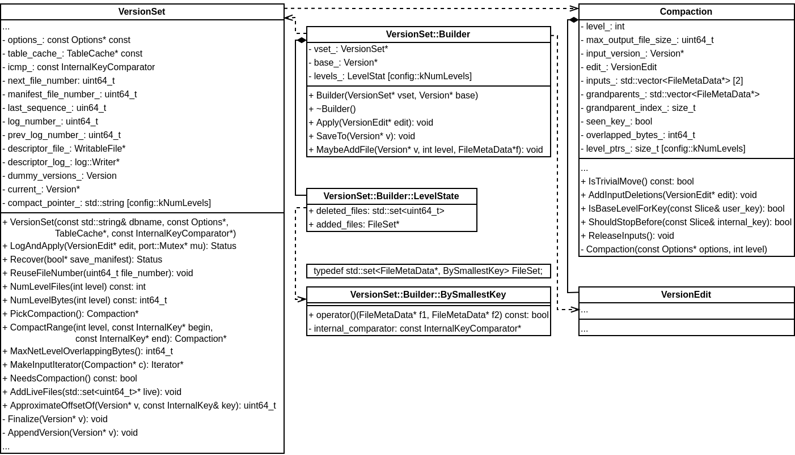

## VersionSet::Builder


Builder 负责将一个 VersionEdit 应用到一个 Version 上（成员变量 base_ 指向），生成新的 Version。Apply() 函数将版本与版本的变化部分VersionEdit 记录在Builder，定义如下：
```
  void Apply(VersionEdit* edit) {
    // Update compaction pointers
    for (size_t i = 0; i < edit->compact_pointers_.size(); i++) {
      const int level = edit->compact_pointers_[i].first;
      vset_->compact_pointer_[level] = // 合并时每 Level 开始的 Key
          edit->compact_pointers_[i].second.Encode().ToString();
    }

    // Delete files
    const VersionEdit::DeletedFileSet& del = edit->deleted_files_;
    for (VersionEdit::DeletedFileSet::const_iterator iter = del.begin();
         iter != del.end(); ++iter) {
      const int level = iter->first;
      const uint64_t number = iter->second;
      levels_[level].deleted_files.insert(number);
    }

    // Add new files
    for (size_t i = 0; i < edit->new_files_.size(); i++) {
      const int level = edit->new_files_[i].first;
      FileMetaData* f = new FileMetaData(edit->new_files_[i].second);
      f->refs = 1;
      // *
      f->allowed_seeks = static_cast<int>((f->file_size / 16384U));
      if (f->allowed_seeks < 100) f->allowed_seeks = 100;

      levels_[level].deleted_files.erase(f->number);
      levels_[level].added_files->insert(f);
    }
  }
```
对于新 Version 文件的整理（删除、添加和合并）延迟到一定搜索次数后进行。LevelDB 做了如下假设：

1. 查询一个文件耗时 10ms；
2. 读写 1MB 数据耗时 10ms（假设速度 100MB/s）；
3. 合并 1MB 数据需要读写 25MB 数据：从该 Level 读取 1MB 数据，从下一个 Level 读取 10-12MB 数据（边界可能未对齐），将 10-12MB 写入下一 Level；

这意味着 25 次查找的成本和合并 1MB 数据代价相同。即一次查询和合并 40KB 数据代价大致相同。LevelDB 设置比较保守，在触发合并之前，大约每 16KB 数据允许查找一次，也就是一个文件查询次数超过 file_size / 16384，就会触发合并操作。

函数 SaveTo() 用于将 VersionEdit 应用到当前 Version 生成新的 Version，定义如下：
```
  void SaveTo(Version* v) {
    BySmallestKey cmp;
    cmp.internal_comparator = &vset_->icmp_;
    for (int level = 0; level < config::kNumLevels; level++) {
      // Merge the set of added files with the set of pre-existing files.
      // Drop any deleted files.  Store the result in *v.
      const std::vector<FileMetaData*>& base_files = base_->files_[level];
      std::vector<FileMetaData*>::const_iterator base_iter = base_files.begin();
      std::vector<FileMetaData*>::const_iterator base_end = base_files.end();
      const FileSet* added = levels_[level].added_files;
      v->files_[level].reserve(base_files.size() + added->size());
      for (FileSet::const_iterator added_iter = added->begin();
           added_iter != added->end(); ++added_iter) {
        // Add all smaller files listed in base_
        for (std::vector<FileMetaData*>::const_iterator bpos =
                 std::upper_bound(base_iter, base_end, *added_iter, cmp);
             base_iter != bpos; ++base_iter) {
          MaybeAddFile(v, level, *base_iter); // (1)
        }

        MaybeAddFile(v, level, *added_iter); // (2)
      }

      // Add remaining base files
      for (; base_iter != base_end; ++base_iter) {
        MaybeAddFile(v, level, *base_iter); // (3)
      }

#ifndef NDEBUG
      // Make sure there is no overlap in levels > 0
      if (level > 0) {
        for (uint32_t i = 1; i < v->files_[level].size(); i++) {
          const InternalKey& prev_end = v->files_[level][i - 1]->largest;
          const InternalKey& this_begin = v->files_[level][i]->smallest;
          if (vset_->icmp_.Compare(prev_end, this_begin) >= 0) {
            fprintf(stderr, "overlapping ranges in same level %s vs. %s\n",
                    prev_end.DebugString().c_str(),
                    this_begin.DebugString().c_str());
            abort();
          }
        }
      }
#endif
    }
  }
```
在当前 Version 添加 VersionEdit 内容时，需要确保文件的有序性（Level-0 文件 Key 值可能重叠，其他 Level 文件的 Key 值不能重叠），这就是上面代码 (1)、(2) 和 (3) 的含义，先添加 Key 小于 added_iter 的文件，再添加 added_iter，最后添加 Key 大于 added_iter 的文件。

函数 MayAddFile() 用于添加文件，如果 f 属于删除的文件，直接返回。否则将其添加到 v 中。不过，如果 f 所属的 Level 不为 0，需要检查 f 的Key 是否比前一个文件的 Key 值大。
```
  void MaybeAddFile(Version* v, int level, FileMetaData* f) {
    if (levels_[level].deleted_files.count(f->number) > 0) {
      // File is deleted: do nothing
    } else {
      std::vector<FileMetaData*>* files = &v->files_[level];
      if (level > 0 && !files->empty()) {
        // Must not overlap
        assert(vset_->icmp_.Compare((*files)[files->size() - 1]->largest,
                                    f->smallest) < 0);
      }
      f->refs++;
      files->push_back(f);
    }
  }
```