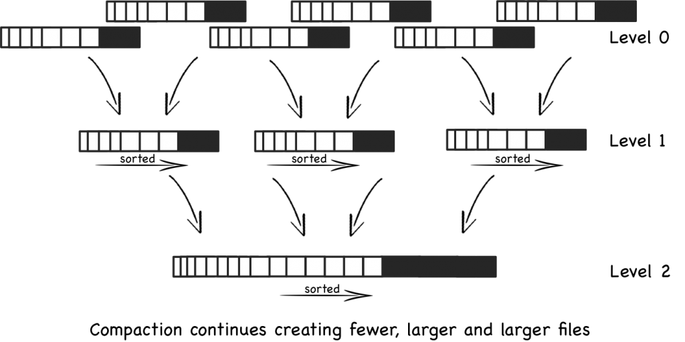

## 原理
### Log-Structured Merge Tree (LSM-Tree)
目前，LSM-Tree 被很多产品用作主要的文件组织结构，包括 HBase、Cassandra、LevelDB 和 SQLite，甚至 MongoDB 3.0 版本也引入了一个可选的 LSM-Tree 引擎。

LSM-Tree 的有趣之处在于它摆脱了文件组织领域主流的基于二叉树的模式。LSM-Tree 看上去有些反直觉，但是当考虑到现代的存储系统的特点后，才能体会 LSM-Tree 的精妙之处。简而言之，LSM-Tree 旨在提供比传统 B+ 树或者 ISAM（Indexed Sequential Access Method）方法更好的写入吞吐量。这是通过摈弃随机的本地更新操作来达到这个目标。

那么为什么这是一个好的方法呢？本质上讲，这时一个古老的话题--对于磁盘而言，随机访问很慢，而顺序访问却很快。无论磁盘是机械的还是固态的，甚至是主存，在这两种访问模式之间，都有巨大的性能差距（三个数量级）。这说明应该避免随机访问，尽量执行顺序访问。

所以，如果我们关注数据写入吞吐量，最好该怎么做？一个好的策略是简单地将数据附加在文件尾部。这个策略常称为日志或者堆文件，因为完全是顺序访问，可以提供逼近理论的写入吞吐量（通常是每块磁盘 200～300 MB/s）。

上述方法足够简单，性能很好，所以在很多海量数据应用中广泛使用。但是，它有一个明显的缺点，从日志中随机读取将花费比写入多得多的时间，涉及到按时间顺序从近及远扫描日志，直到找到查找的键。这意味着，日志策略只适用于简单的场景：要么数据是整体访问，要么明确知道数据偏移。

因此，为了应对更复杂的读取范式（比如基于键的搜索，范围搜索），日志是不够的。广泛地讲，有四种方式可以帮助我们解决问题。
1. 对文件排序（基于键）。如果数据宽度一致，可以使用二分查找。如果不是，可以使用索引加扫描。
2. 哈希。使用哈希函数将数据打散进入 buckets，之后就可以直接读取。
3. B+ 树。使用有助于导航的文件组织，比如 B+ 树、ISAM 等
4. 外部文件。数据就是一个日志形式，另外单独创建哈希或者索引。

所有这些方法都可以显著提高读性能（复杂度从 O(N) 到最佳 O(log N)）。遗憾的是，这些结构添加了顺序信息，而这些信息会使得写操作变慢，日志结构就不能用了。鱼和熊掌不可兼得。

值得一提的是，以上所有四个选项都在数据上施加了某种形式的总体结构。数据是有意且专门放置在文件系统周围的，因此索引可以快速再次找到它。遗憾的是，在写入数据时当然必须尊重其结构。在这里，我们开始通过增加随机磁盘访问来降低写入性能。更糟糕的是，我们现在需要更新哈希或 B+ 索引的结构。这意味着更新文件系统的特定部分，需要缓慢的随机访问。

这就引入 LSM-Tree。与上述四种方法都不同，该技术是面向磁盘的，对内存的需求很少，仅限于性能提升，但是保留了日志系统的优秀的写性能。一个缺点是相比于 B+ 树弱一点的读性能。概括上讲，这种技术尽其所能，利用磁盘的顺序访问性能。

### LSM-Tree 基本算法
从概念上讲，基本的 LSM-Tree 非常简单，它并不是具有一个大的索引结构，而是将一批写入数据顺序地保存到一组较小的索引文件中。因此，每个文件都包含在短时间内进行的一批更改。并且每个文件在写入之前都会进行排序，因此搜索会很快。此外，文件是不可更改的，永远不会更新。新的更新会进入新的文件。读取会检查所有文件，并且定期将文件合并在一起以减少文件数量。

进一步地，当更新到达时，会将它们添加到内存中的缓冲区中，该缓冲区通常以树（红黑树等）的形式保存，以保留键值顺序。在大多数实现中，“内存表”（Memtable）作为预写日志（Write Ahead Log）的缓冲，WAL 完全在磁盘上，仅仅用于恢复。内存表填满后，已排序的数据将刷新到磁盘上的新文件，随着越来越多的写入操作重复此过程。重要的是，由于文件未编辑，系统仅执行顺序 IO。新条目或编辑仅创建连续文件。

因此，随着越来越多的数据进入系统，将创建越来越多的这些不可变的有序文件。每一个代表一小部分按时间顺序排列的变更，并保持排序。
由于旧文件未更新，因此会创建重复条目以取代以前的记录（或删除标记），这也就产生了一些冗余的数据。

系统会周期性地执行合并操作（Compaction）。合并操作选择一些文件，去掉重复或者需要删除的更新，然后合并在一起。这对于删除冗余非常重要，但更重要的是，要保持对读取操作性能的控制，随着文件数量增加，读取性能会下降。幸运的是，由于文件已排序，因此合并文件的过程非常有效。

当执行一个读操作，系统首先检查内存缓冲区（内存表）。如果没有找到对应的键，则以相反的时间顺序一次检查各个文件，直到找到目标键为止。由于每个文件都是有序地，因此查找相对简单。但是，随着文件数量的增加，读取操作将变得越来越慢，因为每个文件都需要检查，这是个问题。

因此在 LSM-Tree 中读取要比就地（in-place）读取方法慢。幸运的是，有一些技巧可以优化读取操作。最常见的方法就是在内存中保存页索引。这样可以方便找到目标 Key。LevelDB、RocksDB 以及 BigTable 就是通过在每个文件末尾保留一个索引块来执行此操作。这通常比直接二进制搜索更好，因为它允许使用可变长度字段，并且更适合压缩数据。

即使每个文件都添加索引，读操作仍会随着文件数量的增加而变慢。通过定期将文件合并在一起，使得文件数量和读取性能都在可接受范围内。即使使用合并，读取仍将需要访问许多文件。大多数实现都通过使用 Bloom Filter 来消除这种情况。Bloom Filter 是一种内存有效的方法，可以确定文件是否包含键。

从“写”的角度来看，所有写操作都按批且按顺序进行写。合并回合还会产生定期的额外 IO 开销。但是，在查找记录时，读取可能会大量的文件。我们将写入时的随机 IO 换成读取时的随机 IO。如果我们可以使用 Bloom Filter 之类的技巧或者大文件缓冲等硬件技巧类优化读取性能，那么这种折衷是可取的。

### LSM-Tree 基本合并
为了保持 LSM-Tree 的读取相对较快，文件数量的管理非常重要。比如说，创建了一定数量的文件（例如 5 个文件，每个文件有 10 行）后，它们将合并为一个文件，其中包含 50 行（或可能少一些）。此过程继续，每次第五个文件填满时，这些文件就会合并一个文件（50 行或更少）。最终假设有五个 50 行的文件。 此时，将五个 50 行的文件合并为一个 250 行的文件。该过程将继续创建越来越大的文件。这种通用方法的问题是创建了大量文件：必须单独搜索所有文件以读取结果（至少在最坏的情况下）。

### 分级合并（Leveled Compaction）
诸如 LevelDB、RocksDB 和 Cassandra 等较新的实现，不是使用基于文件大小，而是基于级别来进行合并。这可以减少最坏情况下读取操作需要访问的文件数量，同时也能减少单次压缩的副作用。分级合并和基本合并有两点不同：
1. 每级包含多个文件，并且保证同一级中不会有重复的键。也就是说，键分布在不同的文件中。因此，在同一级别中，查找一个键只需要访问一个数据。第一级别比较特殊，键可能重复。
2. 文件是一次合并到上级文件中。随着某级写满，会从中抽取单个文件将其合并到上级文件中，从而为添加更多数据腾出空间。这与基本方法略有不同，基本方法是将几个大小相似的文件合并为一个更大的文件。

这些变化意味值分级合并会随着时间的流逝扩展合并的影响，并且需要更少的总空间，它还具有更好的读取性能。但是，大多数工作负载的总 IO 较高，这意味着某些较简单的面向写入的工作负载将无法受益。