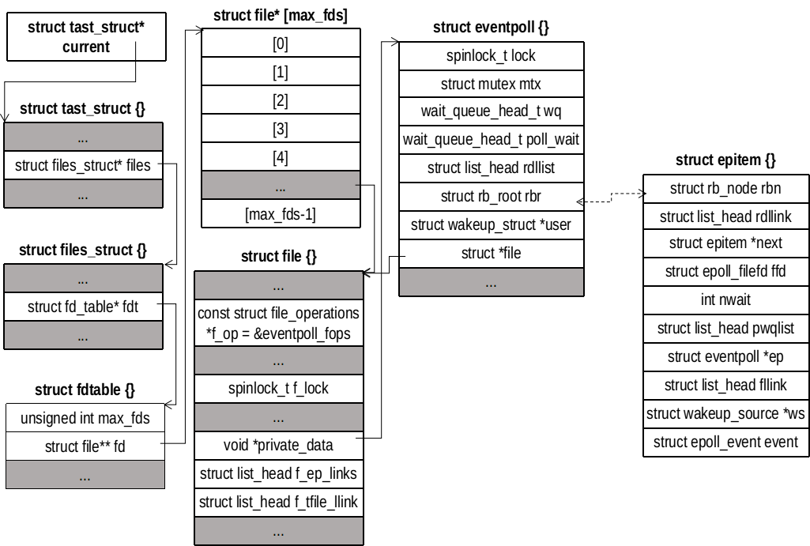

## [epoll(7) 实现及其优缺点](https://tqr.ink/2017/10/05/implementation-of-epoll/)
相对于 select(2) 来说，epoll(7) 没有描述符个数限制。调用 epoll_ctl(2) 注册事件的时候将相关数据拷入内核，以后调用 epoll_wait(2) 不会像 select(2) 或 poll(2) 那样，每次都从用户空间拷贝数据到内核空间。并且与 select(2) 或 poll(2) 返回所有事件不同的是，epoll(7) 返回的是处于就绪的事件的列表。此外 epoll(7) 是基于事件驱动的，在所有添加事件会对应文件建立回调关系，也就是说，当相应的事件发生时会调用这个回调方法，它会将发生的事件添加到就绪链表中。

## 接口函数
```
/// @file sys/epoll.h
typedef union epoll_data
{
  void *ptr;
  int fd;
  uint32_t u32;
  uint64_t u64;
} epoll_data_t;

struct epoll_event
{
  uint32_t events;	/* Epoll events */
  epoll_data_t data;	/* User data variable */
} __EPOLL_PACKED;

#include <sys/epoll.h>
int epoll_create(int size);
int epoll_ctl(int epfd, int op, int fd, struct epoll_event *event);
int epoll_wait(int epfd, struct epoll_event *events, int maxevents, int timeout);
```

## epoll(7) 的数据结构
epoll(7) 的原理和 select(2) 和 poll(2) 都不一样。epoll(7) 在内核中会保存需要监视事件（文件和期望的就绪状态），这时通过 epoll_ctl(2) 来完成监听事件的添加、修改和移除。所以内核中需要特定的数据结构来保存需要监视的事件。首先内核用 eventpoll 结构体来管理所有的监视事件。第一，所有监视事件用红黑树串联起来；第二，一切皆文件，创建 eventpoll 对象会绑定一个匿名文件的 file 对象。我们可以像操作文件一样操作 eventpoll 对象。


```
/// @file fs/eventpoll.c
180 struct eventpoll {
182     spinlock_t            lock;                 // 自旋锁，保护本结构体
190     struct mutex          mtx;                  // 互斥变量，保护 file 对象
193     wait_queue_head_t     wq;                   // sys_epoll_wait() 等待队列
196     wait_queue_head_t     poll_wait;            // file->poll() 等待队列
199     struct list_head      rdllist;              // 就绪事件链表
202     struct rb_root        rbr;                  // 红黑树的根
209     struct epitem        *ovflist;              // 备选队列，锁被占用时添加到此
212     struct wakeup_source *ws;                   // 
215     struct user_struct   *user;                 // epoll_create() 调用者信息
217     struct file          *file;                 // 绑定的 file 对象
220     int                   visited;
221     struct list_head      visited_list_link;
222 };
```
每一个事件都用一个 epitem 结构体表示
```
/// @file fs/eventpoll.c
136 struct epitem {
137     union {
139         struct rb_node          rbn;     // 挂到红黑树
141         struct rcu_head         rcu;     // 挂到释放链表
142     };
145     struct list_head            rdllink; // 挂到就绪链表
151     struct epitem              *next;    // 串联ovflist链表
154     struct epoll_filefd         ffd;     // 保存需要监视 fd 和 file
157     int                         nwait;   // 
160     struct list_head            pwqlist; // 
163     struct eventpoll           *ep;      // 所属的 eventpoll 对象
166     struct list_head            fllink;
169     struct wakeup_source __rcu *ws;
172     struct epoll_event          event;   // 监视的状态
173 };
```
eppoll_entry 是连接 epitem 和监视文件的等待队列的桥梁
```
/// @file fs/eventpoll.c
225 struct eppoll_entry {
227     struct list_head   llink;
230     struct epitem     *base;
236     wait_queue_t       wait;
239     wait_queue_head_t *whead;
240 };
```
ep_send_events_data 用于传递就绪事件
```
249 struct ep_send_events_data {
250     int maxevents;
251     struct epoll_event __user *events;
252 };
```

## 系统实现
```
/// @file include/uapi/linux/eventpoll.h
59 struct epoll_event {
60     __u32 events;
61     __u64 data;
62 } EPOLL_PACKED;
```

## epoll_create(2)
```
/// @file fs/eventpoll.c
1820 SYSCALL_DEFINE1(epoll_create, int, size)
1821 {
1822     if (size <= 0)
1823         return -EINVAL;
1824 
1825     return sys_epoll_create1(0);
1826 }
```
可以看到 size 参数没有任何作用，只要不小于 0 就行。
```
/// @file fs/eventpoll.c
1777 SYSCALL_DEFINE1(epoll_create1, int, flags)
1778 {
1779     int error, fd;
1780     struct eventpoll *ep = NULL;
1781     struct file *file;
1782 
1783     /* Check the EPOLL_* constant for consistency.  */
1784     BUILD_BUG_ON(EPOLL_CLOEXEC != O_CLOEXEC);
1785 
1786     if (flags & ~EPOLL_CLOEXEC)
1787         return -EINVAL;
1788     /*
1789      * Create the internal data structure ("struct eventpoll").
1790      */
1791     error = ep_alloc(&ep); // 申请一个 eventpoll 对象
1792     if (error < 0)
1793         return error;
1794     /*
1795      * Creates all the items needed to setup an eventpoll file. That is,
1796      * a file structure and a free file descriptor.
1797      */
1798     fd = get_unused_fd_flags(O_RDWR | (flags & O_CLOEXEC)); // 申请一个未用的描述符
1799     if (fd < 0) {
1800         error = fd;
1801         goto out_free_ep;
1802     }
1803     file = anon_inode_getfile("[eventpoll]", &eventpoll_fops, ep,
1804                  O_RDWR | (flags & O_CLOEXEC)); // 申请一个匿名文件
1805     if (IS_ERR(file)) {
1806         error = PTR_ERR(file);
1807         goto out_free_fd;
1808     }
1809     ep->file = file;
1810     fd_install(fd, file);
1811     return fd;
1812 
1813 out_free_fd:
1814     put_unused_fd(fd);
1815 out_free_ep:
1816     ep_free(ep);
1817     return error;
1818 }
```
epoll_create(2) 系统调用完成了 fd、file 和 eventpoll 三个对象之间的关联，并将 fd 返回给用户态应用程序。每一个 fd 都会对应一个 eventpoll 对象，用户通过 fd 可以将需要监视的目标事件添加到 eventpoll 中。