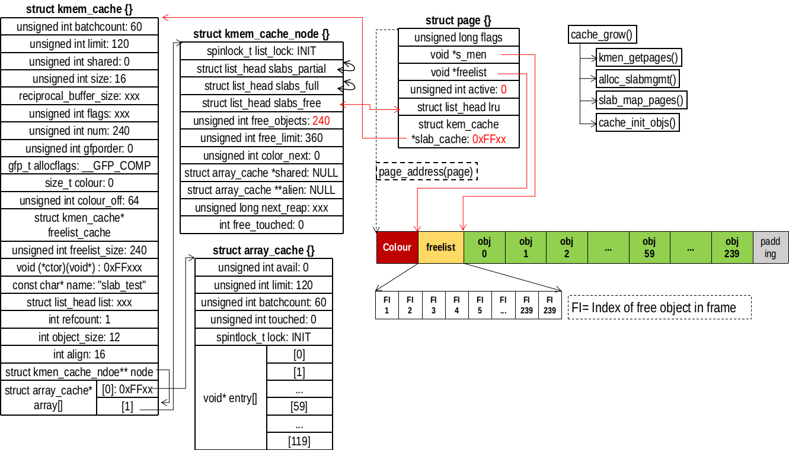
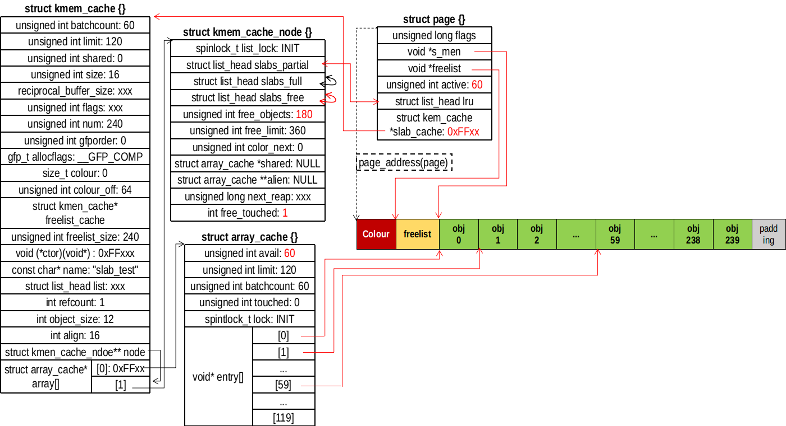
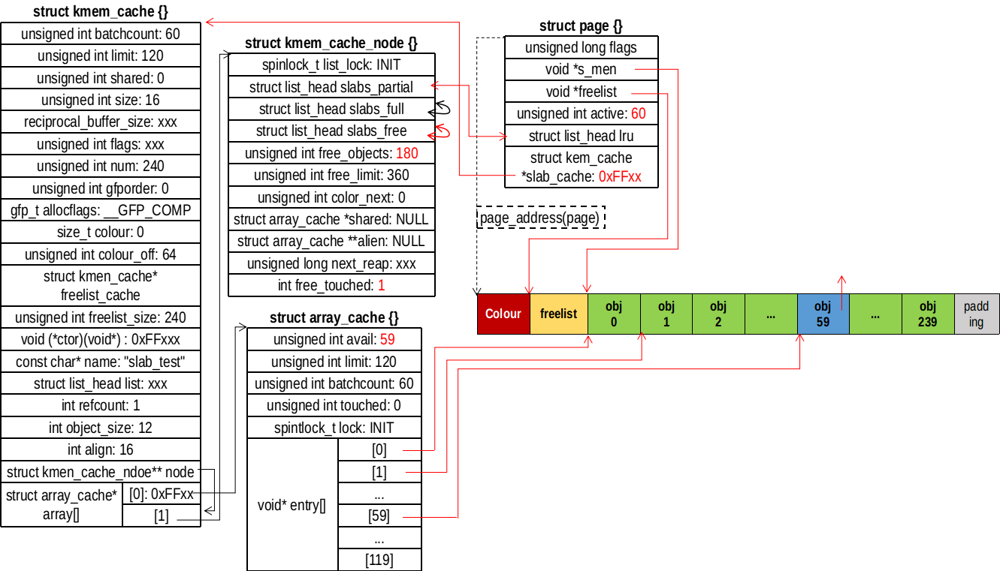

## STEP3、（退无可退）必须申请页面，转到 cache_grow
需要注意的是， cache_grow() 在申请页面后，再次跳转到 retry 

## 申请页


```
/// @file mm/slab.c
2738 static int cache_grow(struct kmem_cache *cachep,
2739         gfp_t flags, int nodeid, struct page *page)
2740 {
2741     void *freelist;
2742     size_t offset;
2743     gfp_t local_flags;
2744     struct kmem_cache_node *n;
2745 
2746     /*
2747      * Be lazy and only check for valid flags here,  keeping it out of the
2748      * critical path in kmem_cache_alloc().
2749      */
2750     BUG_ON(flags & GFP_SLAB_BUG_MASK);
2751     local_flags = flags & (GFP_CONSTRAINT_MASK|GFP_RECLAIM_MASK);
2752 
2753     /* Take the node list lock to change the colour_next on this node */
2754     check_irq_off();
2755     n = cachep->node[nodeid];
2756     spin_lock(&n->list_lock);
2757 
2758     /* Get colour for the slab, and cal the next value. */
2759     offset = n->colour_next;
2760     n->colour_next++;
2761     if (n->colour_next >= cachep->colour)
2762         n->colour_next = 0;
2763     spin_unlock(&n->list_lock);
2764 
2765     offset *= cachep->colour_off;
2766 
2767     if (local_flags & __GFP_WAIT)
2768         local_irq_enable();
2769 
2770     /*
2771      * The test for missing atomic flag is performed here, rather than
2772      * the more obvious place, simply to reduce the critical path length
2773      * in kmem_cache_alloc(). If a caller is seriously mis-behaving they
2774      * will eventually be caught here (where it matters).
2775      */
2776     kmem_flagcheck(cachep, flags);
2777 
2778     /*
2779      * Get mem for the objs.  Attempt to allocate a physical page from
2780      * 'nodeid'.
2781      */
2782     if (!page)
2783         page = kmem_getpages(cachep, local_flags, nodeid);
2784     if (!page)
2785         goto failed;
2786 
2787     /* Get slab management. */
2788     freelist = alloc_slabmgmt(cachep, page, offset,
2789             local_flags & ~GFP_CONSTRAINT_MASK, nodeid);
2790     if (!freelist)
2791         goto opps1;
2792 
2793     slab_map_pages(cachep, page, freelist);
```
alloc_slabmgmt() 是分配slab管理结构
```
/// @file mm/slab.c
2595 static void *alloc_slabmgmt(struct kmem_cache *cachep,
2596                    struct page *page, int colour_off,
2597                    gfp_t local_flags, int nodeid)
2598 {
2599     void *freelist;
2600     void *addr = page_address(page);
2601 
2602     if (OFF_SLAB(cachep)) { // 管理结构在外边
2603         /* Slab management obj is off-slab. */
2604         freelist = kmem_cache_alloc_node(cachep->freelist_cache,
2605                           local_flags, nodeid);
2606         if (!freelist)
2607             return NULL;
2608     } else { // 管理结构在slab内部
2609         freelist = addr + colour_off;
2610         colour_off += cachep->freelist_size;
2611     }
2612     page->active = 0;
2613     page->s_mem = addr + colour_off;
2614     return freelist;
2615 }
```
slab_map_pages() 是连接 cachep 和 freelist
```
/// @file mm/slab.c
2727 static void slab_map_pages(struct kmem_cache *cache, struct page *page,
2728                void *freelist)
2729 {
2730     page->slab_cache = cache;
2731     page->freelist = freelist;
2732 }
```

## 分割页


```
/// @file mm/slab.c : cache_grow()
2795     cache_init_objs(cachep, page);
2796 
2797     if (local_flags & __GFP_WAIT)
2798         local_irq_disable();
2799     check_irq_off();
2800     spin_lock(&n->list_lock);
2801 
2802     /* Make slab active. */
2803     list_add_tail(&page->lru, &(n->slabs_free));
2804     STATS_INC_GROWN(cachep);
2805     n->free_objects += cachep->num;
2806     spin_unlock(&n->list_lock);
2807     return 1;
2808 opps1:
2809     kmem_freepages(cachep, page);
2810 failed:
2811     if (local_flags & __GFP_WAIT)
2812         local_irq_disable();
2813     return 0;
2814 }
```
将页面分割成对象是调用 cache_init_objs() 完成的。完成后，将 page 挂到 slabs_free 链表的末尾。
```
/// @file mm/slab.c
2628 static void cache_init_objs(struct kmem_cache *cachep,
2629                 struct page *page)
2630 {
2631     int i;
2632 
2633     for (i = 0; i < cachep->num; i++) {
2634         void *objp = index_to_obj(cachep, page, i);
2635 #if DEBUG
/// ...
2666 #else
2667         if (cachep->ctor) // 有构造函数，调用够栈函数
2668             cachep->ctor(objp);
2669 #endif
2670         set_obj_status(page, i, OBJECT_FREE); // 空函数
2671         set_free_obj(page, i, i); // 设置slab管理结构freelist
2672     }
2673 }
```
index_to_obj() 是根据索引返回对象的地址
```
/// @file mm/slab.c
438 static inline void *index_to_obj(struct kmem_cache *cache, struct page *page,
439                  unsigned int idx)
440 {
441     return page->s_mem + cache->size * idx;
442 }
```
从 set_free_obj() 可以看出slab管理结构 freelist 是什么。freelist 是一个数组，存放对象的索引，在初始化的时候，freelist[i] = i，根据索引值就可以找到对象的地址。page->active 表示本 slab 分配出的对象，也表示 freelist 数组使用的是 [0, page->active) 区间，该区间保存的索引就是分配出去的对象的索引。
```
/// @file mm/slab.c
2622 static inline void set_free_obj(struct page *page,
2623                     unsigned int idx, freelist_idx_t val)
2624 {
2625     ((freelist_idx_t *)(page->freelist))[idx] = val;
2626 }
```

## 再次访问 retry


此时 slabs_free 链表不再为空，需要用这个链表上的对象填充 array_cache 数组。
```
/// @file mm/slab.c : cache_alloc_refill()
2957         while (page->active < cachep->num && batchcount--) { // 循环
2958             STATS_INC_ALLOCED(cachep);
2959             STATS_INC_ACTIVE(cachep);
2960             STATS_SET_HIGH(cachep);
2961 
2962             ac_put_obj(cachep, ac, slab_get_obj(cachep, page,
2963                                     node));
2964         }

2974 must_grow: // 第一次申请必定跳转到这里
2975     n->free_objects -= ac->avail;

2997     return ac_get_obj(cachep, ac, flags, force_refill); // 返回一个对象
```
slab_get_obj() 是从 page 获取一个对象
```
/// @file mm/slab.c
2685 static void *slab_get_obj(struct kmem_cache *cachep, struct page *page,
2686                 int nodeid)
2687 {
2688     void *objp;
2689 
2690     objp = index_to_obj(cachep, page, get_free_obj(page, page->active));
2691     page->active++; // 表示在使用
2692 #if DEBUG
2693     WARN_ON(page_to_nid(virt_to_page(objp)) != nodeid);
2694 #endif
2695 
2696     return objp;
2697 }
```
get_free_obj() 是返回未分配对象的索引
```
/// @file mm/slab.c
2617 static inline freelist_idx_t get_free_obj(struct page *page, unsigned int idx)
2618 {
2619     return ((freelist_idx_t *)page->freelist)[idx];
2620 }
```
ac_put_obj() 的作用就是将对象放到 array_cache 中
```
/// @file mm/slab.c
928 static inline void ac_put_obj(struct kmem_cache *cachep, struct array_cache *ac,
929                                 void *objp)
930 {
931     if (unlikely(sk_memalloc_socks()))
932         objp = __ac_put_obj(cachep, ac, objp);
933 
934     ac->entry[ac->avail++] = objp; // 这里
935 }
```
需要注意的是，这里是指针的改变，并没有对象的移动。最后调用 ac_get_obj() 返回一个对象

