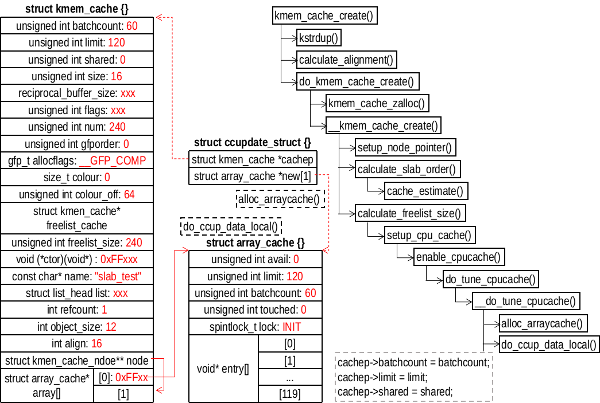

## STEP3、分配 cache_array


首先分配一个 ccupdate_struct 对象（用指针 new 指向）用于暂存分配的 array_cache 对象
```
/// @file mm/slab.c
3838 struct ccupdate_struct {
3839     struct kmem_cache *cachep;
3840     struct array_cache *new[0];
3841 };

3856 static int __do_tune_cpucache(struct kmem_cache *cachep, int limit,
3857                 int batchcount, int shared, gfp_t gfp)
3858 {   
3859     struct ccupdate_struct *new;
3860     int i;
3861     
3862     new = kzalloc(sizeof(*new) + nr_cpu_ids * sizeof(struct array_cache *),
3863               gfp);
3864     if (!new)
3865         return -ENOMEM;
```
然后开始分配 array_cache 对象
```
/// @file mm/slab.c     
3867     for_each_online_cpu(i) {
3868         new->new[i] = alloc_arraycache(cpu_to_mem(i), limit,
3869                         batchcount, gfp); // 分配array_cache*数组
3870         if (!new->new[i]) { // 分配失败，释放已经分配的
3871             for (i--; i >= 0; i--)
3872                 kfree(new->new[i]);
3873             kfree(new);
3874             return -ENOMEM;
3875         }
3876     }
3877     new->cachep = cachep;
```
将 new 指向的 array_cache 和 cachep 交换
```
/// @file mm/slab.c    
3879     on_each_cpu(do_ccupdate_local, (void *)new, 1); // 交换
3880     
3881     check_irq_on();
3882     cachep->batchcount = batchcount; 
3883     cachep->limit = limit;
3884     cachep->shared = shared;
```
最后释放 new 指向的对象
```
/// @file mm/slab.c
3886     for_each_online_cpu(i) {
3887         struct array_cache *ccold = new->new[i];
3888         if (!ccold) // 空指针，没有管理的对象
3889             continue;
3890         spin_lock_irq(&cachep->node[cpu_to_mem(i)]->list_lock);
3891         free_block(cachep, ccold->entry, ccold->avail, cpu_to_mem(i));
3892         spin_unlock_irq(&cachep->node[cpu_to_mem(i)]->list_lock);
3893         kfree(ccold);
3894     }
3895     kfree(new); // 释放 new 指向对象
3896     return alloc_kmem_cache_node(cachep, gfp);
3897 }
```

## alloc_arraycache()
```
/// @file mm/slab.c
796 static struct array_cache *alloc_arraycache(int node, int entries,
797                         int batchcount, gfp_t gfp)
798 {   // 需要分配entries个指针，指向管理的对象
799     int memsize = sizeof(void *) * entries + sizeof(struct array_cache);
800     struct array_cache *nc = NULL;
801 
802     nc = kmalloc_node(memsize, gfp, node); // 分配
810     kmemleak_no_scan(nc);
811     if (nc) {
812         nc->avail = 0;
813         nc->limit = entries;
814         nc->batchcount = batchcount;
815         nc->touched = 0;
816         spin_lock_init(&nc->lock);
817     }
818     return nc;
819 }
```

## on_each_cpu() 
on_each_cpu() 调用 do_ccpudate_local(info)
```
/// @file mm/slab.c
3843 static void do_ccupdate_local(void *info)
3844 {   
3845     struct ccupdate_struct *new = info; // 新分配的
3846     struct array_cache *old;
3847     
3848     check_irq_off();
3849     old = cpu_cache_get(new->cachep); // 原来cachep的array_cache
3850     // 交换
3851     new->cachep->array[smp_processor_id()] = new->new[smp_processor_id()];
3852     new->new[smp_processor_id()] = old;
3853 }
```