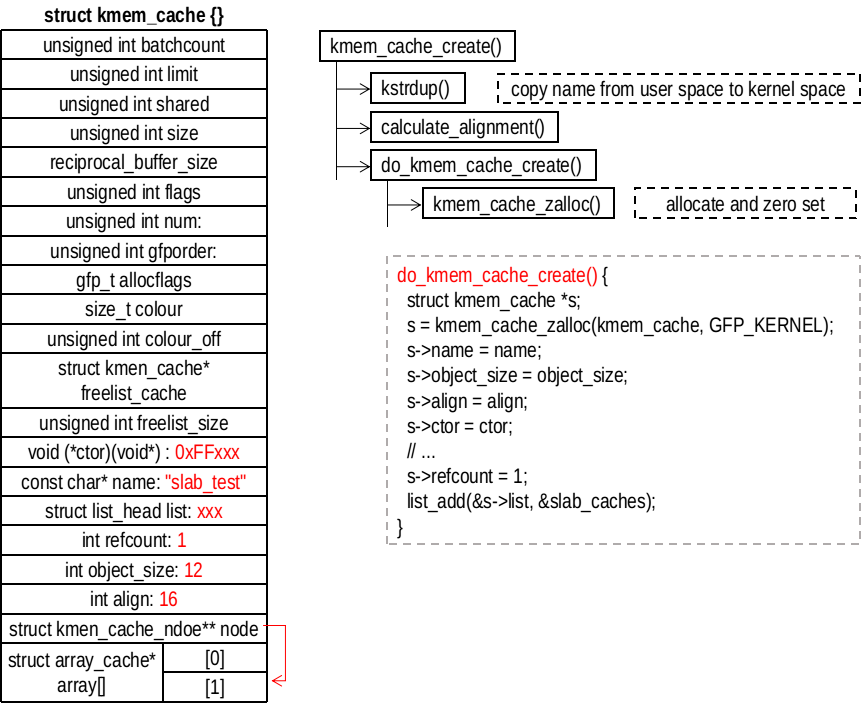

## STEP1、创建 cache 描述符


## kmem_cache_create()
调用 kmem_cache_create() 函数创建一个 keme_cache 类型的对象。
```
/// @file mm/slab_common.c
198 struct kmem_cache *
199 kmem_cache_create(const char *name, size_t size, size_t align,
200           unsigned long flags, void (*ctor)(void *))
```
各个参数的含义如下：
- name：创建 cache 的名字，用于在 `/proc/slabinfo` 表示一个cache
- size：通过本 cache 创建的对象的大小
- align：对齐字节
- flags：标志，常用的是 SLAB_HWCACHE_ALIGN，表示按照硬件缓存线对齐对象
- ctor：对象构造函数

接下来分析具体的实现
```
/// @file mm/slab_common.c
201 {
202     struct kmem_cache *s;
203     char *cache_name;
204     int err;
205 
206     get_online_cpus();
207     get_online_mems();
208 
209     mutex_lock(&slab_mutex);
210 
211     err = kmem_cache_sanity_check(name, size);
212     if (err)
213         goto out_unlock;
214 
215     /*
216      * Some allocators will constraint the set of valid flags to a subset
217      * of all flags. We expect them to define CACHE_CREATE_MASK in this
218      * case, and we'll just provide them with a sanitized version of the
219      * passed flags.
220      */
221     flags &= CACHE_CREATE_MASK;
222 
223     s = __kmem_cache_alias(name, size, align, flags, ctor);
224     if (s)
225         goto out_unlock;
226
227     cache_name = kstrdup(name, GFP_KERNEL); // 将名字拷贝到内核空间
228     if (!cache_name) {
229         err = -ENOMEM;
230         goto out_unlock;
231     }
232 
233     s = do_kmem_cache_create(cache_name, size, size,
234                  calculate_alignment(flags, align, size), // 对齐基准
235                  flags, ctor, NULL, NULL); // 创建kmen_cache对象
236     if (IS_ERR(s)) {
237         err = PTR_ERR(s);
238         kfree(cache_name); // 失败，释放名字占用的内存
239     }
240 
241 out_unlock:
242     mutex_unlock(&slab_mutex);
243 
244     put_online_mems();
245     put_online_cpus();
246 
247     if (err) {
248         if (flags & SLAB_PANIC)
249             panic("kmem_cache_create: Failed to create slab '%s'. Error %d\n",
250                 name, err);
251         else {
252             printk(KERN_WARNING "kmem_cache_create(%s) failed with error %d",
253                 name, err);
254             dump_stack();
255         }
256         return NULL;
257     }
258     return s;
259 }
```
可以看到，kmem_cache_create() 调用 do_kmem_cache_create() 执行创建 kmem_cache 对象的操作。在了解 do_kmem_cache_create() 之前先看一下 calculate_alignment() 是如何进行对齐处理的
```
/// @file mm/slab_common.c
107 /*
108  * Figure out what the alignment of the objects will be given a set of
109  * flags, a user specified alignment and the size of the objects.
110  */
111 unsigned long calculate_alignment(unsigned long flags,
112         unsigned long align, unsigned long size)
113 {   
121     if (flags & SLAB_HWCACHE_ALIGN) {
122         unsigned long ralign = cache_line_size(); // 64
123         while (size <= ralign / 2) // 找到大于size的最小值
124             ralign /= 2;
125         align = max(align, ralign);
126     }
127     
128     if (align < ARCH_SLAB_MINALIGN) // 16
129         align = ARCH_SLAB_MINALIGN; 
130 
131     return ALIGN(align, sizeof(void *)); // 64位系统8字节对齐
132 }
```
如果没有指定（通常是这样）align，需要满足三个对齐要求：（1）和 CPU 的 cache_line_size() 对齐；（2）满足 SLAB 最小对齐要求；（3）满足计算机对齐要求。calculate_alignment() 返回的是对齐值基准，而不是对象对齐后的大小。比如说 size 为 110，那么会返回 64。对象对齐后的大小应该为 128。

## do_kmem_cache_create()
```
/// @file mm/slab_common.c
134 static struct kmem_cache *
135 do_kmem_cache_create(char *name, size_t object_size, size_t size, size_t align,
136              unsigned long flags, void (*ctor)(void *),
137              struct mem_cgroup *memcg, struct kmem_cache *root_cache)
138 {
139     struct kmem_cache *s;
140     int err;
141 
142     err = -ENOMEM;
143     s = kmem_cache_zalloc(kmem_cache, GFP_KERNEL); // 分配kmem_cache对象
144     if (!s)
145         goto out;
146 
147     s->name = name;               // 名字
148     s->object_size = object_size; // 对象原始大小
149     s->size = size;               // 对象对齐后大小
150     s->align = align;             // 对齐基准
151     s->ctor = ctor;               // 构造函数
152 
153     err = memcg_alloc_cache_params(memcg, s, root_cache);
154     if (err)
155         goto out_free_cache;
156 
157     err = __kmem_cache_create(s, flags); // 分配或初始化其他内容
158     if (err)
159         goto out_free_cache;
160 
161     s->refcount = 1; // 引用计数
162     list_add(&s->list, &slab_caches);
163 out:
164     if (err)
165         return ERR_PTR(err);
166     return s;
167 
168 out_free_cache:
169     memcg_free_cache_params(s);
170     kfree(s);
171     goto out;
172 }
```