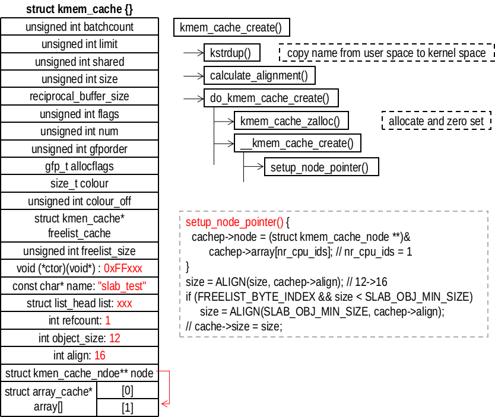
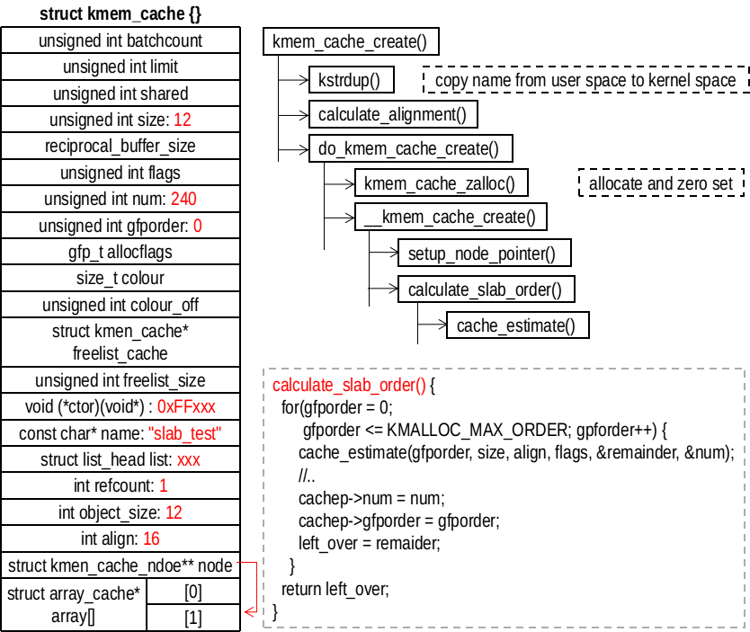
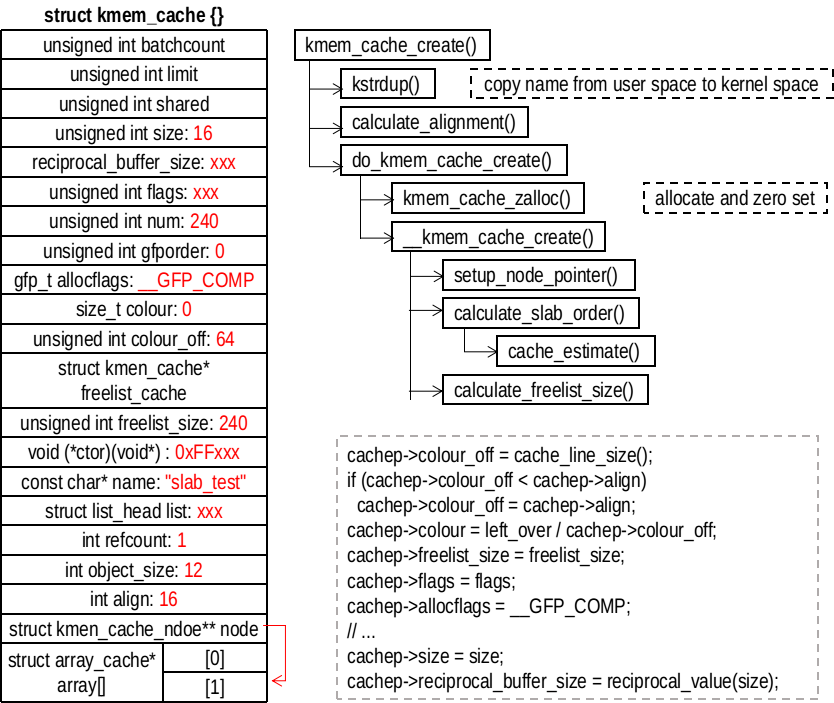

## STEP2、初始化 cache 管理描述符
初始化工作主要在 __kmem_cache_create() 完成
```
/// @file mm/slab.c
2225 int
2226 __kmem_cache_create (struct kmem_cache *cachep, unsigned long flags)
2227 {
2228     size_t left_over, freelist_size;
2229     size_t ralign = BYTES_PER_WORD; // sizeof(void*)
2230     gfp_t gfp;
2231     int err;
2232     size_t size = cachep->size; // 对象大小
2233 
2234 #if DEBUG
/// ...
2250 #endif
```
指针 cachep 指向已经分配的 kmem_cache 的对象首先是再次做对齐处理。目前 cachep->size 是对象的实际大小，如果标志仅仅是 SLAB_HWCACHE_ALIGN，不会更新 cachep->align。随后调用 setup_node_pointer() 更新 cachep->node。最后更新 cachep->size 的大小，更新后表示对象对齐后的大小。



```
/// @file mm/slab.c
2257     if (size & (BYTES_PER_WORD - 1)) {
2258         size += (BYTES_PER_WORD - 1);
2259         size &= ~(BYTES_PER_WORD - 1);
2260     }
2261 
2262     if (flags & SLAB_RED_ZONE) {
2263         ralign = REDZONE_ALIGN; // 更新对齐量
2264         /* If redzoning, ensure that the second redzone is suitably
2265          * aligned, by adjusting the object size accordingly. */
2266         size += REDZONE_ALIGN - 1;
2267         size &= ~(REDZONE_ALIGN - 1);
2268     }
2269 
2270     /* 3) caller mandated alignment */
2271     if (ralign < cachep->align) { // 更新对齐量
2272         ralign = cachep->align;
2273     }
2274     /* disable debug if necessary */
2275     if (ralign > __alignof__(unsigned long long))
2276         flags &= ~(SLAB_RED_ZONE | SLAB_STORE_USER);
2277     /*
2278      * 4) Store it.
2279      */
2280     cachep->align = ralign; // 更新对齐
2281 
2282     if (slab_is_available())
2283         gfp = GFP_KERNEL;
2284     else
2285         gfp = GFP_NOWAIT;
2286 
2287     setup_node_pointer(cachep);
2288 #if DEBUG
/// ....
2324 #endif
2332     if (size >= OFF_SLAB_MIN_SIZE && !slab_early_init &&
2333         !(flags & SLAB_NOLEAKTRACE)) // 
2334         /*
2335          * Size is large, assume best to place the slab management obj
2336          * off-slab (should allow better packing of objs).
2337          */
2338         flags |= CFLGS_OFF_SLAB; // obj很大，最好将slab管理obj的结构放在slab外面
2339 
2340     size = ALIGN(size, cachep->align); // 按照align对齐
2341     /*
2342      * We should restrict the number of objects in a slab to implement
2343      * byte sized index. Refer comment on SLAB_OBJ_MIN_SIZE definition.
2344      */
2345     if (FREELIST_BYTE_INDEX && size < SLAB_OBJ_MIN_SIZE)
2346         size = ALIGN(SLAB_OBJ_MIN_SIZE, cachep->align); // 满足最小obj大小
```
接下来是调用 calculate_slab_order() 计算需要分配多少个页面。
```
/// @file mm/slab.c
2348     left_over = calculate_slab_order(cachep, size, cachep->align, flags);
2349 
2350     if (!cachep->num) // 为0,表示分配失败
2351         return -E2BIG;
```

##  calculate_slab_order()


```
/// @file mm/slab.c
2077 static size_t calculate_slab_order(struct kmem_cache *cachep,
2078             size_t size, size_t align, unsigned long flags)
2079 {
2080     unsigned long offslab_limit;
2081     size_t left_over = 0; // 分割对象后剩余的空间
2082     int gfporder; // 表示需要的页面大小为2^gfporder
2083 
2084     for (gfporder = 0; gfporder <= KMALLOC_MAX_ORDER; gfporder++) {
2085         unsigned int num; // 可以分割的对象个数
2086         size_t remainder; // 剩余空间
2087 
2088         cache_estimate(gfporder, size, align, flags, &remainder, &num);
2089         if (!num) // 2^gfporder大小的页面无法分割出一个对象，继续增大页面
2090             continue;
2091 
2092         /* Can't handle number of objects more than SLAB_OBJ_MAX_NUM */
2093         if (num > SLAB_OBJ_MAX_NUM) // 超过最大对象大小，无法处理
2094             break;
2095 
2096         if (flags & CFLGS_OFF_SLAB) { // 对象管理结构在slab之外
                 // 每个对象占用管理结构的空间
2097             size_t freelist_size_per_obj = sizeof(freelist_idx_t);
2103             if (IS_ENABLED(CONFIG_DEBUG_SLAB_LEAK))
2104                 freelist_size_per_obj += sizeof(char);
2105             offslab_limit = size; // slab之外的管理结构最大为size
2106             offslab_limit /= freelist_size_per_obj; // 管理结构可以管理的对象数目
2107 
2108             if (num > offslab_limit) // 对象太大
2109                 break;
2110         }
2111 
2112         /* Found something acceptable - save it away */
2113         cachep->num = num; // 可以分割出的对象的数目
2114         cachep->gfporder = gfporder; // 要申请的页面大小
2115         left_over = remainder; // 分割出对象或管理结构后剩余的大小
2116 
2117         /*
2118          * A VFS-reclaimable slab tends to have most allocations
2119          * as GFP_NOFS and we really don't want to have to be allocating
2120          * higher-order pages when we are unable to shrink dcache.
2121          */
2122         if (flags & SLAB_RECLAIM_ACCOUNT)
2123             break;
2124 
2125         /*
2126          * Large number of objects is good, but very large slabs are
2127          * currently bad for the gfp()s.
2128          */
2129         if (gfporder >= slab_max_order)
2130             break;
2131 
2132         /*
2133          * Acceptable internal fragmentation?
2134          */
2135         if (left_over * 8 <= (PAGE_SIZE << gfporder))
2136             break; // 内部碎片大小满足要求
2137     }
2138     return left_over; // 返回剩余的空间大小
2139 }
```
然后看一下 cache_estimate() 的操作
```
/// @file mm/slab.c
662 static void cache_estimate(unsigned long gfporder, size_t buffer_size,
663                size_t align, int flags, size_t *left_over,
664                unsigned int *num)
665 {
666     int nr_objs;
667     size_t mgmt_size;
668     size_t slab_size = PAGE_SIZE << gfporder;
669 
684     if (flags & CFLGS_OFF_SLAB) { // slab管理结构在slab之外
685         mgmt_size = 0;
686         nr_objs = slab_size / buffer_size;
687 
688     } else {
689         nr_objs = calculate_nr_objs(slab_size, buffer_size,
690                     sizeof(freelist_idx_t), align);
691         mgmt_size = calculate_freelist_size(nr_objs, align);
692     }
693     *num = nr_objs;
694     *left_over = slab_size - nr_objs*buffer_size - mgmt_size;
695 }
```
我么可以看到，如果 slab 管理结构在 slab 之外，计算相当简单。复杂的是当管理结构在 slab 内部的时，需要考虑管理结构的放置。第一步是调用 calculate_nr_objs() 计算可以分割出多少个对象。
```
/// @file mm/slab.c
627 static int calculate_nr_objs(size_t slab_size, size_t buffer_size,
628                 size_t idx_size, size_t align)
629 {   
630     int nr_objs;
631     size_t remained_size;
632     size_t freelist_size;
633     int extra_space = 0;
634     
635     if (IS_ENABLED(CONFIG_DEBUG_SLAB_LEAK))
636         extra_space = sizeof(char);
        // 忽略初对齐的填充。 填充最多为align-1个字节，而buffer_size至少align大小。
        // 在最坏的情况下，当考虑填充时，该结果将大于适合内存分配的对象的数量。
645     nr_objs = slab_size / (buffer_size + idx_size + extra_space);
646     
647     /*
648      * This calculated number will be either the right
649      * amount, or one greater than what we want.
650      */
651     remained_size = slab_size - nr_objs * buffer_size; // 甚于空间
652     freelist_size = calculate_freelist_size(nr_objs, align); // 管理结构占用空间（需要对齐）
653     if (remained_size < freelist_size) // 不能放下管理结构，牺牲一个对象的空间
654         nr_objs--;
655 
656     return nr_objs; // 返回空间数
657 }
```
第二步是调用 calculate_freelist_size() 计算 slab 管理结构的大小
```
/// @file mm/slab.c
613 static size_t calculate_freelist_size(int nr_objs, size_t align)
614 {   
615     size_t freelist_size;
616     
617     freelist_size = nr_objs * sizeof(freelist_idx_t);
618     if (IS_ENABLED(CONFIG_DEBUG_SLAB_LEAK))
619         freelist_size += nr_objs * sizeof(char);
620     
621     if (align)
622         freelist_size = ALIGN(freelist_size, align); // 对齐
623     
624     return freelist_size;
625 }
```

## __kmem_cache_create() 填写成员


```
/// @file mm/slab.c : __kmem_cache_create
2353     freelist_size = calculate_freelist_size(cachep->num, cachep->align); // 管理结构大小
         // 如果管理结构是放在slab外面的，并且剩余的空间够大，就把管理结构放置到slab内部
2359     if (flags & CFLGS_OFF_SLAB && left_over >= freelist_size) {
2360         flags &= ~CFLGS_OFF_SLAB; // slab管理结构在slab内部的标志
2361         left_over -= freelist_size; // 更新剩余的空间
2362     }
2363 
2364     if (flags & CFLGS_OFF_SLAB) {
2365         /* really off slab. No need for manual alignment */
2366         freelist_size = calculate_freelist_size(cachep->num, 0);
2368 #ifdef CONFIG_PAGE_POISONING
2369         /* If we're going to use the generic kernel_map_pages()
2370          * poisoning, then it's going to smash the contents of
2371          * the redzone and userword anyhow, so switch them off.
2372          */
2373         if (size % PAGE_SIZE == 0 && flags & SLAB_POISON)
2374             flags &= ~(SLAB_RED_ZONE | SLAB_STORE_USER);
2375 #endif
2376     }
2377 
2378     cachep->colour_off = cache_line_size(); // 颜色偏移值
2379     /* Offset must be a multiple of the alignment. */
2380     if (cachep->colour_off < cachep->align)
2381         cachep->colour_off = cachep->align; // 颜色对齐
2382     cachep->colour = left_over / cachep->colour_off; // 颜色的数量
2383     cachep->freelist_size = freelist_size; // slab管理结构的大小
2384     cachep->flags = flags; // 标志，增加slab管理结构在外还是在内的标志
2385     cachep->allocflags = __GFP_COMP;
2386     if (CONFIG_ZONE_DMA_FLAG && (flags & SLAB_CACHE_DMA))
2387         cachep->allocflags |= GFP_DMA;
2388     cachep->size = size; // 对象对齐后的大小
2389     cachep->reciprocal_buffer_size = reciprocal_value(size);
```
接下来就是申请其他的结构，比如说 slab 管理结构、cache_array 对象和 kmem_cache_node 对象
```
/// @file mm/slab.c : __kmem_cache_create
2391     if (flags & CFLGS_OFF_SLAB) { // 申请slab管理结构
2392         cachep->freelist_cache = kmalloc_slab(freelist_size, 0u);
2393         /*
2394          * This is a possibility for one of the kmalloc_{dma,}_caches.
2395          * But since we go off slab only for object size greater than
2396          * OFF_SLAB_MIN_SIZE, and kmalloc_{dma,}_caches get created
2397          * in ascending order,this should not happen at all.
2398          * But leave a BUG_ON for some lucky dude.
2399          */
2400         BUG_ON(ZERO_OR_NULL_PTR(cachep->freelist_cache));
2401     }
2402 
2403     err = setup_cpu_cache(cachep, gfp); // 申请cache_array和kmem_cache_node对象
2404     if (err) {
2405         __kmem_cache_shutdown(cachep);
2406         return err;
2407     }
2408 
2409     if (flags & SLAB_DEBUG_OBJECTS) {
2410         /*
2411          * Would deadlock through slab_destroy()->call_rcu()->
2412          * debug_object_activate()->kmem_cache_alloc().
2413          */
2414         WARN_ON_ONCE(flags & SLAB_DESTROY_BY_RCU);
2415 
2416         slab_set_debugobj_lock_classes(cachep);
2417     } else if (!OFF_SLAB(cachep) && !(flags & SLAB_DESTROY_BY_RCU))
2418         on_slab_lock_classes(cachep);
2419 
2420     return 0;
2421 }
```

## setup_cpu_cache()
```
/// @file mm/slab.c
2141 static int __init_refok setup_cpu_cache(struct kmem_cache *cachep, gfp_t gfp)
2142 {
2143     if (slab_state >= FULL)
2144         return enable_cpucache(cachep, gfp);
///...
```
setup_cpu_cache() 直接调用 enable_cpucache()，会完成 limit 和 batchcount 的设置
```
/// @file mm/slab.c
3926 static int enable_cpucache(struct kmem_cache *cachep, gfp_t gfp)
3927 {
3928     int err;
3929     int limit = 0;
3930     int shared = 0;
3931     int batchcount = 0;
3932 
3933     if (!is_root_cache(cachep)) {
3934         struct kmem_cache *root = memcg_root_cache(cachep);
3935         limit = root->limit; // 0
3936         shared = root->shared; // 0
3937         batchcount = root->batchcount; // 0
3938     }
3939 
3940     if (limit && shared && batchcount)
3941         goto skip_setup;
3951     if (cachep->size > 131072)
3952         limit = 1;
3953     else if (cachep->size > PAGE_SIZE)
3954         limit = 8;
3955     else if (cachep->size > 1024)
3956         limit = 24;
3957     else if (cachep->size > 256)
3958         limit = 54;
3959     else
3960         limit = 120; // 
3971     shared = 0;
3972     if (cachep->size <= PAGE_SIZE && num_possible_cpus() > 1) // 单 CPU 不成立
3973         shared = 8;
3974 
3975 #if DEBUG
/// ...
3982 #endif
3983     batchcount = (limit + 1) / 2;
3984 skip_setup:
3985     err = do_tune_cpucache(cachep, limit, batchcount, shared, gfp); // 分配工作
3986     if (err)
3987         printk(KERN_ERR "enable_cpucache failed for %s, error %d.\n",
3988                cachep->name, -err);
3989     return err;
3990 }
```
do_tune_cpucache() 会完成 cache_array 对象和 kmem_cache_node 对象的申请
```
/// @file mm/slab.c
3899 static int do_tune_cpucache(struct kmem_cache *cachep, int limit,
3900                 int batchcount, int shared, gfp_t gfp)
3901 {
3902     int ret;
3903     struct kmem_cache *c = NULL;
3904     int i = 0;
3905 
3906     ret = __do_tune_cpucache(cachep, limit, batchcount, shared, gfp); // 分配工作
3907 
3908     if (slab_state < FULL)
3909         return ret;
3910 
3911     if ((ret < 0) || !is_root_cache(cachep))
3912         return ret;
3913 
3914     VM_BUG_ON(!mutex_is_locked(&slab_mutex));
3915     for_each_memcg_cache_index(i) { // 不会执行
3916         c = cache_from_memcg_idx(cachep, i);
3917         if (c)
3918             /* return value determined by the parent cache only */
3919             __do_tune_cpucache(c, limit, batchcount, shared, gfp);
3920     }
3921 
3922     return ret;
3923 }
```