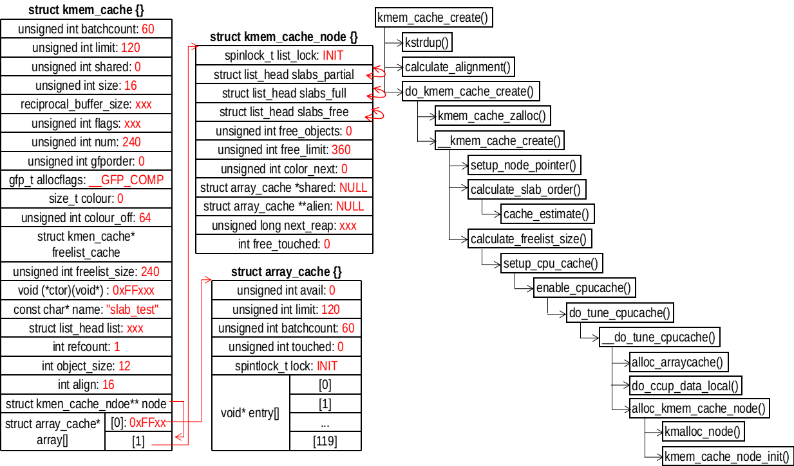

## STEP4、分配 kmem_cache_node 对象


```
/// @file mm/slab.c
3753 static int alloc_kmem_cache_node(struct kmem_cache *cachep, gfp_t gfp)
3754 {
3755     int node;
3756     struct kmem_cache_node *n;
3757     struct array_cache *new_shared;
3758     struct array_cache **new_alien = NULL;
3759 
3760     for_each_online_node(node) {
3761     // for ( (node) = 0; (node) == 0; (node) = 1)
3762                 if (use_alien_caches) { // 不执行
3763                         new_alien = alloc_alien_cache(node, cachep->limit, gfp);
3764                         if (!new_alien)
3765                                 goto fail;
3766                 }
3767 
3768         new_shared = NULL;
3769         if (cachep->shared) { // 0，不执行
3770             new_shared = alloc_arraycache(node,
3771                 cachep->shared*cachep->batchcount,
3772                     0xbaadf00d, gfp);
3773             if (!new_shared) {
3774                 free_alien_cache(new_alien);
3775                 goto fail;
3776             }
3777         }
3778         // cachep->node指向cachep->array_cache[1]
3779         n = cachep->node[node];
3780         if (n) { // 现在为空，不执行
3781             struct array_cache *shared = n->shared;
3782 
3783             spin_lock_irq(&n->list_lock);
3784 
3785             if (shared)
3786                 free_block(cachep, shared->entry,
3787                         shared->avail, node);
3788 
3789             n->shared = new_shared;
3790             if (!n->alien) {
3791                 n->alien = new_alien;
3792                 new_alien = NULL;
3793             }
3794             n->free_limit = (1 + nr_cpus_node(node)) *
3795                     cachep->batchcount + cachep->num;
3796             spin_unlock_irq(&n->list_lock);
3797             kfree(shared);
3798             free_alien_cache(new_alien);
3799             continue;
3800         }
             // 分配kmem_cache_node对象
3801         n = kmalloc_node(sizeof(struct kmem_cache_node), gfp, node);
3802         if (!n) { // 分配失败
3803             free_alien_cache(new_alien);
3804             kfree(new_shared);
3805             goto fail;
3806         }
3807 
3808         kmem_cache_node_init(n); // 初始化
3809         n->next_reap = jiffies + REAPTIMEOUT_NODE +
3810                 ((unsigned long)cachep) % REAPTIMEOUT_NODE;
3811         n->shared = new_shared; // NULL
3812         n->alien = new_alien; // NULL
3813         n->free_limit = (1 + nr_cpus_node(node)) *
3814                     cachep->batchcount + cachep->num; // (1+1) * (120 + 60)
3815         cachep->node[node] = n;
3816     }
3817     return 0;
3818 
3819 fail:
/// ...
3836 }
```
kmem_cache_node_init() 的初始化操作如下：
```
/// @file mm/slab.c
254 static void kmem_cache_node_init(struct kmem_cache_node *parent)
255 {
256     INIT_LIST_HEAD(&parent->slabs_full); // list->next = list; list->prev = list;
257     INIT_LIST_HEAD(&parent->slabs_partial);
258     INIT_LIST_HEAD(&parent->slabs_free);
259     parent->shared = NULL;
260     parent->alien = NULL;
261     parent->colour_next = 0;
262     spin_lock_init(&parent->list_lock);
263     parent->free_objects = 0;
264     parent->free_touched = 0;
265 }
```
到目前位置，SLAB管理相关的数据结构已经分配完成，可以看到，此时并没有任何可以用对象。