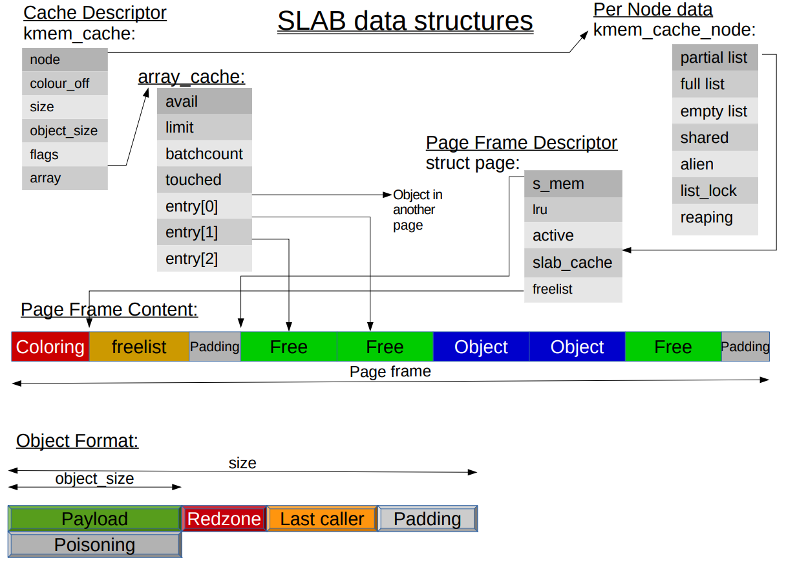

## 背景
Linux 内存管理使用的伙伴系统（Buddy System）最小分配单位是页， 即 PAGE_SIZE，并且每次分配 2^N 个页面。在 x86 架构中每页的大小一般为 4KB。但是很多情况下，内核某个模块某个时候需要申请的内存是远远小于 4KB 的，或者跟 2^N 个页面的大小差别大，如果使用伙伴系统的话，必定是会产生很大的浪费。所以，一个粒度更小的分配器呼之欲出，SLAB 就是为了解决这个小粒度内存分配的问题。

此外，我们考虑下面场景：如果一个内核模块经常使用某一种类型的对象，或者说频繁的创建、回收某一种类型的对象，那我们是不是可以尝试将这类对象单独存放起来，当模块不再使用时一个对象时，我们暂时先不释放对象的内存，而是缓存起来，等该模块再此申请使用这类对象，我们把之前应该回收的对象再拿出来，只不过重新构造一下对象，这样我们就减少了一次释放、申请内存的操作了。

SLAB 分配器是建立在伙伴系统之上的一个更加细粒度的内存分配系统，SLAB 分配器使用的内存空间是通过伙伴算法进行分配的，只不过 SLAB 对这些内存空间实现了自己的算法进而对小块内存进行管理。SALB 分配器背后的基本思想是缓存常用对象，供内核使用。如果没有基于对象的分配器，内核将花费大量时间来分配，初始化和释放同一个对象。

## SLAB 分配器数据结构
在 SLAB 分配器的语境中，cache 指管理特定类型（如 task_struct、mm_struct 和 tcp_sock 等）的多个对象的管理器。cache 管理的对象并不是散乱的，而是用叫做 slab 的结构组织起来的。cache 可以拥有多个 slab，每个 slab 都是从伙伴系统申请的 2^N 个页面构造而成。



- cache 描述符：kmem_cache 结构体类型的对象，保存 cache 的基本信息，比如名字、对象大小、对齐，每个 slab 对象的个数以及需要申请多少个页面
- kmem_cache_node：管理 slab
- array_cache：缓存对象
- slab 管理结构：管理 2^N 个页面分割的对象

### freelist_idx_t
```
/// @file mm/slab.c
163 #if FREELIST_BYTE_INDEX
164 typedef unsigned char freelist_idx_t;
165 #else
166 typedef unsigned short freelist_idx_t;
167 #endif
```

### array_cache
```
/// @file mm/slab.c
189 struct array_cache {
190     unsigned int avail;       // 可用对象的数目 
191     unsigned int limit;       // entry数组大小，表示最多可存放的对象数目
192     unsigned int batchcount;  // 当对象数量不足或超出，一次转移对象的数目
193     unsigned int touched;
194     spinlock_t   lock;
195     void        *entry[];     // 保存对象obj
204 };
```

### kmem_cache_node
```
/// @file mm/slab.h
269 struct kmem_cache_node {
270     spinlock_t list_lock;
271 
272 #ifdef CONFIG_SLAB
273     struct list_head     slabs_partial;  // 本链表中的部分对象空闲
274     struct list_head     slabs_full;     // 本链表中没有对象空闲
275     struct list_head     slabs_free;     // 本链表中所有对象空闲
276     unsigned long        free_objects;   // 空闲对象？？
277     unsigned int         free_limit;
278     unsigned int         colour_next;    // Per-node cache coloring
279     struct array_cache  *shared;         // shared per node
280     struct array_cache **alien;          // on other nodes
281     unsigned long        next_reap;      // updated without locking
282     int                  free_touched;   // updated without locking
283 #endif
284 
285 #ifdef CONFIG_SLUB
286     unsigned long nr_partial;
287     struct list_head partial;
288 #ifdef CONFIG_SLUB_DEBUG
289     atomic_long_t nr_slabs;
290     atomic_long_t total_objects;
291     struct list_head full;
292 #endif
293 #endif
294 
295 };
```

### kmem_cache
```
/// @file include/linux/slab_def.h
 6 /*
 7  * Definitions unique to the original Linux SLAB allocator.
 8  */
 9 
10 struct kmem_cache {
11 /* 1) Cache tunables. Protected by slab_mutex */
12     unsigned int            batchcount;    // 一次转移对象的数目
13     unsigned int            limit;
14     unsigned int            shared;
15 
16     unsigned int            size; // 对象对齐后大小
17     struct reciprocal_value reciprocal_buffer_size;
18 /* 2) touched by every alloc & free from the backend */
19 
20     unsigned int             flags;     /* constant flags */
21     unsigned int             num;       /* # of objs per slab */
22 
23 /* 3) cache_grow/shrink */
24     /* order of pgs per slab (2^n) */
25     unsigned int             gfporder;
26 
27     /* force GFP flags, e.g. GFP_DMA */
28     gfp_t                    allocflags;
29 
30     size_t                   colour;          /* cache colouring range */
31     unsigned int             colour_off;    /* colour offset */
32     struct kmem_cache       *freelist_cache;
33     unsigned int             freelist_size;
34 
35     /* constructor func */
36     void                   (*ctor)(void *obj); // 对象构造函数
37 
38 /* 4) cache creation/removal */
39     const char              *name;
40     struct list_head         list;
41     int                      refcount;         // 引用计数
42     int                      object_size;      // 对象原始大小
43     int                      align;            // 对齐基准
45 /* 5) statistics */
44 
46 #ifdef CONFIG_DEBUG_SLAB
// ...
69 #endif
86     struct kmem_cache_node **node;
87     struct array_cache      *array[NR_CPUS + MAX_NUMNODES];
91 };
```

## SLAB 接口函数
```
#include <linux/slab.h>
/// 创建 SLAB 分配器
struct kmem_cache* 
kmem_cache_create(const char *name, size_t size, size_t align, unsigned long flags, 
                  void (*ctor)(void*, struct kmem_cache*, unsigned long));

/// 释放 SLAB 分配器
void kmem_cache_destroy(struct kmem_cache *cachep);

/// 从 SLAB 分配器中分配对象
void *kmem_cache_alloc(struct kmem_cache *cachep, gfp_t flags);
void *kmem_cache_zalloc(struct kmem_cache *cachep, gfp_t flags); // 对象会清零

/// 将某个对象还会 SLAB 分配器
void kmem_cache_free(struct kmem_cache *cachep, void *objp);

/// 通用对象分配和释放
void *kmalloc(size_t size, int flags);
void kfree(const void* objp)
```
比如创建一个管理 struct test 的 cache
```
struct slab_test {
  float fval;
  int ival;
  char ch;
}; // sizeof(slab_test) = 12

void slab_ctor(void *ptr){
    struct slab_test *stptr = (struct slab_test*)ptr;
    stptr->fval = 3.14;
    stptr->ival = 2;
    stptr->ch = 'R';
}
struct kmem_cache *cachep = kmem_cache_create(
  "test_cache", sizeof(struct slab_test),
  0, SLAB_HWCACHE_ALIGN, slab_ctor);
```