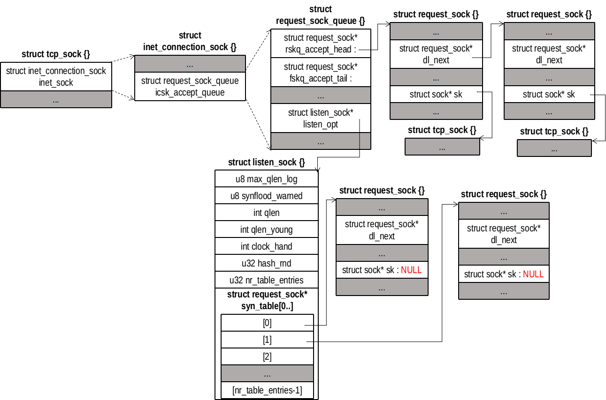

## accept(2) 接口
accept(2) 返回一个新的文件描述符，指向一个连接到客户的套接字文件。
```
int accept(int sockfd, struct sockaddr *addr, socklen_t *addrlen);
```
参数说明如下
- sockfd：服务端监听套接字
- addr：远端地址
- addrlen：地址长度

## 调用关系
```
sys_accept()
  |-->sys_accept4()
      |-->sockfd_lookup_light()
      |-->sock_alloc()
      |-->get_unused_fd_flags()
      |-->sock_alloc_file()
      |-->inet_accept()
      |   |-->inet_csk_accept()
      |   |-->sock_graft()
      |-->fd_install()
      |-->fput_light()
```

## sys_accept()
sys_accept() 直接调用 sys_accept4()
```
/// @file net/socket.c
1662 SYSCALL_DEFINE3(accept, int, fd, struct sockaddr __user *, upeer_sockaddr,
1663         int __user *, upeer_addrlen)
1664 {
1665     return sys_accept4(fd, upeer_sockaddr, upeer_addrlen, 0);
1666 }
```
sys_accept4() 首先创建一个新的 socket 对象和 file 对象，然后绑定两者。
```
/// @file net/socket.c
1581 SYSCALL_DEFINE4(accept4, int, fd, struct sockaddr __user *, upeer_sockaddr,
1582         int __user *, upeer_addrlen, int, flags)
1583 {
1584     struct socket *sock, *newsock;
1585     struct file *newfile;
1586     int err, len, newfd, fput_needed;
1587     struct sockaddr_storage address;
1588 
1589     if (flags & ~(SOCK_CLOEXEC | SOCK_NONBLOCK))
1590         return -EINVAL;
1591 
1592     if (SOCK_NONBLOCK != O_NONBLOCK && (flags & SOCK_NONBLOCK))
1593         flags = (flags & ~SOCK_NONBLOCK) | O_NONBLOCK;
1594 
1595     sock = sockfd_lookup_light(fd, &err, &fput_needed);
1596     if (!sock)
1597         goto out;
1598 
1599     err = -ENFILE;
1600     newsock = sock_alloc(); // 分配一个socket和inode
1601     if (!newsock)
1602         goto out_put;
1603 
1604     newsock->type = sock->type;
1605     newsock->ops = sock->ops;
1606 
1607     /*
1608      * We don't need try_module_get here, as the listening socket (sock)
1609      * has the protocol module (sock->ops->owner) held.
1610      */
1611     __module_get(newsock->ops->owner);
1612 
1613     newfd = get_unused_fd_flags(flags); // 申请一个未用的文件描述符
1614     if (unlikely(newfd < 0)) {
1615         err = newfd;
1616         sock_release(newsock);
1617         goto out_put;
1618     }
         // 分配一个 file 对象，绑定 socket 对象
1619     newfile = sock_alloc_file(newsock, flags, sock->sk->sk_prot_creator->name);
1620     if (unlikely(IS_ERR(newfile))) {
1621         err = PTR_ERR(newfile);
1622         put_unused_fd(newfd);
1623         sock_release(newsock);
1624         goto out_put;
1625     }
1626 
1627     err = security_socket_accept(sock, newsock);
1628     if (err)
1629         goto out_fd;
1630 
1631     err = sock->ops->accept(sock, newsock, sock->file->f_flags); // 调用 inet_accept()
1632     if (err < 0)
1633         goto out_fd;
1634 
1635     if (upeer_sockaddr) {
1636         if (newsock->ops->getname(newsock, (struct sockaddr *)&address,
1637                       &len, 2) < 0) {
1638             err = -ECONNABORTED;
1639             goto out_fd;
1640         }
1641         err = move_addr_to_user(&address,
1642                     len, upeer_sockaddr, upeer_addrlen);
1643         if (err < 0)
1644             goto out_fd;
1645     }
1646 
1647     /* File flags are not inherited via accept() unlike another OSes. */
1648 
1649     fd_install(newfd, newfile); // 绑定文件描述符和 file 对象 
1650     err = newfd;
1651 
1652 out_put:
1653     fput_light(sock->file, fput_needed);
1654 out:
1655     return err;
1656 out_fd:
1657     fput(newfile);
1658     put_unused_fd(newfd);
1659     goto out_put;
1660 }
```

## inet_accept()
调用 inet_csk_accept() 返回一个已建立的连接的传输控制块
```
/// @file  net/ipv4/af_inet.c 
672 int inet_accept(struct socket *sock, struct socket *newsock, int flags)
673 {
674     struct sock *sk1 = sock->sk; // 获取传输控制块
675     int err = -EINVAL;
676     struct sock *sk2 = sk1->sk_prot->accept(sk1, flags, &err); // inet_csk_accept
677 
678     if (!sk2)
679         goto do_err;
680 
681     lock_sock(sk2);
682 
683     sock_rps_record_flow(sk2);
684     WARN_ON(!((1 << sk2->sk_state) &
685           (TCPF_ESTABLISHED | TCPF_SYN_RECV |
686           TCPF_CLOSE_WAIT | TCPF_CLOSE)));
687 
688     sock_graft(sk2, newsock);
689 
690     newsock->state = SS_CONNECTED; // 已连接
691     err = 0;
692     release_sock(sk2);
693 do_err:
694     return err;
695 }
```
## inet_csk_accept()


```
/// @file  net/ipv4/inet_connection_sock.c 
292 struct sock *inet_csk_accept(struct sock *sk, int flags, int *err)
293 {
294     struct inet_connection_sock *icsk = inet_csk(sk);
295     struct request_sock_queue *queue = &icsk->icsk_accept_queue;
296     struct sock *newsk;
297     struct request_sock *req;
298     int error;
299 
300     lock_sock(sk);
301 
302     /* We need to make sure that this socket is listening,
303      * and that it has something pending.
304      */
305     error = -EINVAL;
306     if (sk->sk_state != TCP_LISTEN) // 不是监听套接字，出错
307         goto out_err;
308 
309     /* Find already established connection */
310     if (reqsk_queue_empty(queue)) { // 已建立连接的队列为空
311         long timeo = sock_rcvtimeo(sk, flags & O_NONBLOCK);
312         // 非阻塞套接字直接返回 0，否则返回阻塞时间
313         /* If this is a non blocking socket don't sleep */
314         error = -EAGAIN;
315         if (!timeo) // 非阻塞，返回-EAGAIN
316             goto out_err;
317 
318         error = inet_csk_wait_for_connect(sk, timeo); // 阻塞
319         if (error)
320             goto out_err;
321     }
322     req = reqsk_queue_remove(queue); // 出队，返回一个指向 request_sock 对象的指针
323     newsk = req->sk; // 取出传输控制块
324 
325     sk_acceptq_removed(sk); // --sk->sk_ack_backlog，已建立连接数量减 1
326     if (sk->sk_protocol == IPPROTO_TCP && queue->fastopenq != NULL) {
327         spin_lock_bh(&queue->fastopenq->lock);
328         if (tcp_rsk(req)->listener) {
329             /* We are still waiting for the final ACK from 3WHS
330              * so can't free req now. Instead, we set req->sk to
331              * NULL to signify that the child socket is taken
332              * so reqsk_fastopen_remove() will free the req
333              * when 3WHS finishes (or is aborted).
334              */
335             req->sk = NULL;
336             req = NULL;
337         }
338         spin_unlock_bh(&queue->fastopenq->lock);
339     }
340 out:
341     release_sock(sk);
342     if (req)
343         __reqsk_free(req);
344     return newsk; // 返回已建立连接的传输控制块
345 out_err:
346     newsk = NULL;
347     req = NULL;
348     *err = error;
349     goto out;
350 }
```