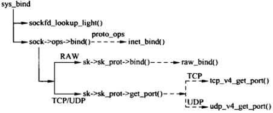

## bind(2) 接口
bind(2) 系统调用将一个本地的 IP 地址及传输层的端口和套接字关联起来。
```
int bind(int sockfd, const struct sockaddr *addr, socklen_t addrlen)
```
参数说明如下：
- sockfd：套接字文件描述符
- addr：本地地址
- addlen：addr 的字节数

## 调用关系


## sys_bind()
```
/// @file net/socket.c
1519 SYSCALL_DEFINE3(bind, int, fd, struct sockaddr __user *, umyaddr, int, addrlen)
1520 {
1521     struct socket *sock;
1522     struct sockaddr_storage address;
1523     int err, fput_needed;
1524 
1525     sock = sockfd_lookup_light(fd, &err, &fput_needed);
1526     if (sock) {
1527         err = move_addr_to_kernel(umyaddr, addrlen, &address); // 用户空间数据拷贝到内核空间
1528         if (err >= 0) {
1529             err = security_socket_bind(sock,
1530                            (struct sockaddr *)&address,
1531                            addrlen);
1532             if (!err)
1533                 err = sock->ops->bind(sock,
1534                               (struct sockaddr *)
1535                               &address, addrlen); // 绑定
1536         }
1537         fput_light(sock->file, fput_needed); // 操作完成，减少文件引用计数
1538     }
1539     return err;
1540 }
```
首先调用 sockfd_lookup_light() 返回文件描述符对应 file 对象，从中找到关联的套接字文件，并且返回是否需要减少该文件引用计数的标志。套接字和它地应的文件是绑定的，因此在使用套接字的时候需要增加对文件的引用计数，防止被意外释放。

### sockfd_lookup_light()
```
/// @file net/socket.c
453 static struct socket *sockfd_lookup_light(int fd, int *err, int *fput_needed)
454 {
455     struct fd f = fdget(fd);
456     struct socket *sock;
457 
458     *err = -EBADF;
459     if (f.file) {
460         sock = sock_from_file(f.file, err);
461         if (likely(sock)) {
462             *fput_needed = f.flags;
463             return sock;
464         }
465         fdput(f);
466     }
467     return NULL;
468 }
```

### inet_bind()
sock->ops->bind 函数指针指向具体套接字文件的绑定操作。
```
/// @file net/ipv4/af_inet.c
430 int inet_bind(struct socket *sock, struct sockaddr *uaddr, int addr_len)
431 {
432     struct sockaddr_in *addr = (struct sockaddr_in *)uaddr;
433     struct sock *sk = sock->sk;
434     struct inet_sock *inet = inet_sk(sk);
435     struct net *net = sock_net(sk);
436     unsigned short snum;
437     int chk_addr_ret;
438     int err;
```
如果当前套接字（如 SOCK_RAM）实现了 bind() 函数，则直接调用，进行地址绑定。
```
/// @file net/ipv4/af_inet.c
440     /* If the socket has its own bind function then use it. (RAW) */
441     if (sk->sk_prot->bind) {
442         err = sk->sk_prot->bind(sk, uaddr, addr_len);
443         goto out;
444     }
```
否则（如 SOCK_STREAM 和 SOCK_DGRAM）进行如下操作。首先进行地址和端口号合法性检查
```
/// @file net/ipv4/af_inet.c
459     chk_addr_ret = inet_addr_type(net, addr->sin_addr.s_addr);
468     err = -EADDRNOTAVAIL;
469     if (!sysctl_ip_nonlocal_bind && /* sysctl_ip_nonlocal_bin默认false */
470         !(inet->freebind || inet->transparent) && /* */
471         addr->sin_addr.s_addr != htonl(INADDR_ANY) && /* INADDR_ANY 不进行操作 */
472         chk_addr_ret != RTN_LOCAL &&
473         chk_addr_ret != RTN_MULTICAST &&
474         chk_addr_ret != RTN_BROADCAST)
475         goto out;
476 
477     snum = ntohs(addr->sin_port);
478     err = -EACCES;
479     if (snum && snum < PROT_SOCK && /* PROT_SOCK = 1024，绑定小于 1024 的端口 */
480         !ns_capable(net->user_ns, CAP_NET_BIND_SERVICE)) /* 当前进程没有特权 */
481         goto out;
```
然后进行地址绑定
```
/// @file net/ipv4/af_inet.c
490     lock_sock(sk); // 上锁
491 
492     /* Check these errors (active socket, double bind). */
493     err = -EINVAL;
494     if (sk->sk_state != TCP_CLOSE || inet->inet_num) // 已经绑定
495         goto out_release_sock;
496     // 在网络层绑定ip地址，inet_rcv_saddr用于hash查找，inet_saddr用于传输
497     inet->inet_rcv_saddr = inet->inet_saddr = addr->sin_addr.s_addr;
498     if (chk_addr_ret == RTN_MULTICAST || chk_addr_ret == RTN_BROADCAST)
499         inet->inet_saddr = 0;  /* Use device */
500 
501     // 在传输层绑定端口号，调用 inet_csk_get_port(TCP) 或者 udp_v4_get_port(UDP)，出错返回非 0
502     if (sk->sk_prot->get_port(sk, snum)) { 
503         inet->inet_saddr = inet->inet_rcv_saddr = 0; // 绑定失败
504         err = -EADDRINUSE;
505         goto out_release_sock;
506     }
507 
508     if (inet->inet_rcv_saddr)
509         sk->sk_userlocks |= SOCK_BINDADDR_LOCK; // 标记已经绑定ip地址
510     if (snum)
511         sk->sk_userlocks |= SOCK_BINDPORT_LOCK; // 标记以及绑定端口号
512     inet->inet_sport = htons(inet->inet_num); // inet_sock 本地端口号
513     inet->inet_daddr = 0; // 初始化目的ip地址
514     inet->inet_dport = 0; // 初始化目的端口号
515     sk_dst_reset(sk);
516     err = 0;
```