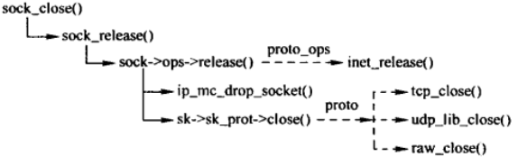
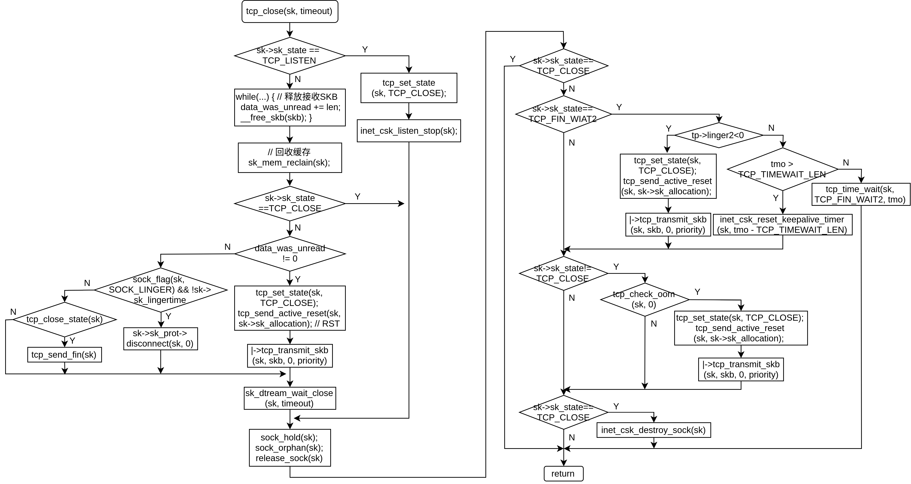

## close(2) 接口
close(2) 关闭各种文件描述符，这里只讨论关闭套接字文件描述符
```
int close(int sockfd);
```

## 调用关系


## sys_close()
```
/// @file fs/open.c
1051 SYSCALL_DEFINE1(close, unsigned int, fd)
1052 {
1053     int retval = __close_fd(current->files, fd);
1054 
1055     /* can't restart close syscall because file table entry was cleared */
1056     if (unlikely(retval == -ERESTARTSYS ||
1057              retval == -ERESTARTNOINTR ||
1058              retval == -ERESTARTNOHAND ||
1059              retval == -ERESTART_RESTARTBLOCK))
1060         retval = -EINTR;
1061 
1062     return retval;
1063 }
```
继续调用 \__close_fd()
```
/// @file fs/file.c
573 int __close_fd(struct files_struct *files, unsigned fd)
574 {
575     struct file *file;
576     struct fdtable *fdt;
577 
578     spin_lock(&files->file_lock);
579     fdt = files_fdtable(files);
580     if (fd >= fdt->max_fds)
581         goto out_unlock;
582     file = fdt->fd[fd]; // 文件描述符对应的 file 对象
583     if (!file)
584         goto out_unlock;
585     rcu_assign_pointer(fdt->fd[fd], NULL); // 从 fdt 中删除
586     __clear_close_on_exec(fd, fdt);
587     __put_unused_fd(files, fd); // 归还文件描述符
588     spin_unlock(&files->file_lock);
589     return filp_close(file, files); // 继续
590 
591 out_unlock:
592     spin_unlock(&files->file_lock);
593     return -EBADF;
594 }
```

## flip_close()
```
/// @file fs/open.c
1024 int filp_close(struct file *filp, fl_owner_t id)
1025 {
1026     int retval = 0;
1027 
1028     if (!file_count(filp)) { // 检查引用计数，引用计数为 0 表示关闭一个没有使用的文件，出错
1029         printk(KERN_ERR "VFS: Close: file count is 0\n");
1030         return 0;
1031     }
1032 
1033     if (filp->f_op->flush) // 套接字文件没有这个函数
1034         retval = filp->f_op->flush(filp, id);
1035 
1036     if (likely(!(filp->f_mode & FMODE_PATH))) {
1037         dnotify_flush(filp, id);
1038         locks_remove_posix(filp, id); // 直接返回
1039     }
1040     fput(filp);
1041     return retval;
1042 }
```

## fput()
```
/// @file fs/file_table.c
272 void fput(struct file *file)
273 {
274     if (atomic_long_dec_and_test(&file->f_count)) { // 递减引用计数
275         struct task_struct *task = current;
276 
277         if (likely(!in_interrupt() && !(task->flags & PF_KTHREAD))) {
278             init_task_work(&file->f_u.fu_rcuhead, ____fput);
279             if (!task_work_add(task, &file->f_u.fu_rcuhead, true))
280                 return;
281             /*
282              * After this task has run exit_task_work(),
283              * task_work_add() will fail.  Fall through to delayed
284              * fput to avoid leaking *file.
285              */
286         }
287 
288         if (llist_add(&file->f_u.fu_llist, &delayed_fput_list))
289             schedule_delayed_work(&delayed_fput_work, 1);
290     }
291 }


250 static void ____fput(struct callback_head *work)
251 {
252     __fput(container_of(work, struct file, f_u.fu_rcuhead));
253 }
```

## \__fput()
```
/// @file fs/file_table.c
194 static void __fput(struct file *file)
195 {   
196     struct dentry *dentry = file->f_path.dentry;
197     struct vfsmount *mnt = file->f_path.mnt;
198     struct inode *inode = file->f_inode;
199     
200     might_sleep();
201     
202     fsnotify_close(file);
203     /*
204      * The function eventpoll_release() should be the first called
205      * in the file cleanup chain.
206      */
207     eventpoll_release(file); // 如果注册到了 epoll，从中删除
208     locks_remove_file(file);
209     
210     if (unlikely(file->f_flags & FASYNC)) {
211         if (file->f_op->fasync)
212             file->f_op->fasync(-1, file, 0);
213     }
214     ima_file_free(file);
215     if (file->f_op->release)
216         file->f_op->release(inode, file); // 关闭，调用 sock_close()
217     security_file_free(file);
218     if (unlikely(S_ISCHR(inode->i_mode) && inode->i_cdev != NULL &&
219              !(file->f_mode & FMODE_PATH))) {
220         cdev_put(inode->i_cdev);
221     }
222     fops_put(file->f_op);
223     put_pid(file->f_owner.pid);
224     if ((file->f_mode & (FMODE_READ | FMODE_WRITE)) == FMODE_READ)
225         i_readcount_dec(inode); // 索引结点引用计数递减
226     if (file->f_mode & FMODE_WRITER) {
227         put_write_access(inode);
228         __mnt_drop_write(mnt);
229     }
230     file->f_path.dentry = NULL;
231     file->f_path.mnt = NULL;
232     file->f_inode = NULL;
233     file_free(file); // 释放 file 对象
234     dput(dentry); // 释放目录项
235     mntput(mnt);
236 }
```

## sock_close()
```
/// @file  net/socket.c
1170 static int sock_close(struct inode *inode, struct file *filp)
1171 {
1172     sock_release(SOCKET_I(inode));
1173     return 0;
1174 }
```
继而调用 sock_release()
```
588 void sock_release(struct socket *sock)
589 {
590     if (sock->ops) {
591         struct module *owner = sock->ops->owner;
592 
593         sock->ops->release(sock); // 调用 inet_release()
594         sock->ops = NULL;
595         module_put(owner);
596     }
597 
598     if (rcu_dereference_protected(sock->wq, 1)->fasync_list)
599         pr_err("%s: fasync list not empty!\n", __func__);
600 
601     if (test_bit(SOCK_EXTERNALLY_ALLOCATED, &sock->flags))
602         return;
603 
604     this_cpu_sub(sockets_in_use, 1);
605     if (!sock->file) {
606         iput(SOCK_INODE(sock)); // 释放索 inode 和 socket 对象
607         return;
608     }
609     sock->file = NULL;
610 }
```

## inet_release()
```
/// @file  net/socket.c
396 int inet_release(struct socket *sock)
397 {
398     struct sock *sk = sock->sk;
399 
400     if (sk) {
401         long timeout;
402 
403         sock_rps_reset_flow(sk);
404 
405         /* Applications forget to leave groups before exiting */
406         ip_mc_drop_socket(sk);
407 
408         /* If linger is set, we don't return until the close
409          * is complete.  Otherwise we return immediately. The
410          * actually closing is done the same either way.
411          *
412          * If the close is due to the process exiting, we never
413          * linger..
414          */
415         timeout = 0;
416         if (sock_flag(sk, SOCK_LINGER) &&
417             !(current->flags & PF_EXITING))
418             timeout = sk->sk_lingertime;
419         sock->sk = NULL;
420         sk->sk_prot->close(sk, timeout); // tcp_close
421     }
422     return 0;
423 }
```

## tcp_close()


```
/// @file net/ipv4/tcp.c
2131 void tcp_close(struct sock *sk, long timeout)
2132 {
2133     struct sk_buff *skb;
2134     int data_was_unread = 0;
2135     int state;
2136 
2137     lock_sock(sk);
2138     sk->sk_shutdown = SHUTDOWN_MASK;
2139 
2140     if (sk->sk_state == TCP_LISTEN) {
2141         tcp_set_state(sk, TCP_CLOSE); // 设置 TCP 状态为 TCP_CLOSE
2142 
2143         /* Special case. */
2144         inet_csk_listen_stop(sk); // 停止监听
2145 
2146         goto adjudge_to_death;
2147     }
2148 
2149     // 释放接受缓冲区，统计未读取数据
2153     while ((skb = __skb_dequeue(&sk->sk_receive_queue)) != NULL) {
2154         u32 len = TCP_SKB_CB(skb)->end_seq - TCP_SKB_CB(skb)->seq -
2155               tcp_hdr(skb)->fin;
2156         data_was_unread += len;
2157         __kfree_skb(skb);
2158     }
2159 
2160     sk_mem_reclaim(sk); // 释放缓存
2161 
2162     /* If socket has been already reset (e.g. in tcp_reset()) - kill it. */
2163     if (sk->sk_state == TCP_CLOSE)
2164         goto adjudge_to_death;
2165 
2173     if (unlikely(tcp_sk(sk)->repair)) {
2174         sk->sk_prot->disconnect(sk, 0);
2175     } else if (data_was_unread) { // 存在为读取数据
2176         /* Unread data was tossed, zap the connection. */
2177         NET_INC_STATS_USER(sock_net(sk), LINUX_MIB_TCPABORTONCLOSE);
2178         tcp_set_state(sk, TCP_CLOSE); // 甚至 TCP 状态为 TCP_CLOSE
2179         tcp_send_active_reset(sk, sk->sk_allocation); // 构造一个 RST 分节并发送
2180     } else if (sock_flag(sk, SOCK_LINGER) && !sk->sk_lingertime) {
2181         /* Check zero linger _after_ checking for unread data. */
2182         sk->sk_prot->disconnect(sk, 0); // 调用tcp_disconnect()断开连接
2183         NET_INC_STATS_USER(sock_net(sk), LINUX_MIB_TCPABORTONDATA);
2184     } else if (tcp_close_state(sk)) { // 设置为下一个状态，如果可以发送 FIN
2214         tcp_send_fin(sk); // 发送FIN分节
2215     }
2216     // 等待 TCP 完成其他操作
2217     sk_stream_wait_close(sk, timeout);
2218 
2219 adjudge_to_death:
2220     state = sk->sk_state;
2221     sock_hold(sk);
2222     sock_orphan(sk); // 设置孤儿套接字
2223 
2224     /* It is the last release_sock in its life. It will remove backlog. */
2225     release_sock(sk);
2226 
2227 
2228     // 到目前位置，套接字被内核接管
2231     local_bh_disable();
2232     bh_lock_sock(sk);
2233     WARN_ON(sock_owned_by_user(sk));
2234 
2235     percpu_counter_inc(sk->sk_prot->orphan_count);
2236 
2237     /* Have we already been destroyed by a softirq or backlog? */
2238     if (state != TCP_CLOSE && sk->sk_state == TCP_CLOSE) // 已经关闭，无需处理
2239         goto out;
2254 
2255     if (sk->sk_state == TCP_FIN_WAIT2) { // 处于 TCP_FIN_WAIT2 状态
2256         struct tcp_sock *tp = tcp_sk(sk);
2257         if (tp->linger2 < 0) {
2258             tcp_set_state(sk, TCP_CLOSE);
2259             tcp_send_active_reset(sk, GFP_ATOMIC); // 发送 RST
2260             NET_INC_STATS_BH(sock_net(sk),
2261                     LINUX_MIB_TCPABORTONLINGER);
2262         } else {
2263             const int tmo = tcp_fin_time(sk);
2264 
2265             if (tmo > TCP_TIMEWAIT_LEN) { // 超时时间大于 60 秒
2266                 inet_csk_reset_keepalive_timer(sk,
2267                         tmo - TCP_TIMEWAIT_LEN);// 重置超时时间
2268             } else {
2269                 tcp_time_wait(sk, TCP_FIN_WAIT2, tmo);
2270                 goto out;
2271             }
2272         }
2273     }
2274     if (sk->sk_state != TCP_CLOSE) {
2275         sk_mem_reclaim(sk);
2276         if (tcp_check_oom(sk, 0)) {
2277             tcp_set_state(sk, TCP_CLOSE);
2278             tcp_send_active_reset(sk, GFP_ATOMIC); // 发送 RST
2279             NET_INC_STATS_BH(sock_net(sk),
2280                     LINUX_MIB_TCPABORTONMEMORY);
2281         }
2282     }
2283 
2284     if (sk->sk_state == TCP_CLOSE) {
2285         struct request_sock *req = tcp_sk(sk)->fastopen_rsk;
2286         /* We could get here with a non-NULL req if the socket is
2287          * aborted (e.g., closed with unread data) before 3WHS
2288          * finishes.
2289          */
2290         if (req != NULL)
2291             reqsk_fastopen_remove(sk, req, false);
2292         inet_csk_destroy_sock(sk); // 释放传输控制块
2293     }
2294     /* Otherwise, socket is reprieved until protocol close. */
2295 
2296 out:
2297     bh_unlock_sock(sk);
2298     local_bh_enable();
2299     sock_put(sk);
2300 }
```