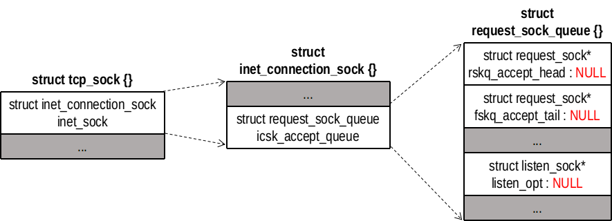

## listen(2) 接口
当 socket(2) 函数创建一个套接字是，他被假设为一个主动套接字（调用 connect(2) 发起连接的客户套接字）。listen(2) 函数把一个未连接的套接字转换成一个被动套接字，指示内核应接受指向该套接字的连接请求。调用 listen(2) 导致套接字从 CLOSED 状态转换到 LISTEN 状态。同时可以指定已完成连接的队列长度。超过门限制，套接字将拒绝新的连接请求。
```
int listen(int sockfd, int backlog);
```
参数说明如下：
- sockfd：套接字文件描述符
- backlog：已完成连接的队列长度

## 调用关系
```
sys_listen()
  |-->inet_listen()
        |-->inet_csk_listen_start()
```

## sys_listen()
```
/// @file net/socket.c
1548 SYSCALL_DEFINE2(listen, int, fd, int, backlog)
1549 {
1550     struct socket *sock;
1551     int err, fput_needed;
1552     int somaxconn;
1553 
1554     sock = sockfd_lookup_light(fd, &err, &fput_needed);
1555     if (sock) { // inlcude/linux/socket.h:231 #define SOMAXCONN	128
1556         somaxconn = sock_net(sock->sk)->core.sysctl_somaxconn; // 队列最大128
1557         if ((unsigned int)backlog > somaxconn)
1558             backlog = somaxconn;
1559 
1560         err = security_socket_listen(sock, backlog);
1561         if (!err)
1562             err = sock->ops->listen(sock, backlog);
1563 
1564         fput_light(sock->file, fput_needed);
1565     }
1566     return err;
1567 }
```

## inet_listen()
```
/// @file net/ipv4/af_inet.c
192 int inet_listen(struct socket *sock, int backlog)
193 {
194     struct sock *sk = sock->sk;
195     unsigned char old_state;
196     int err;
197 
198     lock_sock(sk);
```
首先检查 socket 对象的状态和类型。如果不是 SS_UNCONNECTED 状态或者不是 SOCK_STREAM 类型，跳出。然后检查 sock 对象的状态是否为 TCPF_CLOSE 或者 TCPF_LISTEN ，不能在其他状态时调用 listen(2)
```
200     err = -EINVAL;
201     if (sock->state != SS_UNCONNECTED || sock->type != SOCK_STREAM)
202         goto out;
203 
204     old_state = sk->sk_state;
205     if (!((1 << old_state) & (TCPF_CLOSE | TCPF_LISTEN)))
206         goto out;
207 
208     /* Really, if the socket is already in listen state
209      * we can only allow the backlog to be adjusted.
210      */
211     if (old_state != TCP_LISTEN) { // old_state为TCP_CLOSE
212         // TFO（TCP Fast Open）是一种能够在 TCP 连接建立阶段传输数据的机制。忽略
219         if ((sysctl_tcp_fastopen & TFO_SERVER_ENABLE) != 0 &&
220             inet_csk(sk)->icsk_accept_queue.fastopenq == NULL) {
221             if ((sysctl_tcp_fastopen & TFO_SERVER_WO_SOCKOPT1) != 0)
222                 err = fastopen_init_queue(sk, backlog);
223             else if ((sysctl_tcp_fastopen &
224                   TFO_SERVER_WO_SOCKOPT2) != 0)
225                 err = fastopen_init_queue(sk,
226                     ((uint)sysctl_tcp_fastopen) >> 16);
227             else
228                 err = 0;
229             if (err)
230                 goto out;
231 
232             tcp_fastopen_init_key_once(true);
233         }
234         err = inet_csk_listen_start(sk, backlog); // 做监听初始化，申请连接请求队列
235         if (err)
236             goto out;
237     } // 如果已经是 TCP_LISTEN 状态，不会进行初始化，而是设置 backlog
238     sk->sk_max_ack_backlog = backlog; // 设置 sock 的已完成连接的队列长度
239     err = 0;
240 
241 out:
242     release_sock(sk);
243     return err;
244 }
```

## inet_csk_listen_start()
首先调用 reqsk_queue_alloc() 申请已完成连接的队列。nr_table_entries 表示存储已建立的连接的队列的最大长度。
```
/// @file net/ipv4/inet_connection_sock.c
744 int inet_csk_listen_start(struct sock *sk, const int nr_table_entries)
745 {
746     struct inet_sock *inet = inet_sk(sk);
747     struct inet_connection_sock *icsk = inet_csk(sk);
748     int rc = reqsk_queue_alloc(&icsk->icsk_accept_queue, nr_table_entries);
749 
750     if (rc != 0)
751         return rc;
```
然后构造 sock 相关的数据
```
753     sk->sk_max_ack_backlog = 0; // ？？
754     sk->sk_ack_backlog = 0; // 已完成连接为0
755     inet_csk_delack_init(sk); // 初始化延迟确认相关的数据结构

762     sk->sk_state = TCP_LISTEN; // 设置 TCP 状态
763     if (!sk->sk_prot->get_port(sk, inet->inet_num)) { // 如果没有绑定端口号，绑定一个临时的
764         inet->inet_sport = htons(inet->inet_num);
765 
766         sk_dst_reset(sk);
767         sk->sk_prot->hash(sk);
768 
769         return 0;
770     }
771     // 失败
772     sk->sk_state = TCP_CLOSE;
773     __reqsk_queue_destroy(&icsk->icsk_accept_queue); // 释放
774     return -EADDRINUSE;
775 }
```


## reqsk_queue_alloc()
申请已完成连接的队列。在三次握手过程，并不会申请一个 tcp_sock 对象（大小2048字节），而是申请一个 tcp_request_sock 对象（大小304字节）。未完成的连接放在 request_sock_queue::listen_opt::syn_table 中，此时 tcp_request_sock::sk 指针为空。当完成了三次握手，会申请一个 tcp_sock 对象，由 tcp_request_sock::sk 指向，然后将 tcp_request_sock 对象放到已完成连接队列 icsk_accept_queue 里面。
```
/// @file net/core/request_sock.c
37 int sysctl_max_syn_backlog = 256;
40 int reqsk_queue_alloc(struct request_sock_queue *queue,
41               unsigned int nr_table_entries)
42 {
43     size_t lopt_size = sizeof(struct listen_sock);
44     struct listen_sock *lopt;
45 
46     nr_table_entries = min_t(u32, nr_table_entries, sysctl_max_syn_backlog); // 最大值 256
47     nr_table_entries = max_t(u32, nr_table_entries, 8); // 最小值为 8
48     nr_table_entries = roundup_pow_of_two(nr_table_entries + 1); // 对齐 2^n
49     lopt_size += nr_table_entries * sizeof(struct request_sock *); // 总共字节数
50     if (lopt_size > PAGE_SIZE) // 大于 1 页
51         lopt = vzalloc(lopt_size); // 分配并清零
52     else
53         lopt = kzalloc(lopt_size, GFP_KERNEL); // 分配并清零
54     if (lopt == NULL)
55         return -ENOMEM;
56 
57     for (lopt->max_qlen_log = 3;
58          (1 << lopt->max_qlen_log) < nr_table_entries;
59          lopt->max_qlen_log++); // 2^max_qlen_log = nr_table_entries
60 
61     get_random_bytes(&lopt->hash_rnd, sizeof(lopt->hash_rnd));
62     rwlock_init(&queue->syn_wait_lock);
63     queue->rskq_accept_head = NULL;
64     lopt->nr_table_entries = nr_table_entries; // 数据总长度
65 
66     write_lock_bh(&queue->syn_wait_lock);
67     queue->listen_opt = lopt;
68     write_unlock_bh(&queue->syn_wait_lock);
69 
70     return 0;
71 }
```
