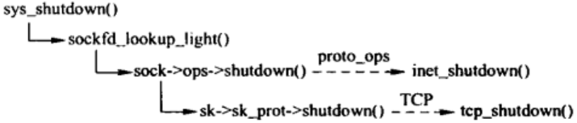

## shutdown(2) 接口
shutdown(2) 关闭连接的读通道、写通道或读写通道。对于读通道，shutdown(2) 丢弃所有进程还没有读走的数据以及调用 shutdown(2) 之后到达的数据。对于写通道，shutdown(2) 使用协议作相应的处理，如果是 TCP，所有剩余的数据将被发送，发送完成后发送 FIN。
```
int shutdown(int sockfd, int how);
```
参数说明
- sock：需要断开的套接字文件描述符
- howto：传递断开方式信息
  - SHUT_RD：断开输入流
  - SHUT_WR：断开输出流
  - SHUT_RDWR：同时断开输入输出流

## 调用关系


## sys_shutdown()
```
/// @file net/socket.c
1956 SYSCALL_DEFINE2(shutdown, int, fd, int, how)
1957 {
1958     int err, fput_needed;
1959     struct socket *sock;
1960 
1961     sock = sockfd_lookup_light(fd, &err, &fput_needed);
1962     if (sock != NULL) {
1963         err = security_socket_shutdown(sock, how);
1964         if (!err)
1965             err = sock->ops->shutdown(sock, how); // inet_shutdown()
1966         fput_light(sock->file, fput_needed);
1967     }
1968     return err;
1969 }
```

## inet_shutdown()
```
/// @file net/ipv4/af_inet.c
781 int inet_shutdown(struct socket *sock, int how)
782 {
783     struct sock *sk = sock->sk;
784     int err = 0;
785 
786     /* This should really check to make sure
787      * the socket is a TCP socket. (WHY AC...)
788      */
789     how++; // 0->1，1->2, 2->3，方便位操作
792     if ((how & ~SHUTDOWN_MASK) || !how) /* MAXINT->0 */
793         return -EINVAL;
794 
795     lock_sock(sk);
796     if (sock->state == SS_CONNECTING) {
797         if ((1 << sk->sk_state) &
798             (TCPF_SYN_SENT | TCPF_SYN_RECV | TCPF_CLOSE))
799             sock->state = SS_DISCONNECTING;
800         else
801             sock->state = SS_CONNECTED;
802     }
803 
804     switch (sk->sk_state) {
805     case TCP_CLOSE: // TCP是关闭状态，出错
806         err = -ENOTCONN;
807         /* Hack to wake up other listeners, who can poll for
808            POLLHUP, even on eg. unconnected UDP sockets -- RR */
809     default: 
810         sk->sk_shutdown |= how;
811         if (sk->sk_prot->shutdown)
812             sk->sk_prot->shutdown(sk, how);// 调用tcp_shutdown，发送FIN
813         break;
814 
815     /* Remaining two branches are temporary solution for missing
816      * close() in multithreaded environment. It is _not_ a good idea,
817      * but we have no choice until close() is repaired at VFS level.
818      */
819     case TCP_LISTEN: // 处于监听状态
820         if (!(how & RCV_SHUTDOWN))
821             break;
822         /* Fall through */
823     case TCP_SYN_SENT: // 处于SYN_SENT，关闭连接
824         err = sk->sk_prot->disconnect(sk, O_NONBLOCK);
825         sock->state = err ? SS_DISCONNECTING : SS_UNCONNECTED;
826         break;
827     }
828 
829     /* Wake up anyone sleeping in poll. */
830     sk->sk_state_change(sk); // 状态改变，唤醒相应进程
831     release_sock(sk); // 释放传输控制块
832     return err;
833 }
```

## tcp_shutdown()
```
/// @file net/ipv4/tcp.c
2097 void tcp_shutdown(struct sock *sk, int how)
2098 {
2099     /*  We need to grab some memory, and put together a FIN,
2100      *  and then put it into the queue to be sent.
2101      *      Tim MacKenzie(tym@dibbler.cs.monash.edu.au) 4 Dec '92.
2102      */
2103     if (!(how & SEND_SHUTDOWN)) // 如果不是关闭发送，直接返回
2104         return;
2105     // 关闭发送方向，需要等待数据发送完毕，在发送FIN
2106     /* If we've already sent a FIN, or it's a closed state, skip this. */
2107     if ((1 << sk->sk_state) &
2108         (TCPF_ESTABLISHED | TCPF_SYN_SENT |
2109          TCPF_SYN_RECV | TCPF_CLOSE_WAIT)) {
2110         /* Clear out any half completed packets.  FIN if needed. */
2111         if (tcp_close_state(sk)) // 根据TCP状态变迁图，改变TCP状态（数据要继续发送）
2112             tcp_send_fin(sk); // 发送FIN
2113     }
2114 }
```