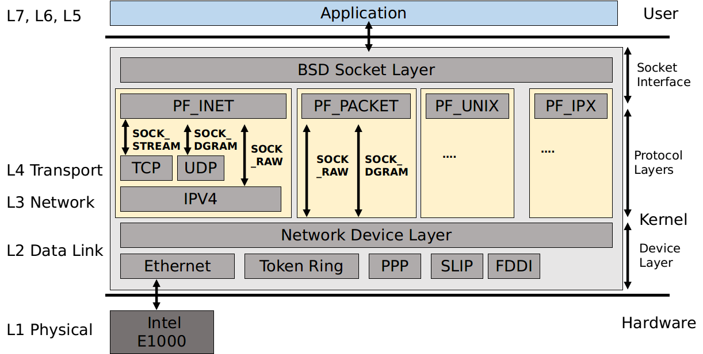
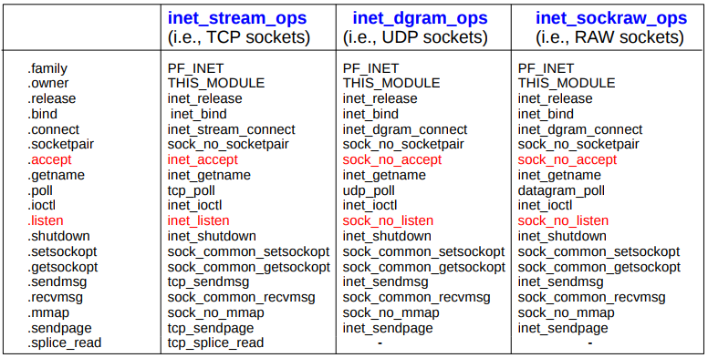
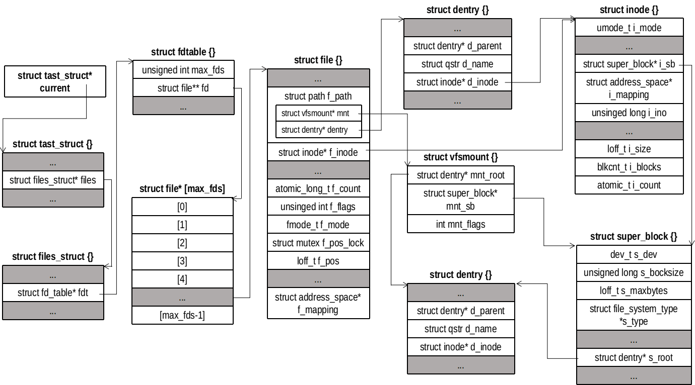
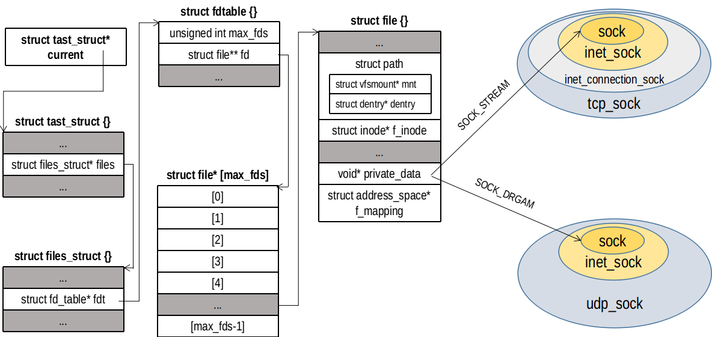
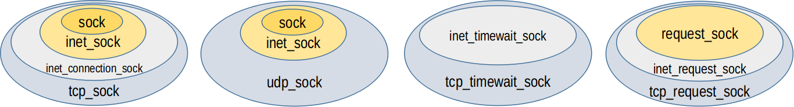

## BSD 协议栈


## socket 结构
套接字代表一条端到端通信的一端，存储了该端所有与通信有关的信息。这些信息包括：使用的协议、套接字状态、源地址、目的地址、到达的连接、数据缓冲和可选标志。
```
/// @file inlude/linux/net.h
105 struct socket {
106     socket_state        state;
107 
108     kmemcheck_bitfield_begin(type);
109     short           type;
110     kmemcheck_bitfield_end(type);
111 
112     unsigned long       flags;
113 
114     struct socket_wq __rcu  *wq;
115 
116     struct file     *file;
117     struct sock     *sk;
118     const struct proto_ops  *ops;
119 };
```
每个成员的含义如下：
- state 表征套接字的状态（不同于 TCP 连接的状态），其状态如下：
```
/// @file inlcude/uapi/linux/net.h
47 typedef enum {
48     SS_FREE = 0,      // 未分配
49     SS_UNCONNECTED,   // 未连接
50     SS_CONNECTING,    // 正在连接
51     SS_CONNECTED,     // 已连接
52     SS_DISCONNECTING  // 正在断开连接
53 } socket_state;
```
- type 表征套接字的类型，比如常用的 SOCK_STREAM（TCP）和 SOCK_DGRAM（UDP）等
- flags 表征套接字的选项
- wq 指向等待队列
```
/// @file inlcude/linux/net.h
88 struct socket_wq {
90     wait_queue_head_t   wait;
91     struct fasync_struct    *fasync_list; // 异步通知队列
92     struct rcu_head     rcu; // Read-Copy Update
93 } ____cacheline_aligned_in_smp;
```
wait 是头结点，封装了自旋锁和任务队列链表
```
/// @file include/linux/wait.h
35 struct __wait_queue_head {
36     spinlock_t      lock;
37     struct list_head    task_list;
38 };
39 typedef struct __wait_queue_head wait_queue_head_t;
```
rcu 是读拷贝修改(Read-Copy Update, RCU)，对于被 RCU 保护的共享数据结构，读者不需要获得任何锁就可以访问它，但写者在访问它时首先拷贝一个副本，然后对副本进行修改，最后使用一个回调（callback）机制在适当的时机把指向原来数据的指针重新指向新的被修改的数据。这个时机就是所有引用该数据的 CPU 都退出对共享数据的操作。
- file 指向与该套接字相关联的 file 对象
- sk 指向 sock 对象。
  - 用户空间每创建一个套接字，内核会有 socket 和 sock 对象与之关联。
  - 为了方便区分，名为 sock 的指针总是指向 socket 对象，名为 sk 的指针总是指向 sock 对象。
  - 两个对象是共生关系，socket::sk 指向 sock 对象，而 sock::sk_socket 指向 socket 对象。
- ops 套接字操作函数，用来将套接字系统调用映射到相应的传输层实现。proto_ops 结构体除了一个 int 型成员 family 表示协议族，一个 mudule 类型的成员 owner 表示所属模块外，其余都是函数指针，因此整个 proto_ops 对象可以看作是一张套接字系统调用到传输层函数的跳转表。
```
/// @file inlcude/linux/net.h
128 struct proto_ops {
129     int     family;
130     struct module   *owner;
131     int     (*release)   (struct socket *sock);
132     int     (*bind)      (struct socket *sock,
133                       struct sockaddr *myaddr,
134                       int sockaddr_len);
135     int     (*connect)   (struct socket *sock,
136                       struct sockaddr *vaddr,
137                       int sockaddr_len, int flags);
138     int     (*socketpair)(struct socket *sock1,
139                       struct socket *sock2);
140     int     (*accept)    (struct socket *sock,
141                       struct socket *newsock, int flags);
142     int     (*getname)   (struct socket *sock,
143                       struct sockaddr *addr,
144                       int *sockaddr_len, int peer);
145     unsigned int    (*poll)      (struct file *file, struct socket *sock,
146                       struct poll_table_struct *wait);
147     int     (*ioctl)     (struct socket *sock, unsigned int cmd,
148                       unsigned long arg);
153     int     (*listen)    (struct socket *sock, int len);
154     int     (*shutdown)  (struct socket *sock, int flags);
155     int     (*setsockopt)(struct socket *sock, int level,
156                       int optname, char __user *optval, unsigned int optlen);
157     int     (*getsockopt)(struct socket *sock, int level,
158                       int optname, char __user *optval, int __user *optlen);
165     int     (*sendmsg)   (struct kiocb *iocb, struct socket *sock,
166                       struct msghdr *m, size_t total_len);
175     int     (*recvmsg)   (struct kiocb *iocb, struct socket *sock,
176                       struct msghdr *m, size_t total_len,
177                       int flags);
178     int     (*mmap)      (struct file *file, struct socket *sock,
179                       struct vm_area_struct * vma);
180     ssize_t     (*sendpage)  (struct socket *sock, struct page *page,
181                       int offset, size_t size, int flags);
182     ssize_t     (*splice_read)(struct socket *sock,  loff_t *ppos,
183                        struct pipe_inode_info *pipe, size_t len, unsigned int flags);
184     int     (*set_peek_off)(struct sock *sk, int val);
185 };
```


## 套接字文件


Linux 一切皆文件。套接字也是一种文件，是由类型为 sock_fs_type 的伪文件系统（pseudo filesystem）负责创建、打开和关闭以及读写。和其他文件一样，用户空间使用的套接字是文件描述符，是 fdtable::fd 数组的索引值。file 是进程对打开文件的抽象表示，inode 是虚拟文件系统对打开文件的表示。不同进程打开同一个文件会有不同 file 对象，但是都指向同一个 inode 对象（？验证）。file 对象记录了本进程文件读写的标记的位置、打开文件的权限等。当创建一个 socket 对象的时候，会分配一个 socket_alloc 对象，里面包含了一个 inode 对象以及 socket 对象。可以看到和普通文件一样，每个打开的套接字文件都有一个 inode。伪文件系统 sock_fs_type 管理 inode 的分配和释放（分别调用alloc_inode() 和 destroy_inode()，其底层分别调用 sock_alloc_inode() 和 sock_destroy_inode() 函数）。
```
struct socket_alloc {
/// @file include/net/sock.h
1395 struct socket_alloc {
1396     struct socket socket;
1397     struct inode vfs_inode;
1398 };
```

## socket 和 sock 的关系



socket 是统一的接口，用于和 file 对象绑定。其 socket::sk 成员指向具体的套接字（比如 tcp_sock 或 udp_sock）

各种 sock 结构之间的关系特别像 C++ 中的继承。用一个 sock 类型的指针可以指向 tcp_sock 或者 udp_sock 对象，通过类型转换，可以将指向 sock 对象的指针向“继承”方向提升为指向 inet_sock 、inet_connection_sock 或 tcp_sock 等对象。

