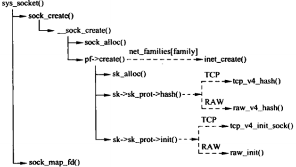
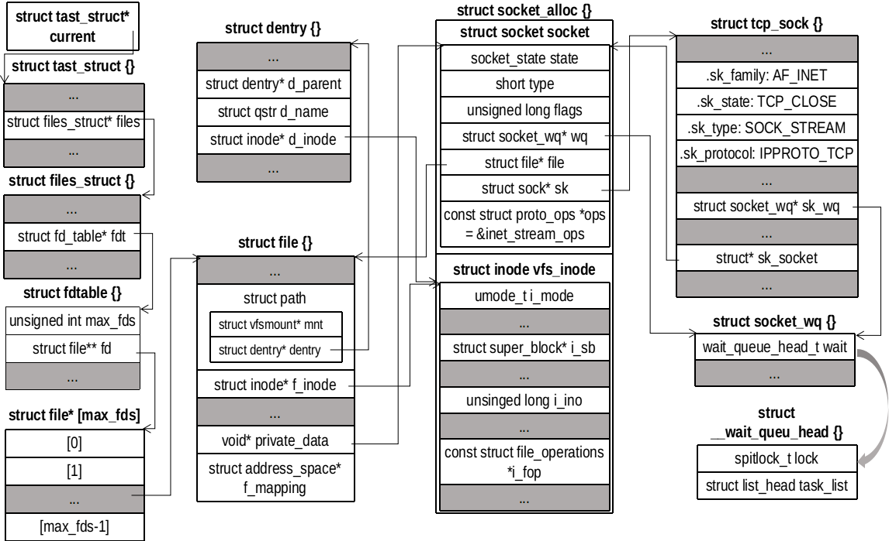

## socket(2) 接口
socket(2) 用于创建一个 socket 对象。
```
int socket(int domain, int type, int protocol);
```
参数说明如下：
- doamin：创建套接字的地址族，如 AF_INET，AF_LOCAL 等
- type：套接字类型，如 SOCK_STREAM，SOCK_DGRAM
- protocol，传输层协议，如 IPPROTO_TCP、IPPROTO_UDP，一般传入 0

## 调用关系


## sys_socket()
```
/// @file net/socket.c
1369 SYSCALL_DEFINE3(socket, int, family, int, type, int, protocol)
1370 {
1371     int retval;
1372     struct socket *sock;
1373     int flags;
```
1. 调用 sock_create() 创建套接字（创建并构造 socket、sock 对象，并将二者关联）
``` 
1389     retval = sock_create(family, type, protocol, &sock);
1390     if (retval < 0)
1391         goto out;
```
2. 调用 sock_map_fd() 将创建的 socket 对象绑定到一个 file 对象（file::private_data = sock），然后返回文件描述。
```
1393     retval = sock_map_fd(sock, flags & (O_CLOEXEC | O_NONBLOCK));
1394     if (retval < 0)
1395         goto out_release;
1404 }
```

sock_create() 直接调用 \__sock_create()，\__sock_create() 比 sock_create() 多了两个参数：net 和 kern，kern 用于表示创建的套接字用于内核（1）还是用于普用进程（0）。net 用于指明命名空间。\__sock_create() 函数的调用：
```
/// @file net/socket.c
1357 int sock_create(int family, int type, int protocol, struct socket **res)
1358 {
1359     return __sock_create(current->nsproxy->net_ns, family, type, protocol, res, 0);
1360 }
```

socket_map_fd() 有一部分工作类似于普通文件 open() 系统调用：获取一个空闲描述符，创建一个 file 对象，然后将 file 对象添加到进程打开的文件指针数组中。除此之外，还需将 socket 绑定到 file 对象
```
/// @file net/socket.c
395 static int sock_map_fd(struct socket *sock, int flags)
396 {
397     struct file *newfile;
398     int fd = get_unused_fd_flags(flags); // 获取一个未用的文件描述符
399     if (unlikely(fd < 0))
400         return fd;
401      // 获取一个file结构体，并和sock绑定, file->private_data = sock;
402     newfile = sock_alloc_file(sock, flags, NULL);
403     if (likely(!IS_ERR(newfile))) {
404         fd_install(fd, newfile); // 将 fd 和 file 绑定
405         return fd; // 返回文件描述符
406     }
407 
408     put_unused_fd(fd);
409     return PTR_ERR(newfile);
410 }
```

## \__sock_create()
\__sock_create() 主要完成套接字的分配
```
/// @file net/socket.c
1244 int __sock_create(struct net *net, int family, int type, int protocol,
1245              struct socket **res, int kern)
1246 {
1247     int err;
1248     struct socket *sock;
1249     const struct net_proto_family *pf;
```
（略过安全检查）接下来调用 sock_alloc() 从 sock_inode_cache 指向的 SLAB 分配器中申请一个 socket_alloc 对象，同时做必要的构造，然后返回指向 socket 的指针
```
1283     sock = sock_alloc();
1284     if (!sock) {
1285         net_warn_ratelimited("socket: no more sockets\n");
1286         return -ENFILE; /* Not exactly a match, but its the
1287                    closest posix thing */
1288     }
1289 
1290     sock->type = type;
```
接下来调用具体的协议族（如果是 AF_INET，则调用 inet_create() 函数）给 socket 创建一个传输控制块 sock 对象
```
1303     rcu_read_lock();
1304     pf = rcu_dereference(net_families[family]); // pf->inet_family_ops
1305     err = -EAFNOSUPPORT;
1306     if (!pf)
1307         goto out_release;

1313     if (!try_module_get(pf->owner))
1314         goto out_release;
1315 
1316     /* Now protected by module ref count */
1317     rcu_read_unlock();
1318 
1319     err = pf->create(net, sock, protocol, kern); // inet_family_ops.inet_create
1320     if (err < 0)
1321         goto out_module_put;

1338     *res = sock;
1339 
1340     return 0;
```

### sock_alloc()
创建一个 socket_alloc 结构体，里面有一个 socket 和一个 inode 成员。但是 sock_alloc() 函数返回的不是指向分配的 socket_alloc 对象的指针，而是返回指向 socket 的指针。
```
/// @file net/socket.c
540 static struct socket *sock_alloc(void)
541 {
542     struct inode *inode;
543     struct socket *sock;
544 
545     inode = new_inode_pseudo(sock_mnt->mnt_sb);
546     if (!inode)
547         return NULL;
548 
549     sock = SOCKET_I(inode); // 通过inode成员找到socket成员
```
然后构造 inode 成员
```
551     kmemcheck_annotate_bitfield(sock, type);
552     inode->i_ino = get_next_ino();
553     inode->i_mode = S_IFSOCK | S_IRWXUGO;
554     inode->i_uid = current_fsuid();
555     inode->i_gid = current_fsgid();
556     inode->i_op = &sockfs_inode_ops;
557 
558     this_cpu_add(sockets_in_use, 1);
559     return sock;
560 }
```
new_inode_pseudo() 主要是调用 alloc_inode()（底层是 sock_alloc_inode() 函数）。sock_alloc_inode() 在 SLAB 分配器中申请一个 socket_alloc 对象，返回指向 inode 指针
```
249 static struct inode *sock_alloc_inode(struct super_block *sb)
250 {
251     struct socket_alloc *ei;
252     struct socket_wq *wq;
253 
254     ei = kmem_cache_alloc(sock_inode_cachep, GFP_KERNEL);
255     if (!ei)
256         return NULL;
257     wq = kmalloc(sizeof(*wq), GFP_KERNEL);
258     if (!wq) {
259         kmem_cache_free(sock_inode_cachep, ei);
260         return NULL;
261     }
262     init_waitqueue_head(&wq->wait);
263     wq->fasync_list = NULL;
264     RCU_INIT_POINTER(ei->socket.wq, wq);
265 
266     ei->socket.state = SS_UNCONNECTED; // 初始状态
267     ei->socket.flags = 0;
268     ei->socket.ops = NULL;
269     ei->socket.sk = NULL;
270     ei->socket.file = NULL;
271 
272     return &ei->vfs_inode;
273 }
```
此时 socket 的状态为未连接， type 为传入的值，其他成员为空

### inet_create()
inet_create() 主要是用于创建一个传输控制块，比如 tcp_sock 或 udp_sock 对象或者其他，并与 socket 对象关联起来（socket::sock <--> struct sock::sk_socket）
```
/// @file net/ipv4/af_inet.c
251 static int inet_create(struct net *net, struct socket *sock, int protocol,
252                int kern)
253 {
254     struct sock *sk;
255     struct inet_protosw *answer;
256     struct inet_sock *inet;
257     struct proto *answer_prot;
258     unsigned char answer_flags;
259     int try_loading_module = 0;
260     int err;
261 
262     if (protocol < 0 || protocol >= IPPROTO_MAX)
263         return -EINVAL;
264 
265     sock->state = SS_UNCONNECTED;

```
首先根据 sock->type 在全局变量 inetsw 链表中找到IP协议提供的接口 inet_protosw 。考虑两种套接字类型 SOCK_STREAM 和 SOCK_DGRAM。其 osp 和 prot 分布指向全局变量 inet_stream_ops，tcp_prot 和 inet_dgram_ops，udp_prot。
```
269     err = -ESOCKTNOSUPPORT;
270     rcu_read_lock();
271     list_for_each_entry_rcu(answer, &inetsw[sock->type], list) {
272 
273         err = 0;
274         /* Check the non-wild match. */
275         if (protocol == answer->protocol) {
276             if (protocol != IPPROTO_IP)
277                 break;
278         } else {
279             /* Check for the two wild cases. */
280             if (IPPROTO_IP == protocol) {
281                 protocol = answer->protocol;
282                 break;
283             }
284             if (IPPROTO_IP == answer->protocol)
285                 break;
286         }
287         err = -EPROTONOSUPPORT;
288     }
289 
290     if (unlikely(err)) { 错误处理

317     sock->ops = answer->ops;
318     answer_prot = answer->prot;
319     answer_flags = answer->flags;
```
接下来申请 sock 对象，会从 answer_prot->slab 所指向的 SLAB 分配器中申请对象（如果存在）申请对象。如果 SLAB 分配器不存在，用 kmalloc() 申请大小为 answer_prot->obj_size 的对象。
```
324     err = -ENOBUFS;
325     sk = sk_alloc(net, PF_INET, GFP_KERNEL, answer_prot);
326     if (sk == NULL)
327         goto out;
```
最后构造 sock 对象。设置是否可以重用套接字（IP 地址和端口）
```
330     if (INET_PROTOSW_REUSE & answer_flags)
331         sk->sk_reuse = SK_CAN_REUSE;
333     inet = inet_sk(sk); // 类型转换sock-->inet_sock
334     inet->is_icsk = (INET_PROTOSW_ICSK & answer_flags) != 0;
338     if (SOCK_RAW == sock->type) {
339         inet->inet_num = protocol;
340         if (IPPROTO_RAW == protocol)
341             inet->hdrincl = 1;
342     }
343 
344     if (net->ipv4.sysctl_ip_no_pmtu_disc)
345         inet->pmtudisc = IP_PMTUDISC_DONT;
346     else
347         inet->pmtudisc = IP_PMTUDISC_WANT;
348 
349     inet->inet_id = 0;
350 
351     sock_init_data(sock, sk); // 构造 sock
352 
353     sk->sk_destruct    = inet_sock_destruct; // 回调函数，清理工作
354     sk->sk_protocol    = protocol;
355     sk->sk_backlog_rcv = sk->sk_prot->backlog_rcv;
356 
357     inet->uc_ttl    = -1; // 单播 TTL
358     inet->mc_loop   = 1;
359     inet->mc_ttl    = 1; // 多播 TTL
360     inet->mc_all    = 1;
361     inet->mc_index  = 0;
362     inet->mc_list   = NULL;
363     inet->rcv_tos   = 0;
364 
365     sk_refcnt_debug_inc(sk);
366 
367     if (inet->inet_num) {
373         inet->inet_sport = htons(inet->inet_num);
374         /* Add to protocol hash chains. */
375         sk->sk_prot->hash(sk);
376     }
377 
378     if (sk->sk_prot->init) {
379         err = sk->sk_prot->init(sk);
380         if (err)
381             sk_common_release(sk);
382     }
```
