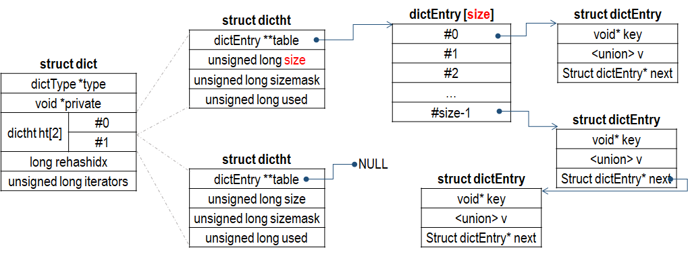

## dict
dict 是 Redis 哈希表的实现，采用链地址发解决冲突。dict 定义如下：
```
typedef struct dictEntry {
    void *key;
    union {
        void *val;
        uint64_t u64;
        int64_t s64;
        double d;
    } v;
    struct dictEntry *next; // 链地址法
} dictEntry;

typedef struct dictType { // 一些函数
    uint64_t (*hashFunction)(const void *key);
    void *(*keyDup)(void *privdata, const void *key);
    void *(*valDup)(void *privdata, const void *obj);
    int (*keyCompare)(void *privdata, const void *key1, const void *key2);
    void (*keyDestructor)(void *privdata, void *key);
    void (*valDestructor)(void *privdata, void *obj);
} dictType;

typedef struct dictht { // 哈希表
    dictEntry **table;
    unsigned long size;
    unsigned long sizemask;
    unsigned long used;
} dictht;

typedef struct dict {
    dictType *type;
    void *privdata;
    dictht ht[2];
    long rehashidx; /* rehashing not in progress if rehashidx == -1 */
    unsigned long iterators; /* number of iterators currently running */
} dict;

typedef struct dictIterator {
    dict *d;
    long index;
    int table, safe;
    dictEntry *entry, *nextEntry;
    /* unsafe iterator fingerprint for misuse detection. */
    long long fingerprint;
} dictIterator;
```
dict 整体布局如下所示：


在大多数时候，只有 ht[0].table 中有数据，ht[1].table 处于空闲。其中 dictht 中 size 表示哈希表的大小，used 表示处于使用中的条目，而 sizemask 用于将哈希函数（Redis 使用 MurmurHash2 哈希算法）的值转换成数组索引，因此，size 值总是 2^N，而 sizemask 的值为 2^N - 1，这样，通过将哈希值与 sizemask 简单地进行按位与操作便可转化成数组索引。

当哈希表 ht[0] 中的数据超过一定量或者空间有很多空闲，需要扩大空间或者缩小空间，这是需要借用 ht[1] 将 h[1] 的数据重新进行散列，保存在 h[1]。完成后，释放 h[0] 的内存空间，将 h[1] 的数据转移到 h[0]，h[1] 再次处于空闲状态。

触发哈希表重新散列的条件如下：
- 服务器目前没有在执行 BGSAVE 或者 BGREWERITEAOF 命令，并且哈希表的负载因子大于等于 1；
- 服务器目前正在执行 BGSAVE 或者 BGREWERITEAOF 命令，并且哈希表的负载因子大于等于 5；
- 哈希表的负载因子小于 0.1；

其中，负载因子计算方式如下：
```
load_factor = ht[0].used / ht[0].size
```

在 rehash 时，新哈希表按照如下策略选取：
- 如果需要容量扩展，ht[1] 的大小为第一个不小于 ht[0].used * 2 并且是 2^N 的值。
- 如果需要搜索容量，ht[1] 的大小为第一个不小于 ht[0].used 并且是 2^N 的值。

另外，扩展或者收缩哈希表并不是一次性、集中式地完成，而是分多次，渐进式完成的。过程如下：
1. 为 ht[1] 分配空间，此时字典同时拥有 ht[0] 和 ht[1] 两个哈希表；
2. 将 rehashidx 赋值为 0，表示重新散列工作正式开始；
3. 每次对字典执行增删改查时，除了执行指定的操作外，还顺带将 ht[0] 哈希表在 rehashidx 索引上的数据转移到 ht[1]，转移结束后 rehashidx 递增 1；
4. 完成 rehash 后，rehashidx 的值赋值为 -1，表示重新散列工作结束；

需要注意的是，在 rehash 期间，字典的删除、查找和更新操作会在两个哈希表上进行，而插入操作一律保存到 ht[1] 哈希表上，ht[0] 上不接受任何插入操作。这一措施确保 ht[0] 哈希表的数据只减不增。