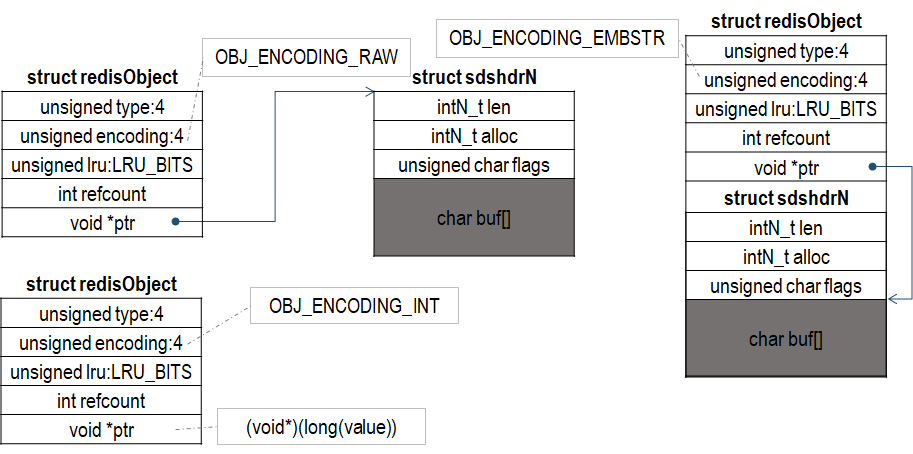

## redisObject
redisObject 是对上述基本数据结构的封装，实现不同的对象。Redis 中，redisObject 有 7 中类型，由如下宏表示：

|宏|值|含义|
|:-|:-:|:-|
|OBJ_STRING|0|字符串对象|
|OBJ_LIST|1|链表对象|
|OBJ_SET|2|集合对象|
|OBJ_ZSET|3|有序集合对象|
|OBJ_HASH|4|哈希表对象|
|OBJ_MODULE|5|Module 对象|
|OBJ_STREAM|6|流对象|

诸如字符串和哈希表之类对象可以用多种基础数据结构实现，redisObject 用 encoding 字段标志底层具体的数据结构。编码方式如下：

|宏|值|含义|
|:-|:-:|:-|
|OBJ_ENCODING_RAW|0|sds|
|OBJ_ENCODING_INT|1|整数类型|
|OBJ_ENCODING_HT|2|哈希表|
|OBJ_ENCODING_ZIPMAP|3|zipmap|
|OBJ_ENCODING_LINKEDLIST|4|已经弃用|
|OBJ_ENCODING_ZIPLIST|5|ziplist|
|OBJ_ENCODING_INTSET|6|intset|
|OBJ_ENCODING_SKIPLIST|7|zset|
|OBJ_ENCODING_EMBSTR|8|embstr 编码字符串|
|OBJ_ENCODING_QUICKLIST|9|quicklist|
|OBJ_ENCODING_STREAM|10|listpack 的基数树|

redisObject 定义如下：
```
// server.h
typedef struct redisObject {
    unsigned type:4;
    unsigned encoding:4;
    unsigned lru:LRU_BITS;
    int refcount;
    void *ptr;
} robj;
```
其中:
- type：记录对象的类型
- encoding：标记 redisObject 底层实现方式
- lru：LRU 时间或者 LFU 数据 
- refcount：引用计数，用于内存回收
- ptr：指向底层实现数据结构

## OBJ_STRING
字符串对象的编码可以是 OBJ_ENCODING_RAW、OBJ_ENCODING_INT 和 OBJ_ENCODING_EMBSTR，它们布局如下：



在函数 createStringObject() 函数中，可以看出 OBJ_ENCODING_RAW 和 OBJ_ENCODING_EMBSTR 挑选逻辑
```
// object.c
#define OBJ_ENCODING_EMBSTR_SIZE_LIMIT 44
robj *createStringObject(const char *ptr, size_t len) {
    if (len <= OBJ_ENCODING_EMBSTR_SIZE_LIMIT)
        return createEmbeddedStringObject(ptr,len);
    else
        return createRawStringObject(ptr,len);
}
```
1. 如果一个字符串的长度不超过 44 字节，采用 OBJ_ENCODING_EMBSTR 编码；
2. 否则，采用 OBJ_ENCODING_RAW 编码。

createStringObjectFromLongLongWithOptions() 函数中描述了采用 OBJ_ENCODING_INT 的情形，函数定义如下：
```
// server.h
#define OBJ_SHARED_INTEGERS 10000
// object.c
robj *createStringObjectFromLongLongWithOptions(long long value, int valueobj) {
    robj *o;

    if (server.maxmemory == 0 ||
        !(server.maxmemory_policy & MAXMEMORY_FLAG_NO_SHARED_INTEGERS))
    {
        /* If the maxmemory policy permits, we can still return shared integers
         * even if valueobj is true. */
        valueobj = 0;
    }

    if (value >= 0 && value < OBJ_SHARED_INTEGERS && valueobj == 0) {
        incrRefCount(shared.integers[value]);
        o = shared.integers[value];
    } else {
        if (value >= LONG_MIN && value <= LONG_MAX) {
            o = createObject(OBJ_STRING, NULL);
            o->encoding = OBJ_ENCODING_INT;
            o->ptr = (void*)((long)value);
        } else {
            o = createObject(OBJ_STRING,sdsfromlonglong(value));
        }
    }
    return o;
}
```
其中，valueobj 如果为 0，可能返回一个共享 redisObject。Redis 可能预先为 [0, OBJ_SHARED_INTEGERS) 范围内的每个值创建一个 redisObject（OBJ_ENCODING_INT 编码），在必要时返回共享 redisObject。

1. 如果 value 在 [0, OBJ_SHARED_INTEGERS) 范围内，可能返回一个共享 redisObject；
2. 如果在 [LONG_MIN, LONG_MAX] 范围内，创建一个 OBJ_ENCODING_INT 编码的 redisObject；
3. 否则，创建一个 OBJ_ENCODING_RAW 编码的 redisObject（什么情况？？）；

## OBJ_LIST
链表对象的编码可以是 OBJ_ENCODING_QUICKLIST 和 OBJ_ENCODING_ZIPLIST，其底层实现分别是 quicklist 和 ziplist。

## OBJ_SET
集合对象的编码可以是 OBJ_ENCODING_HT 或者 OBJ_ENCODING_INTSET，其底层分别由 dict 和 intset 实现。集合对象会涉及到编码转换，OBJ_ENCODING_INTSET 编码在一定条件下会转换成 OBJ_ENCODING_HT，其条件为：
1. intset 的元素个数大于 set-max-intset-entries（默认 512）；
2. intset 插入的元素不再是 long long 类型或者无法 long long 类型无法表示；

上述条件只要有一个满足，就会触发编码转换。集合对象编码转换不可逆，没有从 OBJ_ENCODING_HT 到 OBJ_ENCODING_INTSET 的实现。

## OBJ_ZSET
有序集合对象的编码可以是 OBJ_ENCODING_SKIPLIST 和 OBJ_ENCODING_ZIPLIST，其底层分别是 zset（借助 dict 和 zskiplist 实现）和 ziplist。有序集合对象会涉及到编码转换，OBJ_ENCODING_ZIPLIST 在一定条件下转换为 OBJ_ENCODING_SKIPLIST，其条件为：
1. 元素个数超过 zset-max-ziplist-entries（默认 128）
2. 某个元素的长度超过 zset-max-ziplist-value（默认 64 字节）

上述条件只有有一个满足，就会触发编码转换从 OBJ_ENCODING_ZIPLIST 转换为 OBJ_ENCODING_SKIPLIST。而且，有序集合对象编码转换是可逆的，如果元素个数不超过 zset-max-ziplist-entries 并且所有元素长度不超过 zset-max-ziplist-value，就会触发编码从 OBJ_ENCODING_SKIPLIST 转换为 OBJ_ENCODING_ZIPLIST。

## OBJ_HASH
哈希对象的编码可以是 OBJ_ENCODING_ZIPLIST 和 OBJ_ENCODING_HT，其底层是 ziplist 和 dict。哈希对象也设计编码转换，在一定条件下，编码 OBJ_ENCODING_ZIPLIST 会转换为 OBJ_ENCODING_HT，其条件为：
1. 元素个数超过 hash-max-ziplist-entries（默认 512）；
2. 某个元素长度超过 hash-max-ziplist-value（默认 64 字节）

上述条件满足一个就会触发编码从 OBJ_ENCODING_ZIPLIST 转换为 OBJ_ENCODING_HT，并且这种转换不可逆。

## OBJ_MODULE
Module 对象 encoding 字段不使用，底层借助 moduleValue 数据结构实现。

TODO(Module)

## OBJ_STREAM
Stream 对象的编码只有一种，即 OBJ_ENCODING_STREAM，其底层借助 stream 数据结构实现。