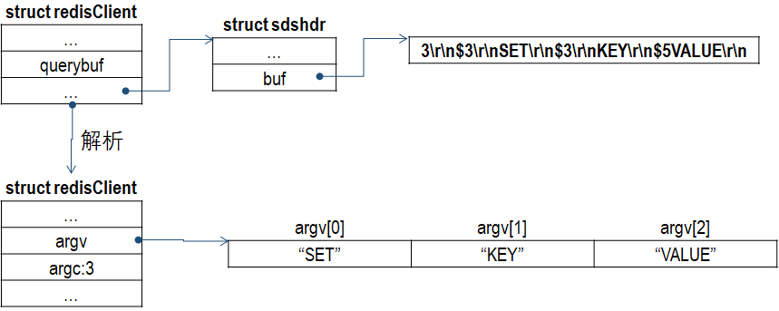
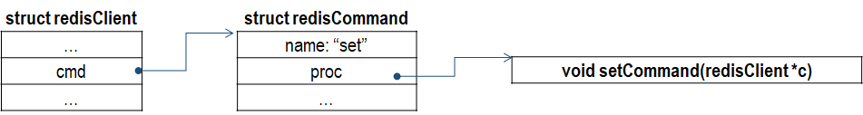

## redisServer

struct redisServer {

};

struct redisServer server;

### redisServer 初始化
一个 Redis 服务器从启动到能够接受客户端的命令请求，需要经过一系列的初始化和配置过程，大致过程如下。
1. 调用 server.c:initServerConfig() 函数初始化 server 变量；
2. 依次调用 initSentinelConfig() 和 initSentinel() 函数初始化 Sentinel 相关参数；
3. 调用 loadServerConfig() 函数加载配置参数
4. 调用 server.c:initServer() 函数初始化服务器
5. 调用 aeMain() 开始 EventLoop，等待客户端的连接和处理就绪事件；

initServer() 函数大致如下：
```
void initServer(void) {
    /* 创建共享对象，比如小于 1000 的整数，错误字符串等 */
    createSharedObjects();
    /* 创建 EventLoop 对象 */
    server.el = aeCreateEventLoop(server.maxclients+CONFIG_FDSET_INCR);
    /* 创建 redisDb 对象 */
    server.db = zmalloc(sizeof(redisDb)*server.dbnum);
    /* 开始监听 */
    if (server.port != 0 &&
        listenToPort(server.port,server.ipfd,&server.ipfd_count) == C_ERR)
        exit(1);
    /* 初始化每个 redisDb 对象 */
    for (j = 0; j < server.dbnum; j++) {
        server.db[j].dict = dictCreate(&dbDictType,NULL);
        server.db[j].expires = dictCreate(&keyptrDictType,NULL);
        server.db[j].expires_cursor = 0;
        server.db[j].blocking_keys = dictCreate(&keylistDictType,NULL);
        server.db[j].ready_keys = dictCreate(&objectKeyPointerValueDictType,NULL);
        server.db[j].watched_keys = dictCreate(&keylistDictType,NULL);
        server.db[j].id = j;
        server.db[j].avg_ttl = 0;
        server.db[j].defrag_later = listCreate();
        listSetFreeMethod(server.db[j].defrag_later,(void (*)(void*))sdsfree);
    }
    /* 注册时间事件处理函数 serverCron */
    if (aeCreateTimeEvent(server.el, 1, serverCron, NULL, NULL) == AE_ERR) {
        serverPanic("Can't create event loop timers.");
        exit(1);
    }
    /* 注册 accept 处理函数 */
    for (j = 0; j < server.ipfd_count; j++) {
        if (aeCreateFileEvent(server.el, server.ipfd[j], AE_READABLE,
            acceptTcpHandler,NULL) == AE_ERR)
            {
                serverPanic(
                    "Unrecoverable error creating server.ipfd file event.");
            }
    }
    /* 注册 AE_READBLE 处理函数 */
    if (server.sofd > 0 && aeCreateFileEvent(server.el,server.sofd,AE_READABLE,
        acceptUnixHandler,NULL) == AE_ERR) serverPanic("Unrecoverable error creating server.sofd file event.");

    /* 注册 AE_WRITABLE 处理函数 */
    if (aeCreateFileEvent(server.el, server.module_blocked_pipe[0], AE_READABLE,
        moduleBlockedClientPipeReadable,NULL) == AE_ERR) {
            serverPanic(
                "Error registering the readable event for the module "
                "blocked clients subsystem.");
    }
    ...
```

### redisServer 处理 Client 请求
一个命令请求从发送到获得回复的过程中，客户端和服务端需要完成一系列操作。举个例子，如果客户亿执行如下命令：
```
redis> SET KEY VALUE
OK
```
客户端和服务端需要执行如下操作：
1. 客户端发送命令 SET KEY VALUE；
2. 服务器接受并处理客户端发来的命令，在数据库中进行设置，并产生命令回复 OK；
3. 服务器将命令回复 OK 发送给客户端；
4. 客户端接受服务器返回的命令回复 OK，并将这个回复打印给用户观看；

客户端发送的命令，同一转换为字节流发送给服务端，例如上述命令被转换成
```
3\r\n$3\r\nSET\r\n$3\r\nKEY\r\n$5VALUE\r\n
```
服务器于客户端之间的套接字连接可读时，服务器将作出如下处理：
1. 读取套接字内容，保存在 redisClient 中的 querybuf 中；
2. 解析 querybuf 中的内容，提取命令和参数，保存在 redisClient 的 argv 和 argc 中；
3. 执行客户端指定的命令；



服务器首先根据 redisClient 中 argv[0] 参数，在命令表（commandTable）中查找 argv[0] 对应的命令，并将找到的命令保存在 redisClient 中的 cmd 属性里面。



到目前为止，服务器已经将执行命令所需的命令实现函数、参数、参数个数都收集齐了，经过一系列安全检查后，执行以下语句
```
client->cmd->proc(client);
```
命令执行函数将命令回复保存到 redisClient 的输出缓冲区里面，并为客户端的套接字关联命令回复处理器。当客户端套接字变为可写状态时，服务器就会执行命令回复处理器，将保存在 redisClient 输出缓冲区中的命令回复发送给客户端。

在执行完实现函数之后，服务器还需要执行一些后续工作：
- 如果服务器开启了慢查询日志功能，那么慢查询日志模块会检查是否需要为刚刚执行完的命令请求添加一条新的慢查询日志；
- 根据刚刚执行命令的耗时，更新被执行命令的 redisCommand 结构的 milliseconds 属性，并将命令的 redisCommand 结构的 calls 计数器递增 1；
- 如果服务器开启了 AOF 持久化功能，那么 AOF 持久化模块会将刚刚执行的命令请求写入到 AOF 缓冲区里面；
- 如果有其他从服务器正在复制当前这个服务器，那么服务器会将刚刚执行的命令传播给所有从服务器；

### severCron() 函数
Redis 服务器中的 serverCron() 函数默认每隔 100 毫秒执行一次，这个函数负责管理服务器的资源，并保持服务器自身的良好运转。serverCron 主要的工作：
- 更新服务器时间缓存；
- 更新 LRU 时钟；
- 更新服务器每秒执行命令的次数；
- 更新服务器内存峰值记录；
- 处理 SIGTERM 信号
- 调用 clientsCron() 与客户端的连接是否正常，客客户端的输入缓冲区是否合适；
- 调用 databaseCron 函数，删除过期的 Key-Value 数据，在必要时，对 dict 进行收缩操作；
- 执行被延迟的 BGFRWRITEAOF；
- 检查持久化操作的运行状态；
- 将 AOF 缓冲区中的内容写入 AOF 文件；
- 关闭异步客户端；
- 增加 cronloops 计数器的值；
