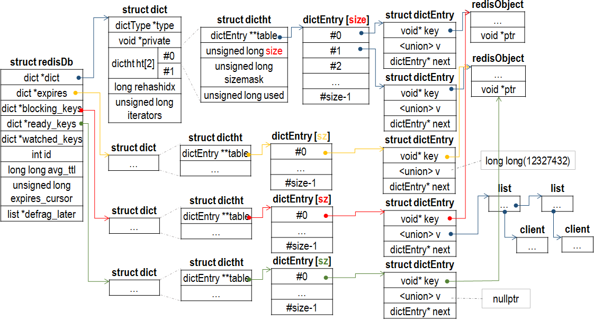

## redisDb
Redis 用 redisDb 数据结构表示数据库。Redis 服务器拥有多个 redisDb，在初始化服务器时，程序会根据配置参数创建目标数量的 redisDb 对象，不同的 redisDb 根据 id 区分。
```
// server.h
typedef struct redisDb {
    dict *dict;                 // 保存数据库所有 Key-Value 数据
    dict *expires;              // 保存 Key-Timeout 数据
    dict *blocking_keys;        // 保存 Key-Clients，阻塞在 Key 上的所有 Client
    dict *ready_keys;           // Key-NULL，就绪的 Key
    dict *watched_keys;         // Key-Clients
    int id;                     // 数据库 ID
    long long avg_ttl;          // 平均 TTL
    unsigned long expires_cursor;
    list *defrag_later;         
} redisDb;
```


dict 存储 redisDb 所有的 Key-Value 数据，而 expires 存储 Key-Timeout 数据，其中 Key 只是一个指针，指向 dict 中对应的 Key，而 Timeout 是一个 64 位整数，表示 Key 失效的时间戳。blocking_keys 和 ready_keys 跟阻塞相关，blocking_keys 存储 Key-Client 数据，表示阻塞在某个 Key 上所有的 Client，这些 Client 用链表串连起来，而 ready_keys 表示就绪的 Key。同样，blocking_keys 和 ready_keys 中的 Key 也是指针，指向 dict 中对应的 Key。watched_keys 和 blocking_keys 具有相似的结构，也是 Key-Client 数据。

redisDb 过期 Key-Value 采用惰性删除策略，由 db.c:expireIfNeed() 函数完成，该函数主要被 lookupKey\*() 函数族调用。

expireIfNeed() 函数的行为取决于 redisDb 的角色，因为 Slave 不会使 Key-Value 数据失效。Master 在解决一致性问题是发送 Slave DEL 命令时，Slave 才删除某个 Key-Value 数据。（TODO 更多）