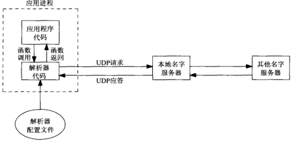
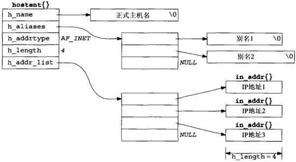

## 域名系统


## gethostbyname() 函数
```
#include <netdb.h>
/* @param
 * hostname：主机名
 * return：成功返回非空指针，失败返回 NULL 且设置 h_errno，可以用hstreero(h_error)解析错误
 *    HOST_NOT_FOUND
 *    TRY_AGAIN
 *    NO_RECOVERY
 *    NO_DATA
 */
struct hostent *gethostbyname(const char *hostname);

struct hostent {      /* 只能含有所查找主机的所有 IPv4 地址 */
  char  *h_name;      /* official name of host */
  char **h_aliases;   /* pointer to array of pointers to alias names */
  int    h_addrtype;  /* host address type: AF_INET */
  int    h_length;    /* length of address: 4 */
  char **h_addr_list; /* pointer to array of pointers with Ipv4 address */
};
```


## gethostbyaddr() 函数
```
#include <netdb.h>
struct hostent *gethostbyaddr(const char *addr, socklen_t len, int family);
```

## getservbyname() 和 getservbyport() 函数
```
#include <netdb.h>
struct servent *getservbyname(const char *servname, const char *protoname);
struct servent *getservbyport(int port, const char *protoname); // port 为网络字节

struct servent {
  char  *s_name;    /* oficial service name */
  char **s_aliases; /* alias list */
  int    s_port;    /* port number, network byte order */
  char  *s_proto;   /* protocol to use */
};
```

## getaddrinfo() 函数
```
#include <netdb.h>
int getaddrinfo(const char *hostname, const char *service, const struct addrinfo *hints, struct addrinfo **result);

struct addrinfo {
  int              ai_flags;
  int              ai_family;
  int              ai_socktype;
  int              ai_protocol;
  socklen_t        ai_addrlen;
  char            *ai_canonname;
  struct sockaddr *ai_addr;
  struct addrinfo *ai_next;
};

void freeaddrinfo(struct addrinfo *ai); // 释放 getaddrinfo() 返回的储存空间
```

## getnameinfo() 函数
以一个套接字地址为参数，返回描述其中的主机的一个字符串和描述其中的服务的另一个字符串
```
#include <netdb.h>
int getnameinfo(const struct sockaddr *sockaddr, socklen_t addrlen, 
                char *host, socklen_t hostlen, 
                char *serv, socklen_t servlen, int flag);
```