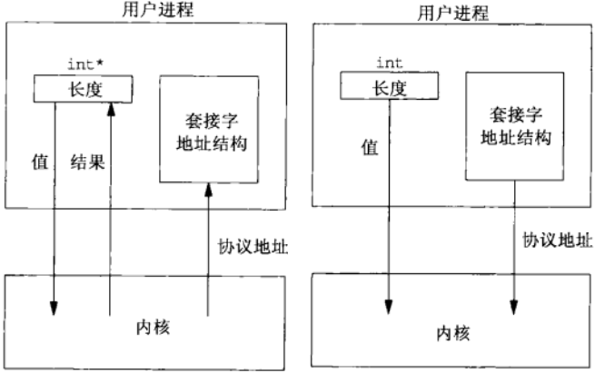
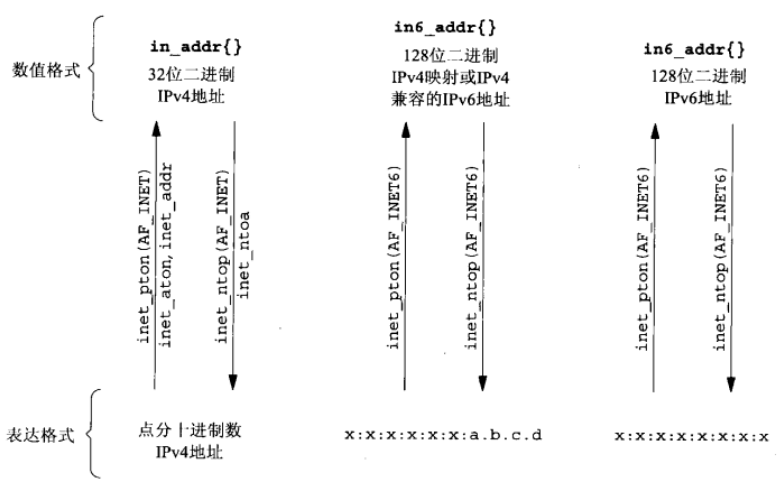

## IPv4 套接字地址结构 (Linux)
```
typedef unsigned short __kernel_sa_family_t;
typedef __kernel_sa_family_t	sa_family_t;
#define __SOCKADDR_COMMON(sa_prefix) \
sa_family_t sa_prefix##family /* 16-bit address family */

typedef uint32_t in_addr_t;
struct in_addr {
  in_addr_t      s_addr;      /* 32-bit IPv4 address */
};

typedef uint16_t in_port_t;
struct sockaddr_in {
  __SOCKADDR_COMMON(sin_);   /* 16-bit IPv4 address */
  int_port_t     sin_port;   /* 16-bit TCP or UDP port number */
  struct in_addr sin_addr;   /* network byte ordered */
  unsigned char  sin_zero[sizeof (struct sockaddr) -
                          __SOCKADDR_COMMON_SIZE -
                          sizeof (in_port_t) - 
                          sizeof (struct in_addr)];  /* sin_zero[8]*/
};
```
## 通用套接字地址结构（Linux）
```
struct sockaddr {
  sa_family sa_family;   /* address family AF_*/
  char      sa_data[14]; /* 14 bytes of protocol address */
};
```
## IPv6 套接字地址结构
```
struct in6_addr {
  union {
    unit8_t __u6_addr8[16];
  }__in6_u;
};

struct sockaddr_in6 {
  __SOCKADDR_COMMON(sin6_);       /* address family AF_ */
  in_port_t       sin6_port;      /* Transport layer port */
  uint32_t        sin6_flowinfo;  /* IPv6 flow information */
  struct in6_addr sin6_addr;      /* IPv6 address */
  uint32_t        sin6_scope_id;  /* IPv6 scope-id */
};
```
## 值-结果参数
- 从进程到内核传递套接字地址结构的函数有3个： bind()、connect() 和 sendto()。这些函数一个参数是指向套接字地址结构的指针，一个是套接字地址结构的大小。
- 从内核到进程传递套接字地址结构的函数有4个：accept()、recvfrom()、getsockname()、getpeername()。这些函数一个参数是指向套接字地址结构的指针，一个是指向表示套接字结构大小的变量的指针。



## 字节排序函数
```
#include <netinet/in.h>
uint16_t htons(uint16_t host16bitvalue); // 返回网络字节序
uint32_t htonl(uint32_t host32bitvalue); // 返回网络字节序
uint16_t ntohs(uint16_t net16bitvalue);  // 返回主机字节序
uint32_t ntohl(uint32_t net16bitvalue);  // 返回主机字节序
```
## 字节操纵函数
```
#include <string.h>
void bzero(void *dest, size_t nbytes);
void bcopy(const void *src, void &dest, size_t nbytes);
int bcmp(cont void *ptr1, const void *ptr2, size_t nbytes);

void *memset(void *dest, int c, size_t nbytes);
void *memcpy(void *dest, const void *src, size_t nbytes);
int memcmp(void *ptrl, const void *ptr2, size_t nbytes);
```
需要补充的是，memset() 的作用是：用常量字节c填充s指向的存储区的前n个字节，并且是逐个字节填充。看下面的例子
```
int main(int argc, char *argv[]) {
  int dst = 0, c = 0x55FF;
  memset(&dst, c, sizeof(dst));
  unsigned char *base = (unsigned char*)&dst;
  for(int i = 0; i < sizeof(dst); ++i) {
    printf("%x ", *(base+ i));
  }
  return 0;
}
```
程序输出的是 ff ff ff ff。c 的高位字节被舍弃

## 地址转换函数
```
#include <arpa/inet.h>
// 点分十进制字符串转换为二进制值 IPv4 地址
int inet_aton(const char *strptr, struct in_addr *addrptr);  // 成功返回 1，失败返回 0
int_addr_t inet_addr(const char *strptr);  // 失败返回 INADDR_NONE

// 二进制值 IPv4 地址转换为点分十进制字符串
char *inet_ntoa(struct in_add inaddr); // 指向点分十进制字符串

// IPv4 地址和 IPv6 地址都适用
int inet_pton(int family, const char *strptr, void *addrptr); // 成功 1，无效 0，失败 -1
const char *inet_ntop(int family, const void *addrptr, const *strptr, size_t len); // 出错 NULL
```
