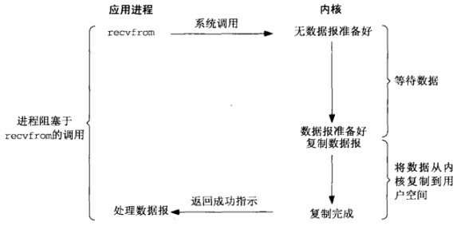
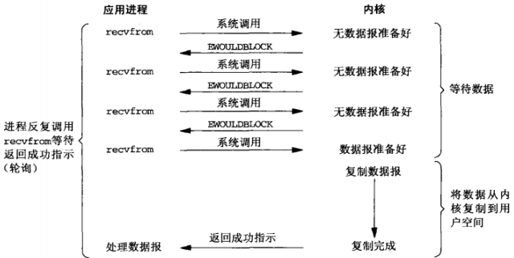
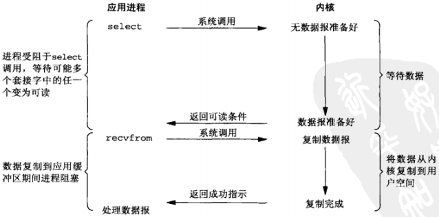
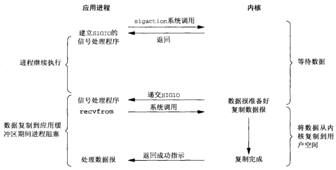
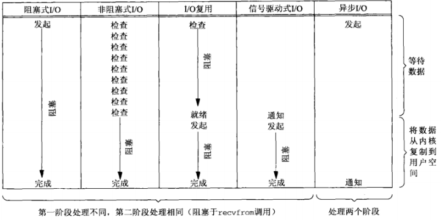

## IO 模型
在默认条件下，所有的套接字都是阻塞的。以 UDP 为例（比较简单），将 recvfrom() 函数视为系统调用（在源自 Berkeley 的内核上是作为系统调用，在 System V 内核上是作为系统调用 getmsg() 的实现函数）

## 阻塞式 IO 模型
进程调用 recvfrom()，其系统调用直到数据报到达且被复制到应用进程的缓冲区中或者发生错误才返回。进程在从调用 recvfrom() 开始到它返回的整段时间内是被阻塞的。recvfrom() 成功返回后，应用进程开始处理数据报

## 非阻塞式 IO 模型
前三次调用 recvfrom() 时没有数据可返回，因此内核转而立即返回一个 EWOULDBLOCK 错误。第四次调用 recvfrom() 时已有一个数据报准备好，开始将数据复制到应用进程缓冲区。数据复制完成（数据复制完或缓冲区满），recvfrom() 成功返回，应用进程开始处理数据

## IO 复用模型
有了 IO 复用，就可以调用 select()、poll() 或 epoll()，阻塞在这三个系统调用的某个之上（可以设置不阻塞），而不是阻塞在真正的 IO 系统调用上。

等待阻塞于 select() 调用，等待数据报套接字变为可读。当 select() 返回套接字可读这一条件时，调用 recvfrom() 把所读数据报复制到应用进程缓冲区。

## 信号驱动式 IO 模型
利用信号，让内核在描述符就绪时发送 SIGIO 信号通知应用进程。首先开启套接字的信号驱动式 IO 功能，并通过 signal() 或 sigaction() 系统调用安装一个信号处理函数，该系统调用立即返回，应用进程继续工作。当数据报准备好读取时，内核就为该进程产生一个 SIGIO 信号。应用进程随后可以在信号处理函数（先前通过通过 signal() 或 sigaction() 系统调用注册）中调用 recvfrom() 读取数据报，并通知主循环数据已准备好，也可以通知主讯号，让他读取数据报。

## 异步 IO 模型
告知内核启动某个操作，并让内核在整个操作（包括将数据从内核复制到应用进程的缓冲区）完成后通知应用进程。

这种模型与前一节介绍的信号驱动模型的主要区别在于：信号驱动式 IO 模型是内核通知应用进程何时可以启动一个 IO 操作，而异步 IO 模型是内核通知应用进程 IO 操作何时完成

应用进程调用 aio_read() 函数给内核传递描述符、缓冲区指针、缓冲区大小和文件偏移，并告诉内核当整个操作完成时如何通知应用进程（产生某个信号，该信号直到数据已复制到应用进程缓冲区才产生）。该系统调用立即返回，而且在等待 IO 完成期间，应用进程不被阻塞

## 同步 IO 和异步 IO 对比
- 同步 IO 操作导致请求进程阻塞，直到 IO 操作完成
  - [阻塞式IO模型](##阻塞式-IO-模型)
  - [非阻塞式IO模型](##非阻塞式-IO-模型)
  - [IO复用模型](##IO-复用模型)
  - [信号驱动式IO模型](##信号驱动式-IO-模型)
- 异步 IO 操作不导致请求进程阻塞
  - [异步IO模型](##异步-IO-模型)

