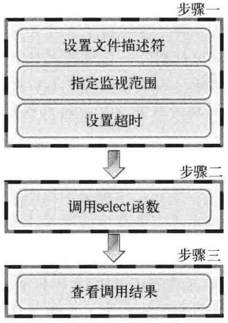
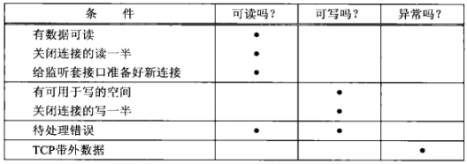
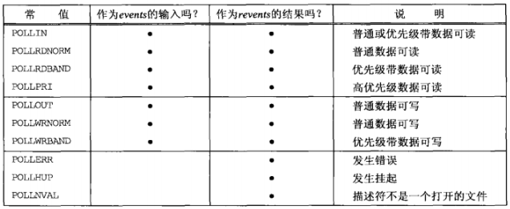

## 概述
多进程服务器端的缺点
- 创建进程时付出极大代价
- 进程通信相对复杂

在客户阻塞于（标准输入）fgets() 调用期间，服务器进程被杀死。服务器TCP 虽然正确地给客户TCP发送了一个 FIN，但是客户进程正阻塞于从标准输入读入数据的过程，将看不到这个 EOF，直到从套接字读时为止。这样的进程需要一种预先告知内核的能力，使得内核一旦发现进程的一个或多个 IO 条件就绪（输入已准备好被读取，或者描述符已能承接更多的输出），它就通知进程，这个能力称为 IO 复用。

## select() 函数的功能和调用顺序
- 使用 select() 函数时可以将多个文件描述符集中到一起统一监视，项目如下：
  - 是否存在套接字接受数据
  - 无需阻塞传输数据的套接字有那些
  - 那些套接字发生类异常
- 调用顺序  



## 设置文件描述符
首先需要将要监视的文件描述符集中到一起。集中时也要要找监视项（接受、传输、异常）进行区分，即按照上述3种监视项分成3类

fd_set 数组将要监视的文件描述符集中到一起，某位设置 1 表示监视
- FD_ZERO(fd_set *fdset)：将 fdset 所指变量的所有位初始化为0
- FD_SET(int fd, fd_set *fdset)：在参数 fdset() 所指的变量中注册文件描述符 fd 的信息
- FD_CLR(int fd, fd_set *fdset)：在参数 fdset() 所指的变量中清除文件描述符 fd 的信息
- FD_ISSET(int fd, fd_set *fdset)：若参数 fdset() 所指的变量中包含文件描述符 fd 的信息，则返回真


## 设置监视范围及超时
```
#include <sys/select.h>
#include <sys/time.h>
/* @param
 * maxfd：监视对象文件描述符的范围，即所有文件描述符的最大值加1
 * readset：是否存在待读取数据
 * writeset：是否可传输无阻赛数据
 * exceptset：是否发生异常
 * timeout：调用 select() 函数后，为防止陷入无限阻塞的状态，传递超时信息
 * return：成功返回 0,失败返回 -1。因发生关注的事件返回时，返回大于 0 的值
 */
int select(int maxfd, fd_set *readset, fd_set *writeset, fd_set *exceptset, const struct timeval *timeout);

struct tiemval {
  long tv_sec;  // seconds
  long tv_usec; // microseconds
};
```
timeout 参数的三种可能：
- 永远等待下去：仅在有一个描述符准备好 IO 时才返回。为此，我们把该参数设置为空指针
- 等待一段固定时间：在有一个描述符准备好 IO 时返回，但是不超过由该参数所指向的 timaval 对象中指定的秒数和微妙数
- 根本不等待：检查描述符后立即返回，这称为轮询。为此，该参数必须指向一个 timeval 对象，而且其中的定时器必须为 0

前两种情形的等待通常会被进程在等待期间捕获的信号中断，并从信号处理函数返回。

## 描述符就绪条件
1. 满足下列四个条件中的任何一个时，一个套接字准备好读
   - 该套接字接收缓冲区中的数据字节数大于等于套接字接收缓冲区低水位标记的当前大小。对这样的套接字执行读操作不会阻塞并将返回一个大于 0 的值。可以用 SO_RCVLOWAT 套接字选项设置该套接字的低水位标记。对于 TCP 和 UDP 套接字而言，其默认值为 1
   - 该连接的读半部关闭（也就是接收了 FIN 的 TCP 连接），对这样的套接字的读操作不会阻塞并返回 0（EOF）
   - 该套接字是一个监听套接字且已完成的连接数不为 0。对这样的套接字的accept() 通常不会阻塞
   - 其上有一个套接字错误待处理。对这样的套接字的读操作将不阻塞并返回 -1，同时把 errno 设置成确切的错误条件。这些待处理错误也可以通过指定 SO_ERROR 套接字选项调用 getsockopt() 获取并清除
2. 下面四个条件中的任何一个满足时，一个套接字准备好写：
   - 该套接字发送缓冲区中的可用空间字节数大于等于套接字发送缓冲区低水位标记的当前大小，并且或者该套接字已连接，或者该套接字不需要连接（如 UDP 套接字）。这意味着如果把这样的套接字设置成非阻塞，写操作将不阻塞并返回一个正值。可以使用 SO_SNDLOWAT 套接字选项来设置该套接字的低水位标记。对 TCP 和 UDP 套接字而言，其默认值通常为2048
   - 该连接的写半部关闭。对这样的套接字的写操作将产生 SIGPIPE 信号
   - 使用非阻塞式 connect() 的套接字已建立连接，或者 connect() 已经以失败告终
   - 其上有一个套接字错误待处理。对这样的套接字的写操作将不阻塞并返回 -1，同时把 errno 设置成确切的错误条件。这些待处理错误也可以通过指定 SO_ERROR 套接字选项调用 getsockopt() 获取并清除
3. 如果一个套接字存在带外数据或者仍处于带外标记，那么它有异常条件待处理。

 select() 返回某个套接字就绪的条件



## poll() 函数
```
#include <poll.h>
/* @param
 * fdvec：指向结构体数组的首个元素的指针
 * nfds：第一个参数所指结构体的长度
 * timeout：超时时间，单位是毫秒
 *    INFTIM：永远等待
 *    0：立即返回，不阻塞进程
 *    >0：等待指定数目的毫秒
 * return：若有就绪描述符则为其数目，若超时则为0，若出错则为-1
 */
int poll(struct pollfd *fdvec, unsigned long nfds, int timeout);

struct pollfd {
  int   fd;      /* descriptor to check */
  short events;  /* events of interest on fd */
  short revents; /* events that occurred on fd */
};
```
